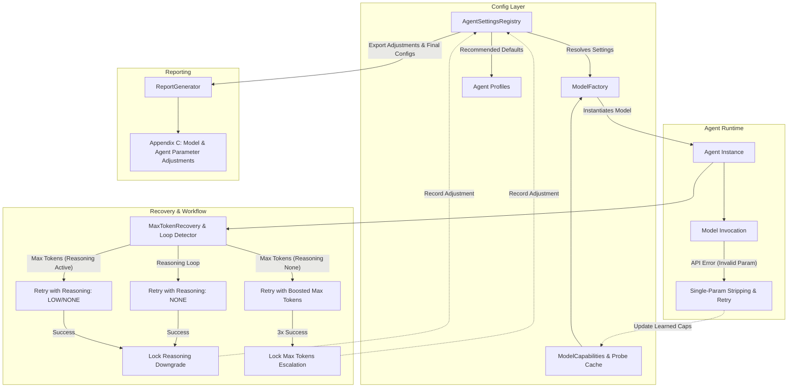

# Requirements

### Overview & Goals
The objective is to enable fine-grained, per-agent-type model configuration (temperature, reasoning level, `top_k`, `top_p`, and output token limit) across all workflow agents (`plan_creator`/`plan_builder`, `plan_critic`, `task_creator`, `task_prompt_builder`, `task_prompt_critic`, `task_executor`, `task_evaluator`, `report_agent`, etc.), provide expert baseline recommendations for each agent role, and implement an autonomous runtime adaptation engine that handles:
1. **Reasoning Loop Recovery**: Immediate repair with reasoning level `none`, locking in `none` for that agent role upon successful resolution.
2. **Reasoning Max Token Exhaustion**: Immediate repair by reducing reasoning level to `low` or `none`, locking in the reduced level for that agent role upon success.
3. **Non-Reasoning Max Token Exhaustion**: Immediate repair with bounded token limit increase, permanently escalating the agent role's token limit after 3 successful repairs.
4. **Provider Capability Graceful Degradation**: Lazy JIT probing and single-parameter error recovery (e.g. Ollama string -> bool `think` -> omit; stripping unsupported `temperature`, `top_k`, or `top_p` one at a time) ensuring no operation fails due to model parameter rejection.
5. **Report Appendix C**: Deterministic generation of Appendix C in security assessment reports capturing all baseline parameters, provider constraints, and runtime adaptations.

### Scope
#### In Scope
- Dedicated per-agent configuration registry with recommended defaults for all workflow and reporting roles.
- Dynamic runtime parameter adjustment manager tracking reasoning level downgrades and 3-strike token escalations.
- Provider parameter translation matrix supporting Bedrock, LiteLLM, Ollama, and Gemini.
- Progressive, single-parameter error fallback and capability learning.
- Enhanced max token and reasoning loop recovery handlers in `cyberautoagent.py` and `multi_agent_workflow.py`.
- Deterministic Appendix C generation in `report_generator.py`.
- Full test coverage for positive, negative, fallback, and promotion scenarios.

#### Out of Scope
- Major version upgrades of core dependencies.
- Changes to external LLM provider API protocols beyond parameter formatting and error recovery.

### User Stories
- **As a Security Engineer**, I want each workflow agent (e.g., plan creator vs task executor) to use optimal temperature, reasoning level, and token limits so that planning is deeply reasoned while tool execution is precise and deterministic.
- **As an Operator**, I want models with limited parameter support (e.g., fixed temperature or boolean thinking) to seamlessly degrade parameters without aborting the assessment.
- **As an Assessor**, I want the final report to include Appendix C detailing every model parameter adjustment made during the run for auditability and forensic traceability.

### Functional Requirements
- **Per-Agent Parameter Configuration**: Support individual configuration of `temperature` (float), `reasoning_level` (`none`, `low`, `medium`, `high`, `xhigh`), `top_k` (int), `top_p` (float), and `max_tokens` (int) for each agent type.
- **Recommended Defaults**:
  - `plan_creator` / `plan_builder`: temp 0.2, reasoning `high`, top_p 0.95, top_k 40, max_tokens 8192.
  - `plan_critic`: temp 0.0, reasoning `high`, top_p 0.95, top_k 40, max_tokens 4096.
  - `task_creator`: temp 0.2, reasoning `medium`, top_p 0.95, top_k 40, max_tokens 8192.
  - `task_prompt_builder`: temp 0.2, reasoning `medium`, top_p 0.95, top_k 40, max_tokens 4096.
  - `task_prompt_critic`: temp 0.0, reasoning `low`, top_p 0.95, top_k 40, max_tokens 2048.
  - `task_executor`: temp 0.0, reasoning `low`, top_p 0.95, top_k 40, max_tokens 8192.
  - `task_evaluator` / `phase_evaluator`: temp 0.0, reasoning `none`, top_p 0.95, top_k 40, max_tokens 4096.
  - `report_agent` / `report_executive` / `report_finding`: temp 0.2, reasoning `none`, top_p 0.95, top_k 40, max_tokens 8192.
  - `report_critic`: temp 0.0, reasoning `low`, top_p 0.95, top_k 40, max_tokens 2048.
- **Reasoning Loop Repair**: When a loop is detected, the first repair attempt must execute with reasoning level `none`. If the repair succeeds, `none` becomes the persistent default for that agent type for the remainder of the run.
- **Reasoning-Induced Max Token Repair**: When token limit is hit due to reasoning output, reduce reasoning level to `low` (or `none`) for one repair attempt. If successful, persist this reduced level for that agent type.
- **Non-Reasoning Max Token Repair & 3-Strike Escalation**: When token limit is hit with reasoning `none`, increase `max_tokens` by a bounded step (+2048 tokens or +50% bounded by model ceiling) and retry once. If this token increase succeeds 3 times for that agent type, increase default `max_tokens` for that agent type for the remainder of the operation.
- **One-by-One Parameter Stripping & Fallback**:
  - If a model API rejects a parameter (e.g. invalid temperature, unsupported top_k, invalid reasoning effort), retry by removing only that specific parameter while preserving all other valid parameters.
  - For Ollama: `think` string level (`low`/`medium`/`high`) -> boolean (`False` for none/low, `True` for medium/high/xhigh) -> omit parameter.
  - In all boolean reasoning models: `none` and `low` evaluate to `False`; `medium`, `high`, `xhigh` evaluate to `True`.
  - Cache learned parameter constraints so subsequent invocations do not repeat failed parameter payloads.
- **Report Appendix C**: Generate `APPENDIX C: MODEL & AGENT PARAMETER ADJUSTMENTS` containing:
  - Baseline vs final configuration per agent type.
  - Log of runtime reasoning reductions, token limit escalations, and provider parameter fallbacks with timestamps, trigger reasons, and outcomes.

### Non-Functional Requirements
- **Resilience**: A missing or unsupported model parameter must never cause an operation failure or abort.
- **Determinism**: Appendix C and parameter translation rules must follow deterministic formatting and state transitions.
- **Test Coverage**: Minimum 80% code and branch coverage across new and modified components.

# Technical Design

### Current Implementation
- `src/modules/config/models/factory.py` applies global role parameters (`primary`, `swarm`, `report`, `evaluation`) with coarse temperature and max_token limits.
- `src/modules/config/models/capabilities.py` performs static and models.dev lookups for reasoning and tool support but lacks dynamic per-agent parameter specifications and single-parameter error fallback chains.
- `src/modules/handlers/max_token_recovery.py` and `src/cyberautoagent.py` perform prompt-based recovery for `task_executor` but do not mutate agent reasoning levels or escalate token limits across operational cycles.
- `src/modules/handlers/report_generator.py` generates Appendix A (Methodology) and Appendix B (Recommended Next Steps), but does not yet generate Appendix C.

### Key Decisions
1. **Centralized Agent Settings Registry & State Manager**: Place default agent profiles and active runtime adaptation state in `src/modules/config/models/agent_profiles.py` to decouple agent definitions from provider SDKs and allow seamless state export to both model factories and `ReportGenerator`.
2. **Lazy JIT Capability Discovery & Progressive Fallback**: Wrap model invocation with single-parameter exception filtering that downgrades or strips offending parameters one at a time and caches the discovered capability mask for that provider/model combination.
3. **Two-Tier Max Token Escalation**: Distinguish between reasoning-dominated exhaustion (resolved by stepping down reasoning level) and payload-dominated exhaustion (resolved by token limit stepping and 3-strike permanent escalation).

### Architecture Diagram


### Data Models & Contracts
```python
from enum import Enum
from dataclasses import dataclass, field
from typing import Optional, Dict, Any, List

class ReasoningLevel(str, Enum):
    NONE = "none"
    LOW = "low"
    MEDIUM = "medium"
    HIGH = "high"
    XHIGH = "xhigh"

@dataclass
class AgentModelSettings:
    temperature: Optional[float] = None
    reasoning_level: ReasoningLevel = ReasoningLevel.NONE
    top_k: Optional[int] = None
    top_p: Optional[float] = None
    max_tokens: int = 4096

@dataclass
class ParameterAdjustmentRecord:
    timestamp: str
    agent_type: str
    parameter_name: str
    old_value: Any
    new_value: Any
    trigger_reason: str
    permanent: bool

class AgentSettingsRegistry:
    def get_settings(self, agent_type: str, provider: str, model_id: str) -> AgentModelSettings: ...
    def apply_reasoning_repair(self, agent_type: str, level: ReasoningLevel, reason: str) -> None: ...
    def record_token_recovery_success(self, agent_type: str, boost_amount: int) -> bool: ...
    def record_parameter_fallback(self, provider: str, model_id: str, param_name: str, fallback_value: Any) -> None: ...
    def export_adjustment_records(self) -> List[ParameterAdjustmentRecord]: ...
    def export_profile_comparison(self) -> Dict[str, Dict[str, Any]]: ...
```

### Provider Translation & Fallback Matrix
- **Ollama**:
  - `think` string (`"low"`, `"medium"`, `"high"`) -> `think: bool` (`False` if none/low, `True` if medium/high/xhigh) -> omit `think`.
  - `options`: `temperature`, `top_p`, `top_k`, `num_predict` (`max_tokens`). Strip individually if rejected.
- **Bedrock**:
  - Claude 3.7 / 4.x / Opus: `additional_request_fields.output_config.effort` (`"low"`, `"medium"`, `"high"`, `"max"`) or `thinking.budget_tokens` based on reasoning level. Disable thinking if `none`.
  - Strip `top_p` or `temperature` if global cross-region model rejects simultaneous settings.
- **LiteLLM**:
  - `client_args["reasoning_effort"]` (`low`, `medium`, `high`, `xhigh`) and `client_args["thinking"] = {"type": "enabled", "budget_tokens": int(max_tokens * 0.8)}`.
  - If rejected, fallback to `thinking: disabled` / omitted.
- **Gemini**:
  - Native SDK: `thinking_config.thinking_budget` (0 for `none`, scaled budget tokens for low/med/high).

### File Structure & Changes
- `src/modules/config/models/agent_profiles.py`: **[NEW]** Central registry for per-agent profiles, recommended defaults, dynamic runtime mutations, 3-strike token tracking, and adjustment logging.
- `src/modules/config/models/capabilities.py`: **[MODIFIED]** Extended with learned capability caching and single-parameter error classification.
- `src/modules/config/models/factory.py`: **[MODIFIED]** Integrated with `AgentSettingsRegistry` for role resolution, provider reasoning mapping, and single-parameter retry wrapper.
- `src/modules/config/models/ollama.py`: **[MODIFIED]** Added `top_k` support and `think` string-to-bool-to-omit fallback cascade.
- `src/modules/handlers/max_token_recovery.py`: **[MODIFIED]** Enhanced classification for reasoning loops vs token exhaustion under varying reasoning levels.
- `src/cyberautoagent.py`: **[MODIFIED]** Updated `run_workflow_agent_with_max_token_recovery` to execute reasoning reduction and token escalation repair workflows.
- `src/modules/agents/multi_agent_workflow.py`: **[MODIFIED]** Updated JSON agent runner to apply per-agent adaptation repairs.
- `src/modules/handlers/report_generator.py`: **[MODIFIED]** Added Appendix C rendering and registry adjustment integration.
- `CHANGELOG.md`: **[MODIFIED]** Updated with new feature entries under `### Features`.

### Risks & Mitigations
- *Risk*: Repeated token limit escalation could exceed underlying model context or output limits.
  - *Mitigation*: Clamp all token escalations to the authoritative model output capacity discovered via `models.dev` / LiteLLM registry.
- *Risk*: Parameter fallback loops could introduce latency.
  - *Mitigation*: Cache learned parameter exclusions in memory per `(provider, model_id)` so each invalid parameter is only stripped once across the entire session.

# Testing

### Validation Approach
Verification will combine unit tests for discrete parameter mapping, fallback cascades, and 3-strike escalation rules, along with integration tests simulating model error recovery and full report generation including Appendix C.

### Key Scenarios
1. **Per-Agent Recommended Profiles**:
   - Verify that instantiating each agent type (`plan_creator`, `plan_critic`, `task_creator`, `task_prompt_builder`, `task_executor`, `task_evaluator`, `report_agent`, etc.) receives its specific recommended temperature, reasoning level, `top_k`, `top_p`, and `max_tokens`.
2. **Reasoning Loop Repair**:
   - Simulate a reasoning loop on `task_executor` or `plan_creator`. Verify immediate retry with reasoning level `none`. Verify that upon success, the agent role's default reasoning level becomes `none` for all subsequent turns and is recorded in the adjustment log.
3. **Reasoning Max Token Exhaustion Repair**:
   - Simulate max tokens hit caused by reasoning output with reasoning `medium` or `high`. Verify repair attempt with reasoning reduced to `low` or `none`. Verify successful recovery updates the default reasoning level for that agent role.
4. **Non-Reasoning Max Token Escalation & 3-Strike Promotion**:
   - Simulate max tokens hit with reasoning `none`. Verify repair attempt with boosted `max_tokens`.
   - Trigger the scenario 3 times for a specific agent role; verify that after the 3rd success, the elevated token limit becomes the permanent default for that agent type.
5. **Progressive One-by-One Parameter Stripping**:
   - Simulate a provider returning an error when `top_k` or `temperature` is passed (e.g. fixed temp model).
   - Verify the error handler strips only the rejected parameter, successfully completes the request, and caches the constraint so subsequent calls do not send the unsupported parameter.
6. **Ollama Think Setting Fallback**:
   - Test Ollama model initialization when string `think: "medium"` fails -> falls back to `think: True` -> falls back to omitting `think`. Verify boolean mapping (`none`/`low` -> `False`, others -> `True`).
7. **Report Appendix C Verification**:
   - Run end-to-end report generation after simulated adaptations; verify Appendix C renders formatted Markdown tables with baseline vs final configs and detailed adjustment audit trails.

### Test Changes
- `tests/config/test_agent_profiles.py`: **[NEW]** Unit tests for agent presets, reasoning level mappings, and 3-strike promotion.
- `tests/models/test_parameter_fallback.py`: **[NEW]** Tests for single-parameter fallback, Ollama think transitions, and learned cache.
- `tests/handlers/test_max_token_recovery.py`: **[MODIFIED]** Tests for reasoning loop and max token adaptation hooks.
- `tests/reporting/test_appendix_c.py`: **[NEW]** Tests for Appendix C table generation and formatting.

# Delivery Steps

### ✓ Step 1: Define Per-Agent Model Parameter Registry and Provider Translation Matrix
A centralized model settings registry and provider translation matrix define per-agent profiles and map parameters across providers.

- Create `src/modules/config/models/agent_profiles.py` defining `ReasoningLevel` (`none`, `low`, `medium`, `high`, `xhigh`), `AgentModelSettings`, and default recommended configurations for all agent roles (`plan_creator`/`plan_builder`, `plan_critic`, `task_creator`, `task_prompt_builder`, `task_prompt_critic`, `task_executor`, `task_evaluator`, `phase_evaluator`, `task_phase_classifier`, `report_agent`, `report_critic`, `taxonomy_annotator`, `attack_enricher`).
- Implement `AgentSettingsRegistry` in `src/modules/config/models/agent_profiles.py` to manage active configurations per agent type, track runtime promotions (e.g. 3-strike max token increases, permanent reasoning downgrades), and record adjustments for reporting.
- Update `src/modules/config/models/factory.py` and `src/modules/agents/factory.py` to resolve model parameters (`temperature`, `top_p`, `top_k`, `max_tokens`, `reasoning_level`) via `AgentSettingsRegistry` when instantiating models for specific agent roles.
- Implement provider-specific reasoning parameter translation for Bedrock (`output_config.effort` / `thinking`), LiteLLM (`reasoning_effort` / `thinking`), Ollama (`think` string/bool), and Gemini (`thinking_config`).

### ✓ Step 2: Implement Single-Parameter Fallback and Lazy JIT Model Probing
Model initialization and invocation dynamically probe supported parameters and recover from provider errors via one-by-one parameter stripping.

- Implement lazy JIT model capability probing and learned parameter constraints cache in `src/modules/config/models/capabilities.py` and `src/modules/config/models/factory.py`.
- Update `src/modules/config/models/ollama.py` to support `top_k`, handle `think` string vs boolean fallback, and gracefully ignore unsupported options.
- Implement progressive single-parameter fallback in model factory and client adapters: when a model returns an error due to invalid settings (e.g. fixed temperature required, `top_k` unsupported, or `think` level invalid), downgrade or strip the offending parameter one at a time, retry, and cache the learned capability.
- Ensure boolean reasoning fallback maps `none` and `low` to `False`, and `medium`, `high`, `xhigh` to `True`.

### ✓ Step 3: Enhance Reasoning Loop and Max Token Recovery Logic with Dynamic Agent State Promotion
Workflow controller and recovery handlers adapt reasoning levels and token limits upon reasoning loops and token exhaustion, promoting successful fixes for the remainder of the run.

- Update `src/modules/handlers/max_token_recovery.py` to classify whether token exhaustion is reasoning-induced or output-content-induced under active reasoning levels vs reasoning `none`.
- Update `run_workflow_agent_with_max_token_recovery` in `src/cyberautoagent.py` and `_run_json_text_agent` in `src/modules/agents/multi_agent_workflow.py` to execute the hierarchical repair protocol:
  - On reasoning loop: retry with reasoning level `none`; on success, promote `none` as default for that agent type and record in registry.
  - On max tokens with active reasoning: retry with reasoning level `low` or `none`; on success, lock in new reasoning level for that agent type and record in registry.
  - On max tokens with reasoning `none`: retry with a bounded token increase (e.g. +2048 tokens); track successful recoveries and permanently increase default `max_tokens` for that agent type upon 3 successful repairs.
- Ensure all dynamic adjustments update the operation-level `AgentSettingsRegistry`.

### ✓ Step 4: Integrate Report Appendix C Generation and Workflow State Tracking
Final reports deterministically include Appendix C documenting all initial settings, provider capability fallbacks, and runtime parameter adjustments.

- Extend `src/modules/handlers/report_generator.py` and `src/modules/prompts/factory.py` to add `APPENDIX C: MODEL & AGENT PARAMETER ADJUSTMENTS`.
- Render deterministic Markdown tables in Appendix C detailing baseline vs final agent configurations (temperature, reasoning, top_k, top_p, max_tokens), trigger causes (reasoning loop repair, max token escalation, provider incompatibility), and fallback history.
- Integrate `AgentSettingsRegistry` adjustment logs into report compilation in `cyberautoagent.py` and `ReportGenerator`.

### ✓ Step 5: Implement Comprehensive Unit and Integration Test Suite
Unit and integration test suites validate per-agent configuration, fallback cascades, recovery promotions, and report output across all supported providers.

- Add unit tests in `tests/config/test_agent_profiles.py` validating recommended defaults, provider translations, and 3-strike token increase promotion in `AgentSettingsRegistry`.
- Add tests in `tests/models/test_parameter_fallback.py` verifying one-by-one parameter stripping, Ollama think string/bool fallback, and learned probe caching.
- Add workflow recovery tests in `tests/handlers/test_max_token_recovery.py` and `tests/workflow/test_multi_agent_adaptation.py` verifying reasoning loop repair to `none`, reasoning reduction on max tokens, and token limit escalation.
- Add report rendering tests in `tests/reporting/test_appendix_c.py` verifying Appendix C Markdown generation.
- Execute full test suite with `uv run pytest` and verify linting with `uv run ruff`.