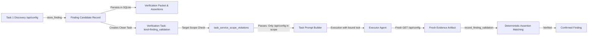

# Requirements

### Overview & Goals
When a task discovers exposed credentials or sensitive resources (such as database connection strings `postgres://user:pass@db:5432/bc` or cloud storage URLs `https://bucket.s3.amazonaws.com`), storing the finding candidate via `store_finding` auto-generates a dedicated finding verification task (`kind="finding_validation"`). 

Currently, the auto-generated task interpolates the raw finding description, observed results, and evidence assertion markers directly into the immutable `Task.objective` and task text. When the task is activated, the immutable task scope validation (`task_service_scope_violations`) extracts every URL matching `_EXPLICIT_SERVICE_URL_REFERENCE_PATTERN` and compares its scheme, host, and port against the assigned service target (e.g., `http://192.168.253.101:3001`). Because the leaked credential strings contain out-of-scope schemes and hosts, the validator flags them as `boundary_mismatch` violations and aborts the task during prompt building (`partial_failure` with `TaskPromptBuildError: Task content exceeds the assigned service boundary`).

The goal of this change is to separate out-of-scope resource references (the credential and URL data values discovered in responses) from in-scope validation targets (the HTTP endpoint exposing them, e.g., `GET /api/config`).

### Scope
- **In Scope**:
  - `src/modules/tools/memory.py`: Refactor `store_finding()` to generate clean `Task` objectives and acceptance criteria for `finding_validation` tasks without raw multi-scheme URL payload string interpolation into immutable task scope text.
  - `src/modules/agents/multi_agent_workflow.py`: Refine task prompt builder guidance and execution prompt context for `task.kind == "finding_validation"` to clearly distinguish in-scope target endpoints from response data markers.
  - `tests/test_typed_memory.py` and `tests/test_multi_agent_workflow.py`: Add unit and workflow tests covering findings with leaked URLs/connection strings.
  - `CHANGELOG.md`: Document the fix under `### Fixes`.
- **Out of Scope**:
  - Relaxing actual network target boundary enforcement on outgoing HTTP/network requests. Out-of-scope target probing must remain strictly blocked.
  - Changes to underlying database schemas or breaking changes to `store_finding` / `record_finding_validation` public tool interfaces.

### User Stories
- As a penetration testing agent, when I discover leaked credentials or external service URLs on an in-scope endpoint, I want `store_finding` to generate a verification task that successfully activates and builds its prompt without being blocked by scope validation.
- As a workflow controller, I want the verification task executor to test only the in-scope vulnerable endpoint while validating the observed response data against the stored finding candidate assertions.

### Functional Requirements
1. **Clean Verification Task Objective Generation**:
   - `store_finding()` must formulate `Task.objective` in terms of the assigned target endpoint and candidate reference (e.g. `f"Independently verify finding candidate {finding_uid} against {candidate['target']}. Reproduce the reported finding behavior in fresh direct or differential artifacts, call record_finding_validation with the outcome, and stop."`).
   - Raw payload data (such as `observed_result` and `evidence_assertions` markers) must remain stored in `candidate["verification_packet"]` and SQLite finding candidate storage, rather than being concatenated into top-level immutable task scope text.
2. **Immutable Scope Validation Compatibility**:
   - `task_service_scope_violations()` running on `_immutable_task_scope_text(task)` must evaluate only the genuine target endpoint of the verification task (`candidate['target']`).
3. **Prompt Builder & Critic Guidance**:
   - For `task.kind == "finding_validation"`, `_task_prompt_builder_prompt()` must explicitly instruct the prompt builder and executor that credentials or external URLs in response data are payload markers to verify within response artifacts, not network endpoints to scan or connect to.
4. **Deterministic Assertion Verification**:
   - `record_finding_validation()` must continue to verify fresh evidence artifacts against the stored candidate assertions in `candidate["verification_packet"]` deterministically.

### Non-Functional Requirements
- **Deterministic & Safe**: No reliance on probabilistic LLM behavior for scope boundary checks.
- **Coverage**: Minimum 80% code and branch coverage on new and modified logic.
- **Standards Compliance**: Pass `uv run ruff check` and `pytest`.

# Technical Design

### Current Implementation & Root Cause Analysis

1. **Verification Task Generation in `src/modules/tools/memory.py`**:
   In `store_finding()` (lines 3666–3678):
   ```python
   task = Task(
       task_uid=task_uid,
       title=f"Verify finding: {candidate['title']}",
       objective=(
           f"Independently verify finding candidate {finding_uid} against {candidate['target']}. "
           f"Expected result: {candidate['verification_packet']['expected_result']} Observed candidate result: "
           f"{candidate['verification_packet']['observed_result']} Source evidence: "
           f"{', '.join(candidate['verification_packet']['artifacts'])}. "
           "Required positive evidence markers: "
           f"{', '.join(assertion['marker'] for assertion in candidate['evidence_assertions'])}. "
           "Reproduce every marker in fresh direct or differential artifacts, call "
           "record_finding_validation with the outcome, and stop."
       ),
       ...
   )
   ```
2. **Scope Validation in `src/modules/agents/multi_agent_workflow.py`**:
   In `_build_task_prompt()` (lines 6040–6052):
   ```python
   immutable_scope_feedback = task_service_scope_violations(
       plan, task, self._immutable_task_scope_text(task)
   )
   if immutable_scope_feedback:
       raise TaskPromptBuildError(
           "Task content exceeds the assigned service boundary: " + "; ".join(immutable_scope_feedback),
           repairable=False,
           feedback=immutable_scope_feedback,
           failure_source="task_scope_validation",
       )
   ```
3. **Root Cause**:
   `task_service_scope_violations` parses `_immutable_task_scope_text(task)` with `_EXPLICIT_SERVICE_URL_REFERENCE_PATTERN` (`[a-z][a-z0-9+.-]*://[^\s\"'<>`]+`). Because `task.objective` directly embedded `candidate['observed_result']` (which contained `postgres://bc:bc@db:5432/bc` and `https://neuralegion-open-bucket.s3.amazonaws.com`), the validator interpreted those credential strings as out-of-scope network targets, causing a non-repairable prompt build failure.

### Key Decisions
- **Decision 1: Store Payload Data in Candidate Record, Keep Task Contract Target-Focused**:
  - *Approach*: `Task.objective` defines the operational boundary and intent (re-testing the candidate endpoint at `candidate['target']` to verify the finding). The specific markers, observed results, and expected results reside in `candidate["verification_packet"]` and database records.
  - *Rationale*: Maintains strict service boundary enforcement without allowing response payload contents to contaminate task target scope.
- **Decision 2: Dedicated Prompt Builder Guidance for Finding Validation**:
  - *Approach*: Add specific instructions in `_task_prompt_builder_prompt()` for `finding_validation` tasks clarifying that data returned by endpoints (such as connection strings or bucket URLs) are response payload markers, not outbound request targets.
  - *Rationale*: Prevents the LLM prompt builder from generating prompts that attempt to connect to leaked third-party URLs.

### Proposed Changes

#### 1. `src/modules/tools/memory.py`
- Refactor `store_finding()` task creation:
  ```python
  task = Task(
      task_uid=task_uid,
      title=f"Verify finding: {candidate['title']}",
      objective=(
          f"Independently verify finding candidate {finding_uid} against {candidate['target']}. "
          "Re-test the target to reproduce the reported finding behavior, capture required evidence "
          "in fresh direct or differential artifacts, call record_finding_validation with the outcome, "
          "and stop."
      ),
      acceptance=AcceptanceContract(
          mode="outcome",
          basis=AcceptanceBasis(
              kind="snapshot",
              description=f"Finding candidate {finding_uid}",
              source_refs=[f"finding:{finding_uid}"],
          ),
          criteria=[
              AcceptanceCriterion(
                  id=f"verify-finding:{finding_uid}",
                  description="Record an evidence-backed independent validation outcome for the finding candidate.",
                  evidence_requirements=[EvidenceRequirement(kind="artifact", min_count=1)],
              )
          ],
      ),
      evidence=candidate["artifacts"],
      phase=current_phase,
      status="pending",
      kind="finding_validation",
      reference_id=finding_uid,
      target_scope=target_scope,
      target_ids=target_ids,
  )
  ```
- Ensure `candidate["verification_packet"]` retains complete evidence assertions, observed results, expected results, and reproduction steps for verification tooling.

#### 2. `src/modules/agents/multi_agent_workflow.py`
- In `_task_prompt_builder_prompt()`, add finding validation specific guidance when `task.kind == "finding_validation"`:
  ```python
  if task.kind == "finding_validation":
      prompt_guidance += (
          "- For finding validation tasks, instruct the executor to test only the assigned candidate target endpoint. "
          "Treat any credentials, database URIs, or third-party URLs reported in finding data as response payload markers to "
          "inspect within response artifacts, NOT external targets to probe or connect to.\n"
      )
  ```
- In `_run_task_in_trace()`, provide structured finding verification context to the execution prompt (e.g. from `verification_packet`) while maintaining clean scope boundaries.

### Architecture Diagram



### Risks & Mitigations
- **Risk**: The task executor might lack context on what markers to verify if omitted from `task.objective`.
  - *Mitigation*: The executor receives the bound `record_finding_validation` tool, task evidence references, and finding context in the execution prompt. `record_finding_validation` deterministically checks evidence against the stored candidate assertions.
- **Risk**: Finding titles themselves might include URLs.
  - *Mitigation*: Finding titles in `Task.title` are sanitized or stripped of protocol prefixes if necessary, while preserving descriptive vulnerability names.

# Testing

### Validation Approach
Verification will be conducted using automated unit and workflow tests via `uv run pytest`.

### Key Scenarios
1. **Finding Candidate Storage with Embedded URLs**:
   - Store a finding candidate whose `observed_result` and `evidence_assertions` contain `postgres://bc:bc@db:5432/bc`, `https://neuralegion-open-bucket.s3.amazonaws.com`, and API keys.
   - Assert that the auto-generated `Task` has a clean `objective` matching `candidate['target']`.
   - Assert that `task_service_scope_violations(plan, task, task.objective)` returns no violations (`[]`).
2. **Immutable Task Scope Validation on Activation**:
   - Activate the verification task in Phase 1 and Phase 5 plans.
   - Assert `_build_task_prompt()` passes the immutable task scope validation check (`stage: "immutable_task"`).
3. **Finding Validation Prompt Building & Execution**:
   - Run `_task_prompt_builder_prompt()` and verify the generated instructions guide the executor to target the endpoint without treating leaked credentials as scan targets.
4. **Successful Finding Confirmation**:
   - Call `record_finding_validation()` with fresh artifacts containing the required markers and verify it reproduces the candidate assertions and marks the finding confirmed.

### Edge Cases
- Findings containing multiple diverse URL schemes (`redis://`, `mongodb://`, `ftp://`, `https://`).
- Findings with IPv6 / bare host:port combinations in response payloads.
- Negative controls: Verify that if a task actually specifies an unauthorized network target in `task.target` or `target_ids`, `task_service_scope_violations()` continues to reject it.

### Test Changes
- `tests/test_typed_memory.py`: Add test cases for `store_finding` with connection strings and cloud storage URLs in candidate evidence.
- `tests/test_multi_agent_workflow.py`: Add test cases for finding validation task activation and prompt generation with complex payload data.
- Run full test suite: `UV_CACHE_DIR="$PWD/.uv-cache" uv run pytest -q --tb=short`.
- Run linter: `UV_CACHE_DIR="$PWD/.uv-cache" uv run ruff check src tests`.

# Delivery Steps

### ✓ Step 1: Refactor store_finding Verification Task Generation
Isolate the verification task definition from raw payload strings in finding candidate storage.

- Update `store_finding()` in `src/modules/tools/memory.py` to decouple the `Task` definition (`title`, `objective`, `acceptance`) from un-sanitized credential payloads and external URL literals.
- Ensure `Task.objective` states the verification goal against the assigned target endpoint (e.g. `Independently verify finding candidate {finding_uid} against {target}`) without string-interpolating raw `observed_result` and `evidence_assertions` markers containing URL schemes.
- Preserve complete finding payload data, evidence assertions, and reproduction steps inside `candidate["verification_packet"]` and the persistent SQLite database store.
- Add unit tests in `tests/test_typed_memory.py` verifying that findings with embedded connection strings (`postgres://...`, `https://s3...`, `mongodb://...`) produce verification tasks that pass `task_service_scope_violations()`.

### ✓ Step 2: Update Task Prompt Builder and Scope Context for Finding Validation
Enhance prompt building and executor context for finding validation tasks to cleanly differentiate target endpoints from response payload markers.

- Update `_task_prompt_builder_prompt()` in `src/modules/agents/multi_agent_workflow.py` to provide explicit guidance for `task.kind == "finding_validation"`.
- Instruct the prompt builder and task executor that external URLs or credentials found in response bodies are data payloads/evidence markers, not executable targets.
- Ensure execution prompt assembly provides candidate finding context (technique, expected/observed behavior) while preserving strict target boundary enforcement on outgoing requests.
- Update `_immutable_task_scope_text()` and scope check handling to ensure finding validation metadata does not trigger spurious `boundary_mismatch` rejections.

### ✓ Step 3: Add Comprehensive Test Coverage and Update Changelog
Verify end-to-end finding verification task prompt generation, execution, and validation workflows across realistic payload scenarios.

- Add unit and integration tests in `tests/test_multi_agent_workflow.py` testing the complete lifecycle of finding validation tasks created from credential leakage findings.
- Test scenarios including:
  - Unauthenticated config endpoint exposing Postgres, S3, and API keys.
  - Verification task prompt generation passing immutable scope checks (`stage: "immutable_task"`).
  - Deterministic assertion matching in `record_finding_validation`.
  - Negative controls: ensuring real out-of-scope network requests by the executor remain strictly blocked by scope validation.
- Update `CHANGELOG.md` under `### Fixes` documenting the resolution of scope-boundary mismatch on auto-generated verification tasks.