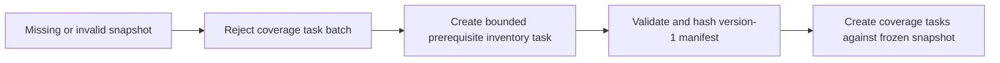
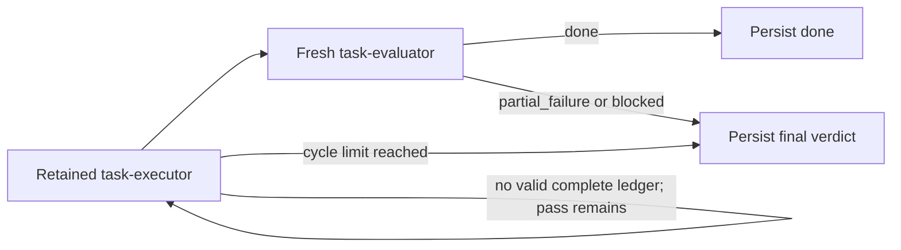
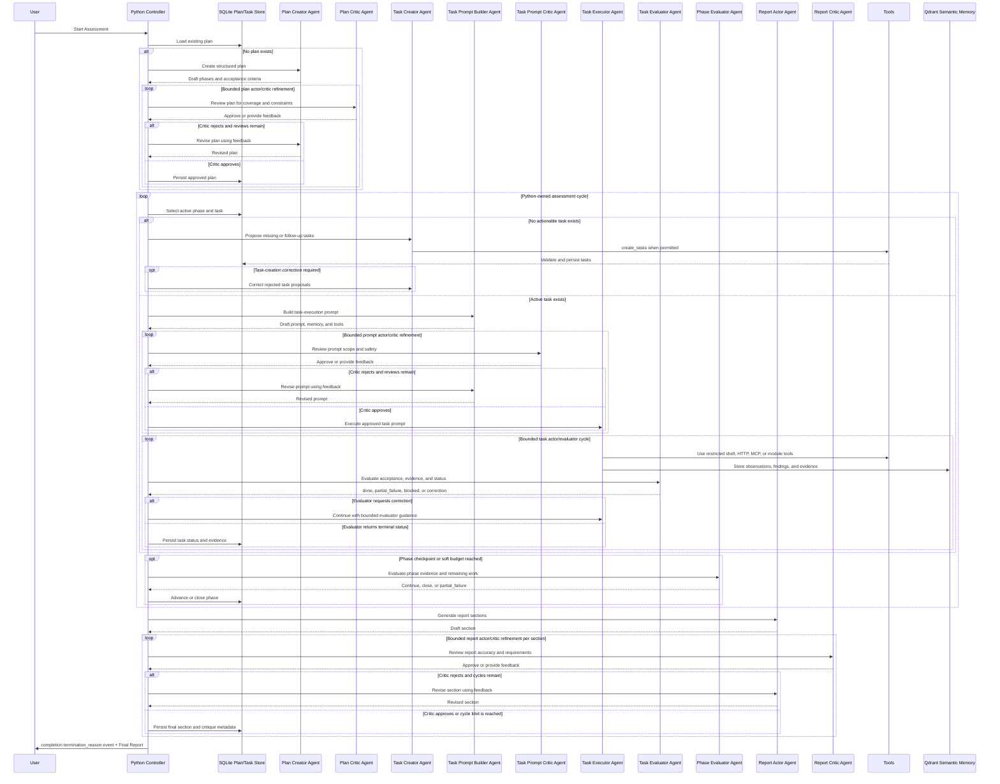
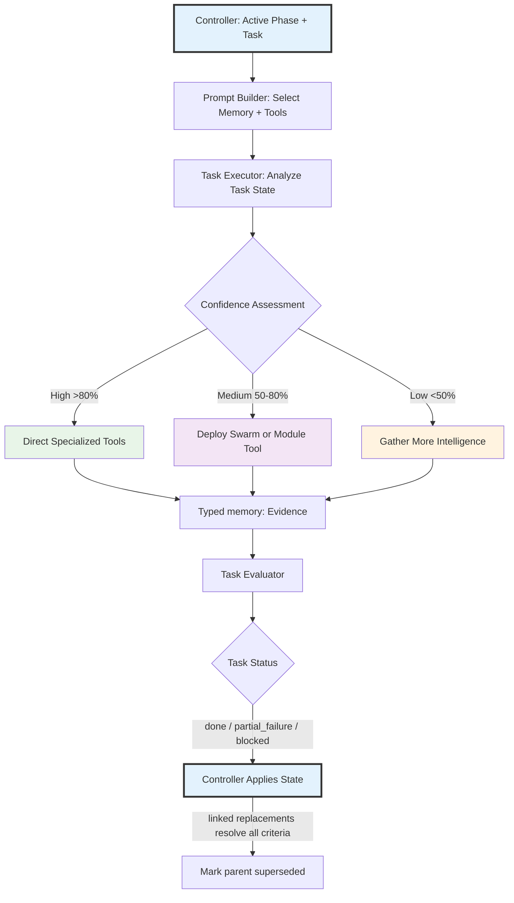
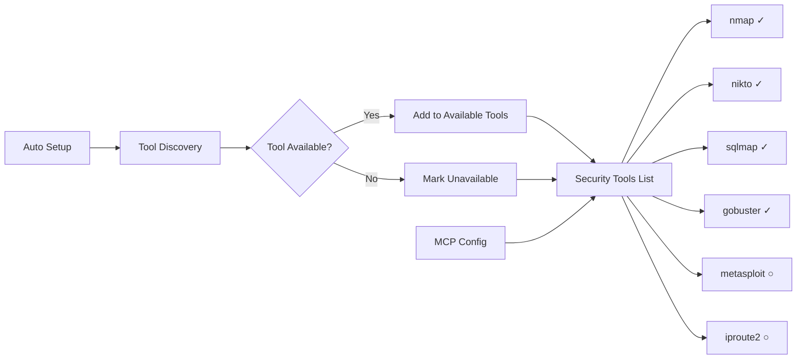
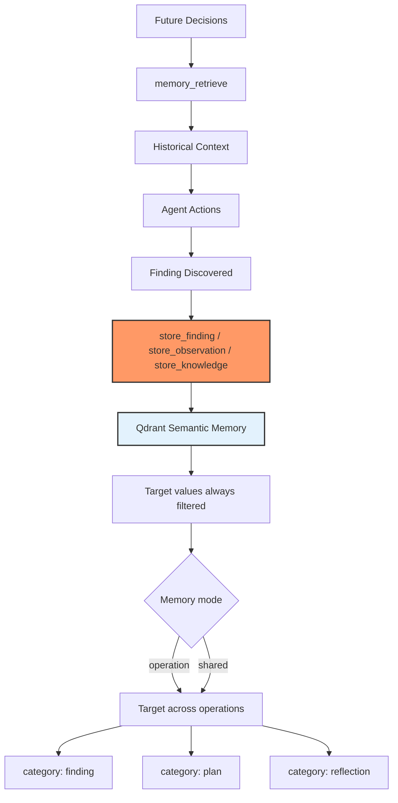

# Agent Architecture

Cyber-AutoAgent implements a **Python-orchestrated multi-agent workflow** using the Strands framework for autonomous security assessment.

## Design Philosophy: Python-Owned Workflow, Focused Agents

The core design philosophy centers on deterministic Python ownership of workflow state with short-lived agents assigned to narrow, well-defined roles.

### Why Python-Owned Orchestration?

Long-lived autonomous conversations tend to accumulate stale assumptions, lose context, and mutate plan/task state inconsistently. Cyber-AutoAgent keeps the durable operation loop in Python:

- plans, phases, and task statuses are stored in SQLite
- Python chooses the active phase and task
- Python applies task and phase evaluator decisions
- Python controls budget-aware phase progression
- agents handle reasoning, prompt tailoring, task execution, task creation, and evaluation

### Focused Agent Roles

The controller creates agents for specific jobs:

- **plan_creator**: creates or revises an initial high-level plan and infers operation-wide constraints
- **plan_critic**: reviews an initial plan and either approves it or returns actionable revision feedback
- **task_creator**: creates concrete current-phase tasks with finite acceptance contracts from a deterministic
  controller prompt
- **task_prompt_builder**: reviews core, optional-tool, and installed shell-command catalogs, then selects applicable
  memory, optional tools, and likely commands for one task
- **task_prompt_critic**: approves a proposed task execution prompt or returns actionable revision feedback
- **task_executor**: executes one active task objective and retains its conversation across critic-guided passes
- **task_evaluator**: reviews semantically complete acceptance ledgers and returns `done`, `partial_failure`, or `blocked`
- **phase_evaluator**: returns phase status: `continue`, `done`, `partial_failure`, or `blocked`

Module execution guidance supplies operation intent, explicit access boundaries, domain behavior, and evidence rules to
planning and execution roles. The module termination policy, including any advisory recommended minimum phase contract,
is also supplied directly to plan creation, plan criticism,
plan revision, and phase evaluation so required end states become measurable plan criteria. A controller-owned executor
contract keeps individual workers scoped to one task regardless of module.

Each task also has an immutable acceptance manifest. Procedure bases declare machine-readable limits and whether they
produce a generic artifact or versioned inventory manifest; coverage bases freeze one inventory artifact and its hash.
Executors submit an atomic evidence-backed result for every criterion and, for coverage work, one terminal disposition
per manifest item. Python resolves typed artifact, memory, observation, and finding evidence before semantic
evaluation. This preserves broad, cohesive work under one retained executor without allowing moving completion
targets.

### Replacement and Supersession

When a task cannot complete and its remaining intent must be split or retried as new work, replacement tasks declare
`replacement_of` with the parent task UID and identify the parent criteria they resolve in `supersedes_criteria`.
Python reconciles this lineage before phase closure. The parent becomes `superseded` only after every parent criterion is
covered and every linked replacement is `done` or `superseded`. The parent record, evidence, and failure reason remain
available for audit. Unlinked failures remain blocking, and Python does not infer replacement relationships from
similar wording.



The swarm tool remains available as an execution capability, but it is no longer the top-level orchestration model.

## Core Architecture


## Strands Tools

Agents operate through role-specific restricted tool lists.

### Primary Tools
- **shell**: Execute system commands (nmap, sqlmap, custom scripts)
- **editor**: Create/modify files and custom tools
- **swarm**: Deploy parallel agents for complex tasks
- **http_request**: Make HTTP requests for web testing
- **memory_list / memory_retrieve**: List or semantically retrieve findings and knowledge
- **load_tool**: Dynamically load created tools
- **create_tasks**: Create durable tasks when a role permits task creation

Plan/task state transitions are owned by Python workflow code. Agents can only add follow-up work with `create_tasks` when their role permits it. Active task context is injected into the role prompt by the workflow; agents do not fetch it with a tool.

There is no agent-callable stop tool. When Python workflow evaluation determines the assessment is complete, the controller emits a `termination_reason` event with reason `complete`.

Generated plan constraints are durable workflow guardrails. Task creation and prompt-building roles must honor them,
and task/phase evaluators prevent successful completion when evidence shows a constraint violation.

Initial plan generation uses a bounded actor/critic cycle before persistence. Critic approval immediately accepts the
current draft; rejection sends feedback to `plan_creator` for revision. The
`CYBER_WORKFLOW_PLAN_REFINEMENT_ITERATIONS` environment variable limits reviews and defaults to three. A rejection on
the final configured review fails the workflow so an unapproved plan is never persisted or executed.

Task prompt generation uses the same bounded pattern. `CYBER_WORKFLOW_TASK_PROMPT_REFINEMENT_ITERATIONS` defaults to
two critic reviews and accepts `0` to disable critique. After JSON retries, malformed or unavailable builder/critic
output and non-scope prompt defects that survive one bounded repair use a deterministic controller task template.
The template has no model-selected optional tools or shell commands, and selects only canonical memory references.
The controller emits `task_prompt_fallback` for that recovery. Only a valid critic response explicitly identifying a
hard target-scope violation marks the active task `partial_failure` without invoking its executor or evaluator.

Task execution then uses a second bounded actor/critic loop:



`CYBER_WORKFLOW_TASK_EXECUTION_CYCLES` limits executor attempts to produce a valid atomic ledger, defaults to three,
and has a minimum of one.
while `CYBER_TASK_ACCEPTANCE_MAX_CORRECTIONS` independently limits rejected acceptance repairs to two after the initial
submission. Repairs retain the executor conversation and stop early when an equivalent rejected payload is repeated.
Once that ledger exists, the evaluator's semantic verdict is terminal because the ledger cannot
be revised. Python persists `done`, `partial_failure`, or `blocked` without replaying completed acceptance.

Task creators stop within the Strands event loop after the first successful `create_tasks` mutation. Task executors
stop the same way after a complete `record_task_acceptance` result. Rejected calls do not set the success marker and
remain correctable; role completion therefore depends on durable success rather than raw tool-call counts or a later
text-only turn.

Every role invocation also has deterministic safety bounds. Three consecutive responses without a new tool action stop
a required-tool role as stalled, regardless of tool calls or reasoning emitted during an earlier actor cycle. An
absolute controller-to-agent call ceiling bounds repeated invocations, while the Strands SDK `turns` limit bounds model
calls and tool executions inside each invocation. Task-executor actor cycles allow 8 agent calls with 32 SDK turns per
call, bounded tool-recovery runs allow 4 calls with 8 turns, and task creators allow 3 calls with 6 turns.
No-action redirection prompts respect the role policy: roles that disallow text completion are instructed to call an
outstanding required tool and are never offered a text-only final-answer path. Task executors instead receive a
task-progress redirect because their required acceptance tool is a completion condition: they call the next tool needed
for unmet criteria and durable evidence, then submit acceptance after its prerequisites are complete.

Bounded procedure contracts declare whether their output is a generic artifact or a version-1 inventory manifest.
Python rejects mismatched evidence requirements during task creation. Inventory executors receive the canonical JSON
shape in both their task prompt and acceptance-tool description, and acceptance validation evaluates each referenced
artifact independently so an unrelated supporting file cannot invalidate a separate valid inventory.

Each retained task executor also keeps a bounded controller-owned tool-outcome journal. A locally correctable failure
permits prerequisite inspection or creation, independent work, alternative methods, and two changed retries by
default. Structured memory and acceptance validation errors enter the same correction path. Identical failed calls are
blocked locally, and equivalent failures are counted across retained executor cycles so conversation boundaries cannot
restart an unbounded loop. Recovery does not lock unrelated tools or durable evidence operations.
Generic executable startup and dependency failures quarantine only that executable for the current operation; later
task prompts omit it while capability-compatible commands remain available. An unresolved correction is
deterministically `partial_failure`. Evaluators receive the authoritative outcome journal separately from the worker's
final narrative and must prefer it when the two conflict. Failed diagnostic and preflight shell commands remain visible
in the journal but do not start recovery.

Shell-tool discovery first resolves each configured command on `PATH`. A tool may optionally declare a side-effect-free
`canary` object with `args`, `timeout_seconds`, and `accepted_exit_codes`; successful canaries mark tools verified.
Commands without a safe standalone canary remain available but unverified. The Docker tools-image verifier implements
the same configuration contract independently and is not imported by application runtime code.

Task creation similarly has a deterministic tool-loop boundary. After an initial rejected `create_tasks` call, the
controller may continue the same conversation for `CYBER_TASK_CREATOR_MAX_CORRECTIONS` correction turns (six by
default). Each turn ends after its first tool result; the initial prompt contains stable phase context and corrections
contain only the prior validation error. Generic reasoning-loop repair is disabled for this role. Agents submit a flat
`TaskProposal` whose `limits` object is always required. Python discards it and `output_kind` for snapshot work,
infers the basis, supplies procedure invariants, derives source references and target scope, and compiles the proposal
before storage. Inventory-wide moving collections are rejected as procedures and must use frozen snapshot references.
Exact frozen-contract duplicates are skipped deterministically within the active phase; completed coverage from one
phase does not suppress work against the same snapshot in a later phase. Unfinished coverage retries remain eligible,
and duplicate-only calls retain the creator tool for a bounded corrected submission.

Successful task acceptance populates task evidence with the validated immutable ledger references. Phase
evaluators receive that canonical per-criterion ledger and may read only its resolved artifact paths, preventing stale
predicted filenames from overriding accepted evidence. Task creators use a closed flat schema with explicit limits,
criterion descriptions, snapshot references, and target IDs. Python generates readable unique criterion IDs and
evidence requirements and owns the remaining contract and lifecycle fields.

Complete task acceptance also publishes one bounded operation observation containing the task objective, criterion
statuses, concrete summaries, evidence references, and aggregate coverage counts. Publication is replay-safe and lets
later task-prompt-builders select accepted information by memory ID. A memory-backend failure is reported in the tool
result but does not invalidate the immutable acceptance ledger or add an undeclared evaluator requirement.

There is also no prompt optimizer tool, prompt rebuild hook, or stalled-loop conversation rebuild fallback. Prompt
adaptation is workflow-native: prompt-builder agents receive current plan state, active phase/task context, compact task
history, memory summaries, and selected optional tool candidates. Python enforces proportional phase budget caps before
task work and handles separate advisory checkpoints before pending task activation.

### Security Tool Access

Security utilities are normally reached through the restricted shell capability. The active role receives only the
capabilities allowed for its task, and command output is captured as operation evidence.

### MCP Tool Access

MCP tools can be accessed as direct tools, but they are optional tools. They are selected per worker role and task objective, not included in every worker's core tool list.

## Execution Flow



The actor/critic loops are bounded by separate configuration values: plan refinement, task-prompt refinement, task
execution cycles plus evaluator corrections, and report refinement cycles. The controller remains the source of truth for
state transitions; agents propose plans, prompts, evidence, evaluations, or revisions but cannot directly activate or
close phases and tasks.

## Role-Agent Reasoning

Focused agents still use the Cyber-AutoAgent methodology, module guidance, confidence updates, and evidence standards. The difference is that role prompts constrain the scope of each agent.



**Key Principles:**
- **Python State Authority**: Controller owns phase/task transitions and plan completion
- **Focused Reasoning**: Agents receive narrow role prompts and task-specific context
- **Metacognitive Awareness**: Agents assess confidence within their assigned objective
- **Dynamic Capability Expansion**: Workers can use shell, selected tools, and swarm when appropriate
- **Centralized Memory**: Discoveries flow into Qdrant and reports query operation-scoped evidence

## Tool Hierarchy

Based on confidence, task complexity, and role-specific tool selection:

1. **Specialized Security Tools** (via shell)
   - When vulnerability type is known
   - High confidence scenarios
   - Direct exploitation

2. **Swarm Deployment**  
   - Multiple approaches needed
   - Medium confidence
   - Parallel reconnaissance

3. **Meta-Tool Creation** (via editor + load_tool)
   - Novel exploits required
   - No existing tool fits
   - Custom payload generation

## Environment Discovery



Tools discovered via `which` command:
- Available tools accessible via `shell`
- Unavailable tools noted but not usable
- Dynamic discovery adapts to environment

MCP Tools pre-configured:
- Python reads from `CYBER_MCP_CONNECTIONS` environment
- React reads from `config.json`
- MCP Server is assigned or one or more modules

## Memory Integration



**Memory Storage**:
1. **Plans, Tasks, and Model Metrics**: Stored in `outputs/cyber_autoagent.db`, scoped by exact logical target and
   operation ID. Model metrics are append-only per provider/model capture and include their capture timestamps.
2. **Semantic Memories**: Stored in one Qdrant collection under `outputs/qdrant`, or in the configured Qdrant service.
3. **Scope**: Exact target values are always criteria; operation ID is additionally required in `operation` mode.

**Evidence Storage Format**:
```
[VULNERABILITY] SQL Injection
[WHERE] /login.php?id=1
[IMPACT] Database access, credential extraction
[EVIDENCE] Request/response pairs, command outputs
[STEPS] Reproduction steps
[REMEDIATION] Use parameterized queries
[CONFIDENCE] 95% - Verified
```

## Model Providers

### Bedrock Provider (AWS)
- **Primary**: Claude Sonnet 4.5 (claude-sonnet-4-5-20250929-v1:0)
- **Embeddings**: Titan Text v2 (amazon.titan-embed-text-v2:0)
- **Region**: us-east-1 (default, configurable)
- **Benefits**: Latest models, managed infrastructure, reliable performance

### Ollama Provider (Local)
- **Primary**: qwen3.6:27b (default)
- **Embeddings**: mxbai-embed-large:latest
- **Benefits**: Privacy, offline, no API costs, local control

### LiteLLM Provider (Universal)
- **Primary**: 100+ models supported (OpenAI, Anthropic, Cohere, etc.)
- **Configuration**: Provider-specific API keys
- **Benefits**: Multi-provider flexibility, unified interface

## Event System and UI Integration

**AgentEventHandler** extends the Strands SDK's callback system to emit structured events for UI consumers:

### Event types emitted during operation

- tool_start: Tool invocation with parameters
- tool_end: Tool completion with results
- reasoning: Agent decision-making context
- metrics_update: Token usage, cost, duration, and budget progress
- progress_update: progress updates
- operation_init: Operation metadata and configuration

Events flow from the Python agent through stdout using the `__CYBER_EVENT__` protocol, enabling real-time monitoring without tight coupling between backend and frontend.

## Evaluation System

**Automated Performance Assessment** using Ragas metrics integrated with Langfuse:

| Metric                   | Range   | Purpose                                   |
|--------------------------|---------|-------------------------------------------|
| tool_selection_accuracy  | 0.0-1.0 | Strategic tool choice and sequencing      |
| evidence_quality         | 0.0-1.0 | Comprehensive vulnerability documentation |
| methodology_adherence    | 0.0-1.0 | Defensible methodology alignment          |
| penetration_test_quality | 0.0-1.0 | Holistic assessment quality               |

Evaluation triggers automatically after operation completion when `ENABLE_AUTO_EVALUATION=true`, providing continuous feedback for system improvement.

## Key Design Principles

1. **Python-Owned Orchestration**: Durable workflow state is managed by code, not by prompt instructions.
2. **Focused Role Agents**: Each agent receives a short, defined objective and restricted tools.
3. **Soft Budget Distribution**: Phase progress is evaluated against proportional budget targets.
4. **Evidence-Focused Memory**: Findings, observations, and proof references are stored in Qdrant for retrieval and reporting.
5. **Swarm Intelligence as a Capability**: Workers may deploy specialized sub-agents when useful, without giving up controller state authority.
6. **Tool Agnostic Execution**: Shell can access installed tools, while optional MCP/module tools are selected per task.
7. **Continuous Evaluation**: Automated performance metrics support operational improvement.

This architecture enables autonomous operation while keeping workflow control deterministic, inspectable, and resilient to context loss.
