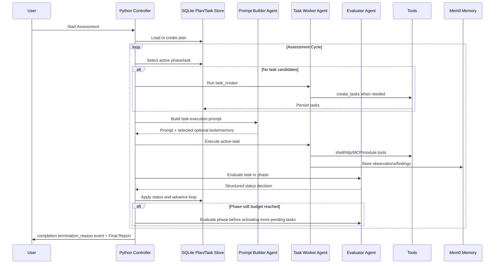
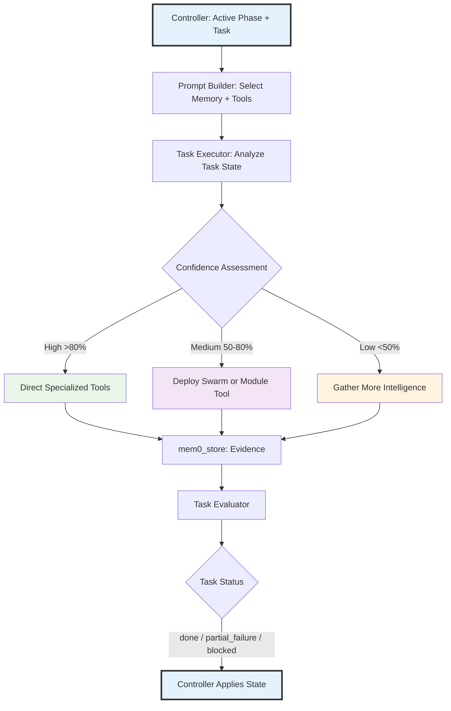
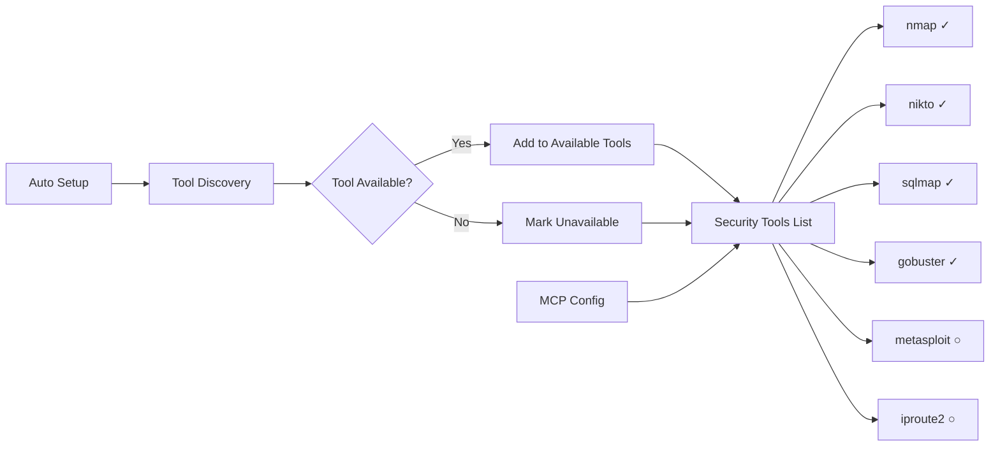
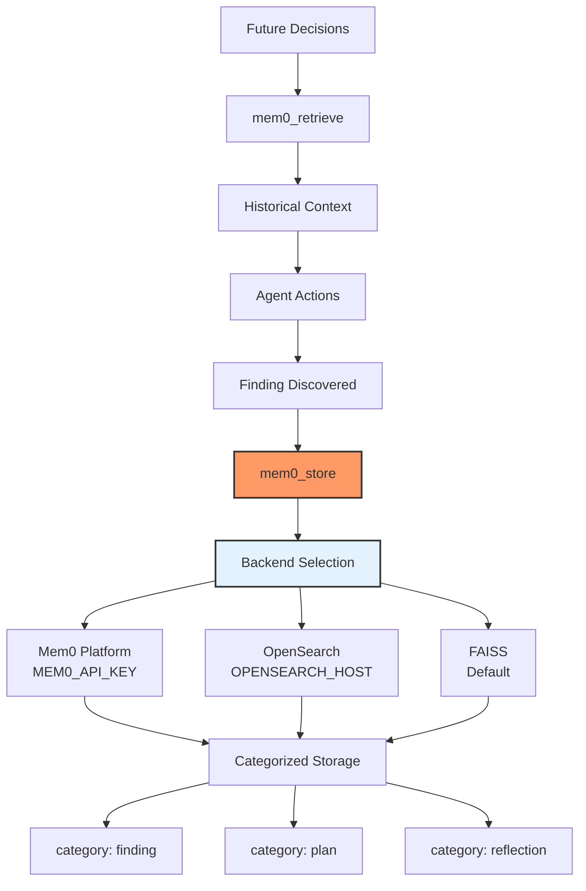

# Agent Architecture

Cyber-AutoAgent implements a **Python-orchestrated multi-agent workflow** using the Strands framework for autonomous security assessment.

## Design Philosophy: Python-Owned Workflow, Focused Agents

The core design philosophy centers on deterministic Python ownership of workflow state with short-lived agents assigned to narrow, well-defined roles.

### Why Python-Owned Orchestration?

Long-lived autonomous conversations tend to accumulate stale assumptions, lose context, and mutate plan/task state inconsistently. Cyber-AutoAgent keeps the durable operation loop in Python:

- plans, phases, and task statuses are stored in SQLite
- Python chooses the active phase and task
- Python applies task and phase evaluator decisions
- Python controls budget-aware phase progression
- agents handle reasoning, prompt tailoring, task execution, task creation, and evaluation

### Focused Agent Roles

The controller creates agents for specific jobs:

- **plan_creator**: creates an initial high-level plan and infers operation-wide constraints when none exists
- **task_creator**: creates concrete current- and future-phase tasks from a deterministic controller prompt
- **task_prompt_builder**: reviews core, optional-tool, and installed shell-command catalogs, then selects applicable
  memory, optional tools, and likely commands for one task
- **task_executor**: executes one active task objective
- **task_evaluator**: returns task status: `done`, `partial_failure`, or `blocked`
- **phase_evaluator**: returns phase status: `continue`, `done`, `partial_failure`, or `blocked`

The swarm tool remains available as an execution capability, but it is no longer the top-level orchestration model.

## Core Architecture


## Strands Tools

Agents operate through role-specific restricted tool lists.

### Primary Tools
- **shell**: Execute system commands (nmap, sqlmap, custom scripts)
- **editor**: Create/modify files and custom tools
- **swarm**: Deploy parallel agents for complex tasks
- **http_request**: Make HTTP requests for web testing
- **mem0_...**: Store/retrieve findings and knowledge
- **load_tool**: Dynamically load created tools
- **create_tasks**: Create durable tasks when a role permits task creation

Plan/task state transitions are owned by Python workflow code. Agents can only add follow-up work with `create_tasks` when their role permits it. Active task context is injected into the role prompt by the workflow; agents do not fetch it with a tool.

There is no agent-callable stop tool. When Python workflow evaluation determines the assessment is complete, the controller emits a `termination_reason` event with reason `complete`.

Generated plan constraints are durable workflow guardrails. Task creation and prompt-building roles must honor them,
and task/phase evaluators prevent successful completion when evidence shows a constraint violation.

There is also no prompt optimizer tool, prompt rebuild hook, or stalled-loop conversation rebuild fallback. Prompt adaptation is workflow-native: prompt-builder agents receive current plan state, active phase/task context, compact task history, memory summaries, and selected optional tool candidates. Budget checkpoints are handled by Python control flow before pending task activation.

### Security Tool Access

Security tools are accessed **via shell**, not as direct tools:

```python
# Agent uses shell tool to run security commands
shell("nmap -sV 192.168.1.1")
shell("sqlmap -u 'http://target.com?id=1' --batch")
shell("nikto -h target.com")
```

### MCP Tool Access

MCP tools can be accessed as direct tools, but they are optional tools. They are selected per worker role and task objective, not included in every worker's core tool list.

## Execution Flow



## Role-Agent Reasoning

Focused agents still use the Cyber-AutoAgent methodology, module guidance, confidence updates, and evidence standards. The difference is that role prompts constrain the scope of each agent.



**Key Principles:**
- **Python State Authority**: Controller owns phase/task transitions and plan completion
- **Focused Reasoning**: Agents receive narrow role prompts and task-specific context
- **Metacognitive Awareness**: Agents assess confidence within their assigned objective
- **Dynamic Capability Expansion**: Workers can use shell, selected tools, and swarm when appropriate
- **Centralized Memory**: Discoveries flow into mem0 and reports query that memory

## Tool Hierarchy

Based on confidence, task complexity, and role-specific tool selection:

1. **Specialized Security Tools** (via shell)
   - When vulnerability type is known
   - High confidence scenarios
   - Direct exploitation

2. **Swarm Deployment**  
   - Multiple approaches needed
   - Medium confidence
   - Parallel reconnaissance

3. **Meta-Tool Creation** (via editor + load_tool)
   - Novel exploits required
   - No existing tool fits
   - Custom payload generation

## Environment Discovery



Tools discovered via `which` command:
- Available tools accessible via `shell`
- Unavailable tools noted but not usable
- Dynamic discovery adapts to environment

MCP Tools pre-configured:
- Python reads from `CYBER_MCP_CONNECTIONS` environment
- React reads from `config.json`
- MCP Server is assigned or one or more modules

## Memory Integration



**Memory Backend Selection**:
1. **Plans and Tasks**: Stored in a local SQLite database (`plan_store.db`).
2. **Semantic Memories**:
   - **Mem0 Platform** - If `MEM0_API_KEY` environment variable is set
   - **OpenSearch** - If `OPENSEARCH_HOST` environment variable is set
   - **FAISS** - Default local vector storage if neither is configured

**Evidence Storage Format**:
```
[VULNERABILITY] SQL Injection
[WHERE] /login.php?id=1
[IMPACT] Database access, credential extraction
[EVIDENCE] Request/response pairs, command outputs
[STEPS] Reproduction steps
[REMEDIATION] Use parameterized queries
[CONFIDENCE] 95% - Verified
```

## Model Providers

### Bedrock Provider (AWS)
- **Primary**: Claude Sonnet 4.5 (claude-sonnet-4-5-20250929-v1:0)
- **Embeddings**: Titan Text v2 (amazon.titan-embed-text-v2:0)
- **Region**: us-east-1 (default, configurable)
- **Benefits**: Latest models, managed infrastructure, reliable performance

### Ollama Provider (Local)
- **Primary**: qwen3-coder:30b-a3b-q4_K_M (default)
- **Embeddings**: mxbai-embed-large:latest
- **Benefits**: Privacy, offline, no API costs, local control

### LiteLLM Provider (Universal)
- **Primary**: 100+ models supported (OpenAI, Anthropic, Cohere, etc.)
- **Configuration**: Provider-specific API keys
- **Benefits**: Multi-provider flexibility, unified interface

## Event System and UI Integration

**AgentEventHandler** extends the Strands SDK's callback system to emit structured events for UI consumers:

### Event types emitted during operation

- tool_start: Tool invocation with parameters
- tool_end: Tool completion with results
- reasoning: Agent decision-making context
- metrics_update: Token usage, cost, duration, and budget progress
- progress_update: progress updates
- operation_init: Operation metadata and configuration

Events flow from the Python agent through stdout using the `__CYBER_EVENT__` protocol, enabling real-time monitoring without tight coupling between backend and frontend.

## Evaluation System

**Automated Performance Assessment** using Ragas metrics integrated with Langfuse:

| Metric                   | Range   | Purpose                                   |
|--------------------------|---------|-------------------------------------------|
| tool_selection_accuracy  | 0.0-1.0 | Strategic tool choice and sequencing      |
| evidence_quality         | 0.0-1.0 | Comprehensive vulnerability documentation |
| methodology_adherence    | 0.0-1.0 | Defensible methodology alignment          |
| penetration_test_quality | 0.0-1.0 | Holistic assessment quality               |

Evaluation triggers automatically after operation completion when `ENABLE_AUTO_EVALUATION=true`, providing continuous feedback for system improvement.

## Key Design Principles

1. **Python-Owned Orchestration**: Durable workflow state is managed by code, not by prompt instructions.
2. **Focused Role Agents**: Each agent receives a short, defined objective and restricted tools.
3. **Soft Budget Distribution**: Phase progress is evaluated against proportional budget targets.
4. **Evidence-Focused Memory**: Findings, observations, and proof artifacts are stored in mem0 for retrieval and reporting.
5. **Swarm Intelligence as a Capability**: Workers may deploy specialized sub-agents when useful, without giving up controller state authority.
6. **Tool Agnostic Execution**: Shell can access installed tools, while optional MCP/module tools are selected per task.
7. **Continuous Evaluation**: Automated performance metrics support operational improvement.

This architecture enables autonomous operation while keeping workflow control deterministic, inspectable, and resilient to context loss.
