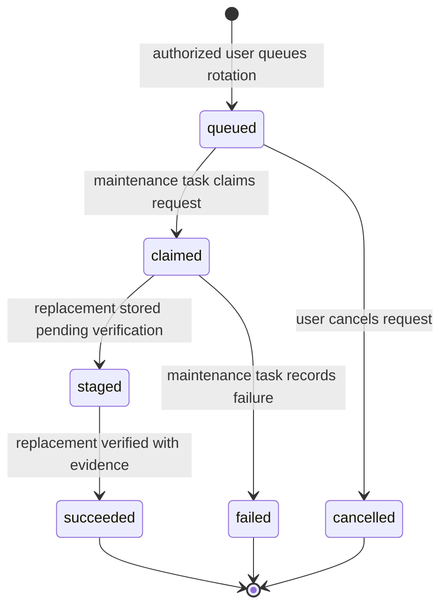

# Credential rotation lifecycle

The credential manager lists only safe metadata for a resolved target: type, role, scope, origin, lifecycle status,
account and tenant labels, lineage, status history, and rotation request history. It never renders credential payloads.

Only operation-managed credentials can be rotated. A user-provided credential remains immutable to operations and must
be changed through the configuration or import path.

The prior credential is retired only when the staged replacement is completed with durable evidence references. A
failed or cancelled request is retained for audit and neither credential is deleted.

Starting a request creates the sole active maintenance task and records its task UID on the request. The task is bound
to both the request and maintenance operation ID; other tasks cannot stage, complete, or fail it, and task fan-out is
disabled for the maintenance operation.

For email MFA, workflow agents call `begin_email_mfa_retrieval` before triggering the target to send mail, then call
`retrieve_email_mfa_code` with the returned challenge ID. The snapshot records IMAP UIDVALIDITY and the highest UID;
retrieval accepts only newer messages from the same mailbox generation. The legacy one-step retrieval remains solely
for standalone compatibility.
