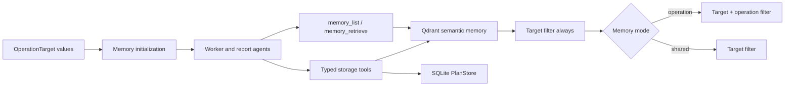

# Memory System

Cyber-AutoAgent uses two complementary persistence layers:

- Qdrant stores semantic memories such as observations, verified findings, validation records, and reusable knowledge.
- SQLite stores authoritative workflow state such as operation plans, phases, tasks, acceptance outcomes, and finding validation.

Qdrant is the only semantic-memory backend. By default it runs as an embedded filesystem database under
`./outputs/qdrant`. A Qdrant service can be configured without changing the memory model or agent tools.

## Architecture



All operations use the same physical Qdrant database. Query scope is controlled by payload filters, not by creating a
different database for each target or operation.

## Identity and isolation

Every semantic-memory point contains:

- `target_values`: exact values from the operation's `OperationTarget` records.
- `operation_id`: the operation that created the point.
- `memory`: searchable content.
- `metadata`: category, status, evidence references, and other typed-memory fields.

Target filtering is mandatory for every list, search, get, and delete operation. Sanitized output-directory names are
never used as target identity.

The `--memory-mode` option controls only query scope:

| Mode | Qdrant criteria | Intended use |
| --- | --- | --- |
| `operation` | Target value and operation ID | Isolate retrieval to the current run. This is the default. |
| `shared` | Target value | Reuse knowledge from other operations against the same target. |

Writes always retain both target values and operation ID, including in shared mode. This preserves provenance and lets
operation reports select their own authoritative records.

Examples:

```bash
# Isolated retrieval for a new operation
uv run python src/cyberautoagent.py --target https://example.com --memory-mode operation

# Reuse memories from earlier operations against exactly the same target value
uv run python src/cyberautoagent.py --target https://example.com --memory-mode shared
```

The former `auto` and `fresh` values are no longer CLI values. Persisted React configuration is normalized once:
`auto` becomes `shared`, and `fresh` becomes `operation`.

## Storage options

### Embedded filesystem storage

No service configuration is required. The default layout is:

```text
outputs/
├── qdrant/                         # Semantic memories for every operation
└── <sanitized-target>/
    └── memory/
        └── <operation-id>/
            └── plan_storage.db     # Authoritative plan/task state
```

The embedded client is suitable for a single Cyber-AutoAgent process. Use a Qdrant service when multiple processes or
hosts need concurrent access.

### Qdrant service

Set `QDRANT_URL` to use a service. Set `QDRANT_API_KEY` when the service requires authentication.

```bash
export QDRANT_URL=http://localhost:6333
export QDRANT_API_KEY=optional-secret
uv run python src/cyberautoagent.py --target https://example.com
```

The Docker Compose file includes an optional Qdrant service profile:

```bash
QDRANT_URL=http://qdrant:6333 docker compose --profile qdrant up
```

Its data is persisted in the repository `outputs/qdrant` directory.

## Agent tools

Agents use provider-neutral names:

- `memory_list`: returns a bounded list in the configured target/operation scope.
- `memory_retrieve`: performs semantic retrieval in that same scope and accepts metadata filters.
- Typed storage tools such as `store_observation`, `store_finding`, and `record_finding_validation` enforce their own
  schemas and write semantic or workflow records as appropriate.

Workflow bookkeeping tools are intentionally separate from semantic retrieval. Qdrant does not replace SQLite as the
authoritative source for task, phase, acceptance, or validation status.

Workflow prompts exclude automatically published task-acceptance memories and any semantic plan/task bookkeeping.
Those records remain available for audit and reporting, while agents receive the controller-owned task history and
acceptance ledger instead. Ordinary observations, findings, validation outcomes, and reusable knowledge remain eligible
as supporting prompt context in either memory mode.

Reports apply the same distinction to informational observations: task-acceptance and plan/task bookkeeping records
remain in canonical evidence for auditability, but are omitted from the informational-observations narrative and its
LLM context because the deterministic task and acceptance tables already represent them.

## Embeddings

Qdrant stores vectors generated by the configured operation embedding provider. The collection has one configured
dimension, so changing to a model with a different vector size requires a new collection name or an explicit migration.
The application validates vector dimensions before writing.

No automatic import of legacy semantic-memory files is performed. Keep old output directories as archives or migrate
them with a purpose-built, reviewed process.

## Configuration

| Variable | Default | Description |
| --- | --- | --- |
| `CYBER_MEMORY_MODE` | `operation` | Query scope: `operation` or `shared`. |
| `QDRANT_URL` | unset | Qdrant service URL. Unset selects filesystem storage. |
| `QDRANT_API_KEY` | unset | Optional Qdrant service API key. |
| `QDRANT_COLLECTION` | `cyber_autoagent_memories` | Semantic-memory collection name. |
| `CYBER_AGENT_OUTPUT_DIR` | `./outputs` | Parent of the local `qdrant` directory and operation outputs. |
| `CYBER_AGENT_EMBEDDING_MODEL` | provider default | Embedding model used for Qdrant vectors. |
| `MEMORY_LIST_LIMIT` | `100` | Maximum default records returned by bounded list operations. |

These variables are represented in `.env.example`; Docker Compose forwards the service-related values.

## Cleanup and reporting

When memory retention is disabled, cleanup deletes points matching the operation ID and leaves the shared database and
other operations untouched. Raw artifacts are not modified.

Reports use the current operation's SQLite records and operation-tagged semantic evidence. Shared mode helps agent
reasoning across earlier runs but does not allow another operation to overwrite current operation status, counts, or
validation outcomes.

## Troubleshooting

- **Qdrant cannot open the local path:** verify `CYBER_AGENT_OUTPUT_DIR` is writable and only one process owns the
  embedded database. Use a service for concurrent processes.
- **Dimension mismatch:** choose an embedding model matching the collection dimension or configure a new collection.
- **No shared results:** target values must match exactly. A URL and hostname are distinct unless both are explicit
  `OperationTarget` values.
- **Service connection failure:** check `QDRANT_URL`, credentials, network access, and the service health endpoint.
