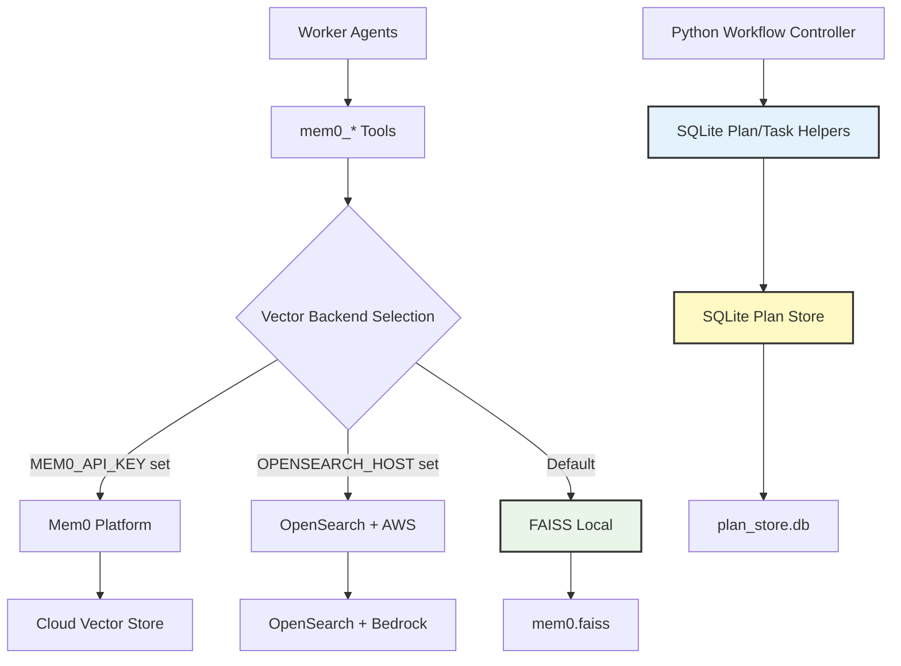
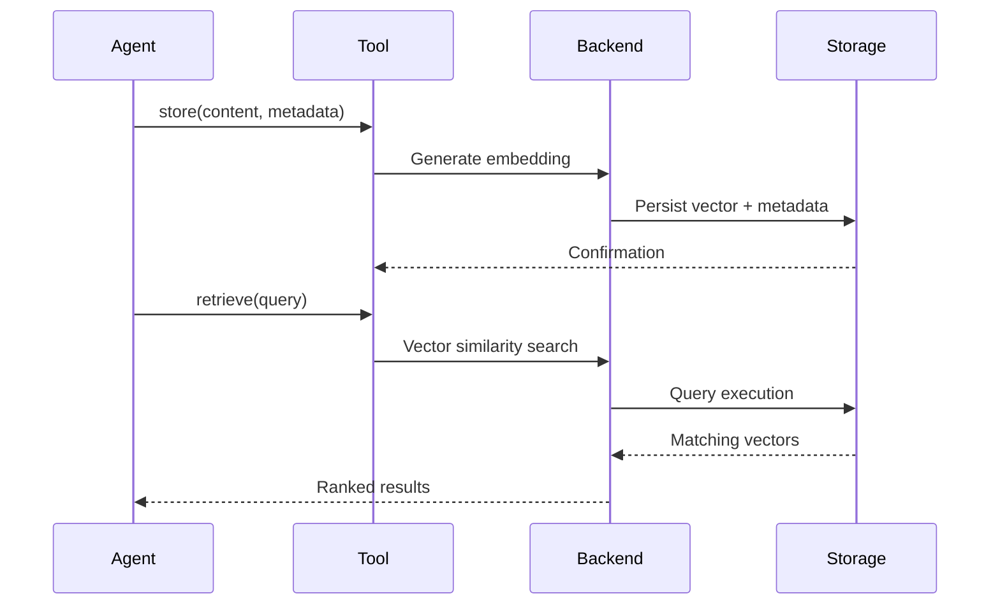

# Memory System

Cyber-AutoAgent implements persistent memory using Mem0 with automatic reflection and evidence categorization. The system uses a hybrid storage approach: a local SQLite database for structured plans and tasks, and a vector backend (Mem0 Platform, OpenSearch, or FAISS) for semantic memories.

## Key Features

- **Operation Scoping**: Memories and task state are automatically scoped to the current operation via `run_id`
- **Cross-Operation Learning**: Query semantic memories across all operations using `cross_operation=True`
- **Hybrid Storage**: Relational data (plans, tasks) uses SQLite; semantic data uses vector stores
- **Thread-Safe Writes**: SQLite and FAISS backends use locking for safe concurrent writes
- **Category Validation**: Invalid categories are auto-corrected to prevent empty reports
- **Status Validation**: Contradictory status fields are automatically reconciled

## Architecture

The memory system employs a hybrid architecture to balance structured task tracking with unstructured semantic search.



## Backend Selection

Backend configuration follows environment-based precedence:

**Priority Order:**
1. **Mem0 Platform**: `MEM0_API_KEY` configured - Cloud-hosted service
2. **OpenSearch**: `OPENSEARCH_HOST` configured - AWS managed search
3. **FAISS**: Default - Local vector storage

Backend selection occurs at memory initialization and remains fixed for operation duration.

## Memory Operations



## Backend Configurations

### FAISS Backend
**Default Configuration:**
- **Storage Location**:
  - Default (operation isolation): `./outputs/<target>/memory/<operation_id>/`
  - Shared mode (`MEMORY_ISOLATION=shared`): `./outputs/<target>/memory/`
- **Embedder**: AWS Bedrock Titan Text v2 (1024 dimensions)
- **LLM**: Claude 3.5 Sonnet
- **Characteristics**: Local persistence, no external dependencies, thread-safe writes

### OpenSearch Backend
**AWS Managed Configuration:**
- **Storage**: AWS OpenSearch Service
- **Embedder**: AWS Bedrock Titan Text v2 (1024 dimensions)
- **LLM**: Claude 3.5 Sonnet
- **Characteristics**: Scalable search, managed infrastructure

### Mem0 Platform
**Cloud Service Configuration:**
- **Storage**: Mem0 managed infrastructure
- **Configuration**: Platform-managed
- **Characteristics**: Zero-setup, fully managed

## Memory Categorization

Evidence storage employs structured metadata for efficient retrieval and analysis:

```python
# Finding storage with metadata
mem0_store(
    content="[WHAT] SQL injection [WHERE] /login [IMPACT] Auth bypass [EVIDENCE] payload",
    metadata={
        "category": "finding",
        "severity": "CRITICAL",
        "confidence": "95%",
        "status": "verified"
    }
)
```

### Category Taxonomy

**Report-Generating Categories** (appear in final reports):
- **finding**: Exploited vulnerabilities, extracted data, confirmed security issues
- **signal**: Security signals that warrant attention
- **observation**: Reconnaissance data, failed attempts, recon findings
- **discovery**: Techniques learned, patterns identified

**Internal Categories** (not in reports):
- **plan**: Strategic assessment roadmaps
- **decision**: Tactical decisions and pivot reasoning

**Category Decision Tree** (CRITICAL - wrong category = empty report):
```
Q: Did you EXPLOIT something or extract sensitive data?
   YES → category="finding" (SQLi data dump, auth bypass, flag, RCE, creds)
   NO  → Q: Did you CONFIRM a vulnerability exists?
            YES → category="finding" (XSS fires, IDOR returns other user data)
            NO  → category="observation" (recon, tech stack, failed attempts)
```

**Severity Levels** (for findings):
- **CRITICAL**: Remote code execution, authentication bypass, data breach
- **HIGH**: Significant security impact, privilege escalation
- **MEDIUM**: Moderate risk, information disclosure
- **LOW**: Minor security concerns, informational

## Advanced Features

### Budget-Aware Phase Evaluation

Plan evaluation is triggered by the Python workflow controller. Budget progress is a soft cap distributed across phases:

```text
soft_cap = phase_id / total_phases * 100
```

When a phase reaches its soft cap and only pending work remains, the controller runs a `phase_evaluator` agent before activating more work. The evaluator returns `continue`, `done`, `partial_failure`, or `blocked`; Python stores the result and advances the plan when appropriate.

### Strategic Plan Management

Hierarchical planning with phase tracking is stored in SQLite by Python workflow helpers:

```python
plan = {
    "objective": "Compromise web application",
    "current_phase": 1,
    "total_phases": 3,
    "phases": [
        {"id": 1, "title": "Reconnaissance", "status": "active", "criteria": "Map attack surface"},
        {"id": 2, "title": "Exploitation", "status": "pending", "criteria": "Exploit vulnerabilities"},
        {"id": 3, "title": "Post-Exploitation", "status": "pending", "criteria": "Document impact"}
    ],
    "assessment_complete": false
}
```

**Required Plan Fields:**
- `objective`: Overall mission goal
- `current_phase`: Active phase number
- `total_phases`: Total number of phases
- `phases`: List of phase objects with `id`, `title`, `status`, `criteria`
- `assessment_complete`: Whether all phases are terminal

**Phase Status Values:**
- `active`
- `pending`
- `done`
- `partial_failure`
- `blocked`

### Reflection via Plan Updates

Tactical pivots are managed by evaluator decisions and Python plan updates:

```python
phase_decision = {"status": "partial_failure", "reason": "Soft budget reached; remaining work deferred"}
# Python records phase status, activates the next pending phase, and leaves pending tasks durable.
```

## Storage Structure

### FAISS Backend Layout (Default - Per-Operation Isolation)
```
./outputs/<target>/memory/<operation_id>/
├── mem0.faiss           # Vector embeddings (FAISS index)
├── mem0.pkl             # Metadata storage (pickle: docstore + ID mapping)
└── plan_store.db        # SQLite database (Plans and Tasks)
```

### FAISS Backend Layout (Shared Mode)
```
./outputs/<target>/memory/
├── mem0.faiss           # Vector embeddings (FAISS index)
├── mem0.pkl             # Metadata storage (pickle: docstore + ID mapping)
└── plan_store.db        # SQLite database (Plans and Tasks)
```

### Operation Output Structure
```
./outputs/<target>/<operation_id>/
├── artifacts/                      # Operation artifacts
├── security_assessment_report.md   # Final assessment report
├── security_assessment_report.json # Final assessment report data (can be used in other tools)
└── logs/                           # Operation logs
    └── cyber_operations.log
```

## Memory Tool Usage

### Basic Operations
```python
# Store finding with metadata
mem0_store(
    content="[WHAT] RCE [WHERE] /upload [IMPACT] Shell access [EVIDENCE] shell.php",
    metadata={"category": "finding", "severity": "critical", "confidence": "98%"}
)

# Search memories  
mem0_retrieve(query="SQL injection")

# List all memories
mem0_list()
```

### Advanced Operations

Agents should use semantic memory tools for observations, findings, and evidence:

```python
mem0_store(
    content="[WHAT] SQL injection hypothesis [WHERE] /login [EVIDENCE] /outputs/.../request.txt",
    metadata={"category": "observation", "confidence": "65%"}
)

mem0_retrieve(query="authentication findings")
mem0_list()
```

The Python workflow controller uses direct memory service calls for plans and tasks. Normal worker agents should not call plan/task mutation tools directly, except `create_tasks` when their role prompt permits task creation.

### Memory Query Patterns
```python
# Semantic search (current operation only - default)
mem0_retrieve(query="SQL injection vulnerabilities")

# Search with metadata filter
mem0_retrieve(
    query="authentication bypass",
    metadata={"category": "finding", "severity": "CRITICAL"}
)

# Cross-operation learning (search ALL operations)
mem0_retrieve(
    query="SQL injection techniques",
    cross_operation=True  # Enables cross-learning
)

# List memories from current operation
mem0_list()

# List all memories across operations
mem0_list(cross_operation=True)
```

### Cross-Operation Learning
```python
# Learn from past successful exploits
mem0_retrieve(
    query="successful exploitation techniques",
    metadata={"status": "verified"},
    cross_operation=True
)

# Find what blocked previous attempts
mem0_retrieve(
    query="blocked or filtered",
    metadata={"category": "observation"},
    cross_operation=True
)
```

## Configuration

### Local Mode (Ollama)
```python
config = {
    "embedder": {"provider": "ollama", "config": {"model": "mxbai-embed-large:latest"}},
    "llm": {"provider": "ollama", "config": {"model": "llama3.2:3b"}}
}
```

### Remote Mode (AWS Bedrock)
```python
config = {
    "embedder": {"provider": "aws_bedrock", "config": {"model": "amazon.titan-embed-text-v2:0"}},
    "llm": {"provider": "aws_bedrock", "config": {"model": "us.anthropic.claude-sonnet-4-5-20250929-v1:0"}}
}
```

## Operational Guidelines

### Finding Documentation Format

Structured finding format ensures consistent evidence collection:

```
[WHAT] Vulnerability classification
[WHERE] Precise location identifier
[IMPACT] Business and technical impact
[EVIDENCE] Reproduction steps and proof
```

### Metadata Standards

**Required Fields:**
- **category**: Taxonomy classification (finding, observation, discovery, signal) - **REQUIRED, missing category raises error**
- **severity**: Risk level for findings (CRITICAL/HIGH/MEDIUM/LOW)
- **confidence**: Assessment certainty (percentage, e.g., "85%")

> **Note**: The `category` field is mandatory for store operations. Attempting to store without a category will raise a `ValueError` with guidance on proper categorization.

**Optional Fields:**
- **status**: Verification state (hypothesis, unverified, verified)
- **validation_status**: Submission state (hypothesis, unverified, verified)
- **technique**: Exploitation technique used
- **challenge_id**: CTF challenge identifier

### Status Validation

The memory system automatically validates and corrects inconsistent status fields:

```python
# These contradictions are auto-corrected:
# status="verified" + validation_status="hypothesis" → validation_status="verified"
# validation_status="verified" + status="hypothesis" → status="verified"

# FORBIDDEN: status="solved" is ambiguous and auto-converts to "hypothesis"
# Use status="verified" for confirmed findings
```

### Plan Management

**Lifecycle:**
1. Python loads the current plan or runs `plan_creator` when none exists.
2. Python ensures exactly one active phase.
3. Python activates existing active tasks first, then pending tasks when budget policy allows.
4. Evaluator agents return task/phase decisions.
5. Python records `done`, `partial_failure`, or `blocked` and advances the plan.

### Plan-Based Strategy Updates

**Operational Flow:**
- Check phase progress against the soft phase budget target.
- Run `phase_evaluator` when no tasks remain or soft budget suggests moving on.
- Store updated phase status in SQLite through Python helpers.
- Leave pending work durable when the controller advances to preserve budget for later phases.

### Query Optimization

**Efficiency Techniques:**
- Pre-query deduplication checks
- Metadata-based filtering
- Specific query construction
- Result ranking utilization

## Configuration Options

### Command Line Arguments

```bash
# Specify memory path
--memory-path ./outputs/<target>/memory/

# Memory persistence (default: enabled)
--keep-memory

# Memory storage location
# Format: ./outputs/<target>/memory/
```

### Memory Persistence

**Default Behavior (Operation Isolation):**
- Each operation gets its own isolated memory store
- No automatic cross-operation contamination
- Use `cross_operation=True` to explicitly query across operations

**Shared Mode (`MEMORY_ISOLATION=shared`):**
- All operations share a single memory store per target
- Automatic cross-operation learning
- Use `run_id` filtering for operation-specific queries

**Storage Path Patterns:**
```
# Default (operation isolation)
./outputs/<target>/memory/<operation_id>/

# Shared mode
./outputs/<target>/memory/
```

### Environment Variables

| Variable             | Default        | Description                                                |
|----------------------|----------------|------------------------------------------------------------|
| `MEMORY_ISOLATION`   | `operation`    | `operation` for isolated stores, `shared` for single store |
| `CYBER_OPERATION_ID` | Auto-generated | Operation identifier for scoping                           |
| `MEM0_LIST_LIMIT`    | `100`          | Default limit for list/retrieve operations                 |

Memory isolation ensures target-specific knowledge remains separated while enabling explicit cross-operation learning when needed via the `cross_operation` parameter.
