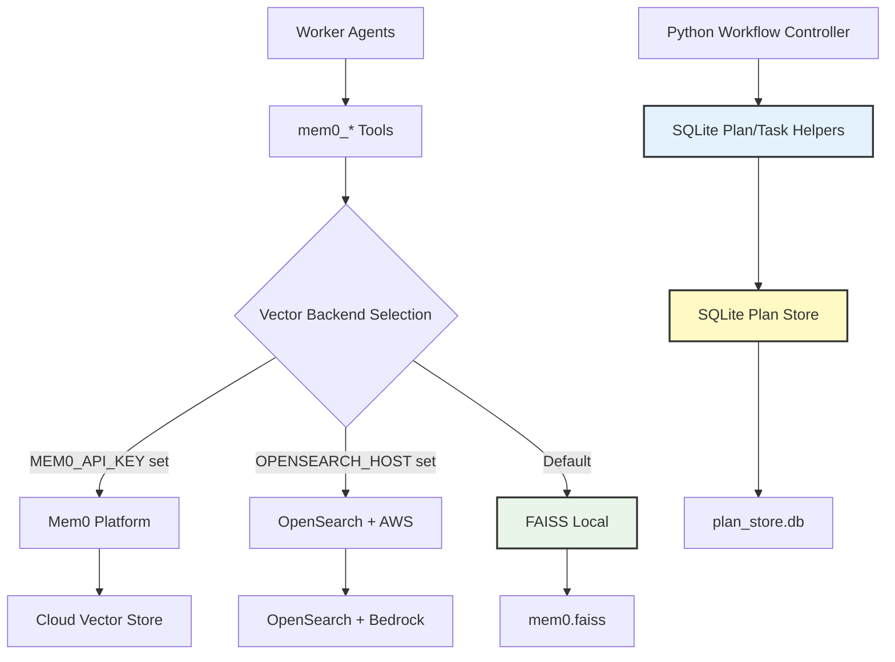
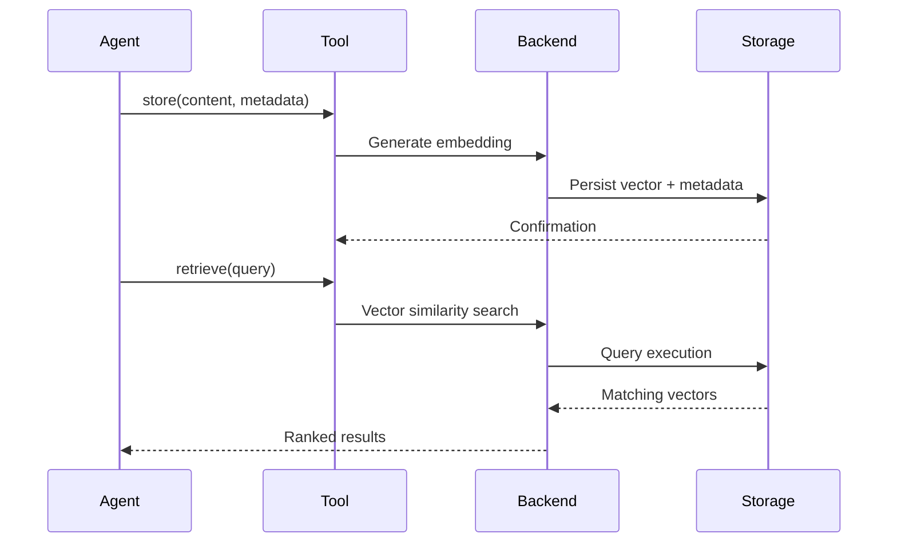

# Memory System

Cyber-AutoAgent implements persistent memory using Mem0 with automatic reflection and evidence categorization. The system uses a hybrid storage approach: a local SQLite database for structured plans and tasks, and a vector backend (Mem0 Platform, OpenSearch, or FAISS) for semantic memories.

## Key Features

- **Operation Scoping**: Memories and task state are automatically scoped to the current operation via `run_id`
- **Cross-Operation Learning**: Query semantic memories across all operations using `cross_operation=True`
- **Hybrid Storage**: Relational data (plans, tasks) uses SQLite; semantic data uses vector stores
- **Thread-Safe Writes**: SQLite and FAISS backends use locking for safe concurrent writes
- **Category Validation**: Invalid categories are auto-corrected to prevent empty reports
- **Status Validation**: Contradictory status fields are automatically reconciled
- **Target Scoping**: Plans store executable target literals separately from the logical `--target` output label, and
  tasks carry `all` or `subset` target scopes.

## Architecture

The memory system employs a hybrid architecture to balance structured task tracking with unstructured semantic search.



## Backend Selection

Backend configuration follows environment-based precedence:

**Priority Order:**
1. **Mem0 Platform**: `MEM0_API_KEY` configured - Cloud-hosted service
2. **OpenSearch**: `OPENSEARCH_HOST` configured - AWS managed search
3. **FAISS**: Default - Local vector storage

Backend selection occurs at memory initialization and remains fixed for operation duration.

## Memory Operations



## Backend Configurations

### FAISS Backend
**Default Configuration:**
- **Storage Location**:
  - Default (operation isolation): `./outputs/<target>/memory/<operation_id>/`
  - Shared mode (`MEMORY_ISOLATION=shared`): `./outputs/<target>/memory/`
- **Embedder**: AWS Bedrock Titan Text v2 (1024 dimensions)
- **LLM**: Claude 3.5 Sonnet
- **Characteristics**: Local persistence, no external dependencies, thread-safe writes

### OpenSearch Backend
**AWS Managed Configuration:**
- **Storage**: AWS OpenSearch Service
- **Embedder**: AWS Bedrock Titan Text v2 (1024 dimensions)
- **LLM**: Claude 3.5 Sonnet
- **Characteristics**: Scalable search, managed infrastructure

### Mem0 Platform
**Cloud Service Configuration:**
- **Storage**: Mem0 managed infrastructure
- **Configuration**: Platform-managed
- **Characteristics**: Zero-setup, fully managed

## Memory Categorization

Evidence storage employs structured metadata for efficient retrieval and analysis. Observations capture factual
observations, knowledge captures reusable lessons, and findings include claims, severity, target, technique, expected
and observed results, reproduction steps, and artifact references.

Successful `record_task_acceptance` calls automatically publish one operation-scoped observation for the completed
task. The observation contains concrete criterion statuses and summaries, direct evidence references, and bounded
coverage aggregates. Metadata identifies `source=task_acceptance`, the task UID, phase, targets, acceptance manifest,
and a replay-safe publication key. Later task-prompt-builders can select this memory when it applies to a new objective.
Publication warnings do not invalidate the already persisted acceptance ledger; explicit `memory` or `observation`
acceptance requirements still require their referenced evidence to exist before acceptance is recorded.

`store_finding` requires at least one existing artifact path and an `observed_result` that describes concrete observed
behavior. Assumptions, hypothetical findings, or unread output should be stored as observations or follow-up tasks
instead of findings.

## Target Registry and Task Scope

The CLI `--target` value is always treated as the logical operation label used for output naming. The workflow builds an
executable target registry from exact target literals in the objective first, including URLs, IP addresses, CIDR ranges,
FQDNs, host:port values, and resolvable filesystem paths. If the objective contains no executable targets, the logical
`--target` value is used as the fallback executable target.

Tasks can cover all executable targets or a subset:

```json
{
  "tasks": [
    {
      "title": "Enumerate login routes",
      "objective": "Enumerate login routes on http://dvwa.local",
      "target_scope": "subset",
      "target_ids": ["target-1"]
    }
  ]
}
```

`target_ids` must match the registry exactly. Placeholder or unknown IDs are rejected. Finding-verification tasks inherit
the exact finding target when it matches the registry, and final reports include a deterministic Target Coverage section.

### Category Taxonomy

- **observation**: Operation-specific facts, reconnaissance, failed attempts, and informational behavior.
- **knowledge**: Reusable techniques and lessons. Knowledge is retrievable but excluded from reports.
- **finding_candidate**: A claim submitted through `store_finding`; it automatically creates one verification task.
- **finding**: A candidate promoted only after its verification task and evaluator approve the evidence.
- **validation_failure**: A claim that was rejected, not confirmed, incomplete, or still pending at report time.

Legacy `signal` and `discovery` memories are read as observations. Legacy `decision` memories remain internally
retrievable but are excluded from reports. New workflow decisions are stored in plans, tasks, evaluator results, and
logs rather than semantic memory.

**Severity Levels** (for findings):
- **CRITICAL**: Remote code execution, authentication bypass, data breach
- **HIGH**: Significant security impact, privilege escalation
- **MEDIUM**: Moderate risk, information disclosure
- **LOW**: Minor security concerns, informational

## Advanced Features

### Budget-Aware Phase Evaluation

Plan evaluation is triggered by the Python workflow controller. Budget progress is distributed across phases using
mandatory caps:

```text
phase_cap = phase_id / total_phases * 100
```

When a phase reaches its cap, the controller stops its task work and runs `phase_evaluator` with terminal-only outcomes.
Python stores `done`, `partial_failure`, or `blocked` and advances the plan. Separate 20%, 40%, 60%, 80%, and 90%
checkpoints remain advisory below the phase cap and may return `continue`.

### Strategic Plan Management

Hierarchical planning with phase tracking is stored in SQLite by Python workflow helpers:

```python
plan = {
    "objective": "Compromise web application",
    "constraints": [
        "Use only network-accessible target interfaces",
        "Keep activity within the authorized target scope",
        "Support findings with durable artifact evidence"
    ],
    "current_phase": 1,
    "total_phases": 3,
    "phases": [
        {"id": 1, "title": "Reconnaissance", "status": "active", "criteria": "Map attack surface"},
        {"id": 2, "title": "Exploitation", "status": "pending", "criteria": "Exploit vulnerabilities"},
        {"id": 3, "title": "Post-Exploitation", "status": "pending", "criteria": "Document impact"}
    ],
    "assessment_complete": false
}
```

**Required Plan Fields:**
- `objective`: Overall mission goal
- `constraints`: Operation-wide guardrails inferred during plan generation from the objective and active prompts
- `current_phase`: Active phase number
- `total_phases`: Total number of phases
- `phases`: List of phase objects with `id`, `title`, `status`, `criteria`
- `assessment_complete`: Whether all phases are terminal

**Phase Status Values:**
- `active`
- `pending`
- `done`
- `partial_failure`
- `blocked`

### Reflection via Plan Updates

Tactical pivots are managed by evaluator decisions and Python plan updates:

```python
phase_decision = {"status": "partial_failure", "reason": "Soft budget reached; remaining work deferred"}
# Python records phase status, activates the next pending phase, and leaves pending tasks durable.
```

## Storage Structure

### FAISS Backend Layout (Default - Per-Operation Isolation)
```
./outputs/<target>/memory/<operation_id>/
├── mem0.faiss           # Vector embeddings (FAISS index)
├── mem0.pkl             # Metadata storage (pickle: docstore + ID mapping)
└── plan_store.db        # SQLite database (Plans and Tasks)
```

### FAISS Backend Layout (Shared Mode)
```
./outputs/<target>/memory/
├── mem0.faiss           # Vector embeddings (FAISS index)
├── mem0.pkl             # Metadata storage (pickle: docstore + ID mapping)
└── plan_store.db        # SQLite database (Plans and Tasks)
```

### Operation Output Structure
```
./outputs/<target>/<operation_id>/
├── artifacts/                      # Operation artifacts
├── security_assessment_report.md   # Final assessment report
├── security_assessment_report.json # Final assessment report data (can be used in other tools)
└── logs/                           # Operation logs
    └── cyber_operations.log
```

## Memory operations

Agents store observations, findings, and reusable knowledge through typed memory capabilities. Retrieval can be scoped
to the current operation or explicitly enabled for cross-operation learning. Acceptance evidence keeps its memory
reference alongside artifact references; operation-scoped references must not be reused as evidence in another operation.

The Python workflow controller performs plan and task memory operations directly. Worker agents do not mutate plan or
task state, except for permitted follow-up task creation.

## Configuration

### Local Mode (Ollama)
```python
config = {
    "embedder": {"provider": "ollama", "config": {"model": "mxbai-embed-large:latest"}},
    "llm": {"provider": "ollama", "config": {"model": "llama3.2:3b"}}
}
```

### Remote Mode (AWS Bedrock)
```python
config = {
    "embedder": {"provider": "aws_bedrock", "config": {"model": "amazon.titan-embed-text-v2:0"}},
    "llm": {"provider": "aws_bedrock", "config": {"model": "us.anthropic.claude-sonnet-4-5-20250929-v1:0"}}
}
```

## Operational Guidelines

### Finding Documentation Format

Structured finding format ensures consistent evidence collection:

```
[WHAT] Vulnerability classification
[WHERE] Precise location identifier
[IMPACT] Business and technical impact
[EVIDENCE] Reproduction steps and proof
```

### Metadata Standards

Memory tools assign their category; agents do not provide it. `store_finding` requires severity, target, expected and
observed behavior, reproduction steps, and a technique. A confirmed validation requires existing operation-scoped
artifacts. Differential evidence also requires a negative-control artifact.

Objective candidates, such as CTF flags, are not vulnerability findings. Store them with
`store_objective_candidate`; the exact value must already appear in a cited artifact. The CTF-only
`discover_flag_candidates` tool scans artifacts for common braced and SHA-256/SHA-512-style flag shapes and returns
opaque references instead of flag values. Independent validation records use `validation_type="objective"` and do not
affect finding verification or severity totals. Existing records without `validation_type` retain finding semantics.

**Optional Fields:**
- **status**: Verification state (hypothesis, unverified, verified)
- **validation_status**: Submission state (hypothesis, unverified, verified)
- **technique**: Exploitation technique used
- **challenge_id**: CTF challenge identifier

### Status Validation

The memory system automatically validates and corrects inconsistent status fields:

```python
# These contradictions are auto-corrected:
# status="verified" + validation_status="hypothesis" → validation_status="verified"
# validation_status="verified" + status="hypothesis" → status="verified"

# FORBIDDEN: status="solved" is ambiguous and auto-converts to "hypothesis"
# Use status="verified" for confirmed findings
```

### Plan Management

**Lifecycle:**
1. Python loads the current plan or runs the configured `plan_creator`/`plan_critic` refinement cycle when none exists.
2. Python ensures exactly one active phase.
3. Python activates existing active tasks first, then pending tasks when budget policy allows.
4. Evaluator agents return task/phase decisions.
5. Python records `done`, `partial_failure`, or `blocked` and advances the plan.

### Plan-Based Strategy Updates

**Operational Flow:**
- Check phase progress against the soft phase budget target.
- Run `phase_evaluator` when no tasks remain or soft budget suggests moving on.
- Store updated phase status in SQLite through Python helpers.
- Leave pending work durable when the controller advances to preserve budget for later phases.

### Query Optimization

**Efficiency Techniques:**
- Pre-query deduplication checks
- Metadata-based filtering
- Specific query construction
- Result ranking utilization

## Configuration Options

### Command Line Arguments

```bash
# Specify memory path
--memory-path ./outputs/<target>/memory/

# Memory persistence (default: enabled)
--keep-memory

# Memory storage location
# Format: ./outputs/<target>/memory/
```

### Memory Persistence

**Default Behavior (Operation Isolation):**
- Each operation gets its own isolated memory store
- No automatic cross-operation contamination
- Use `cross_operation=True` to explicitly query across operations

**Shared Mode (`MEMORY_ISOLATION=shared`):**
- All operations share a single memory store per target
- Automatic cross-operation learning
- Use `run_id` filtering for operation-specific queries

**Storage Path Patterns:**
```
# Default (operation isolation)
./outputs/<target>/memory/<operation_id>/

# Shared mode
./outputs/<target>/memory/
```

### Environment Variables

| Variable             | Default        | Description                                                |
|----------------------|----------------|------------------------------------------------------------|
| `MEMORY_ISOLATION`   | `operation`    | `operation` for isolated stores, `shared` for single store |
| `CYBER_OPERATION_ID` | Auto-generated | Operation identifier for scoping                           |
| `MEM0_LIST_LIMIT`    | `100`          | Default limit for list/retrieve operations                 |

Memory isolation ensures target-specific knowledge remains separated while enabling explicit cross-operation learning when needed via the `cross_operation` parameter.
