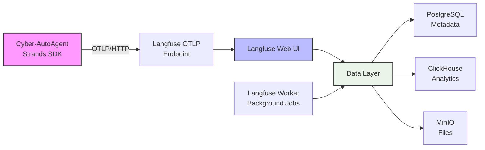
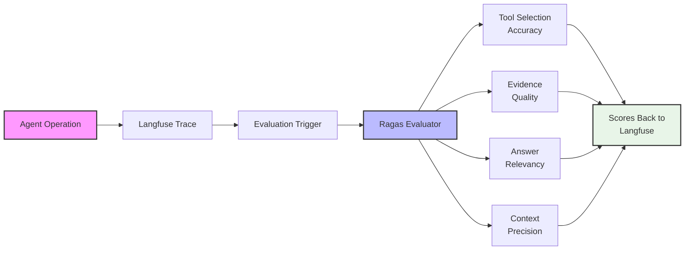
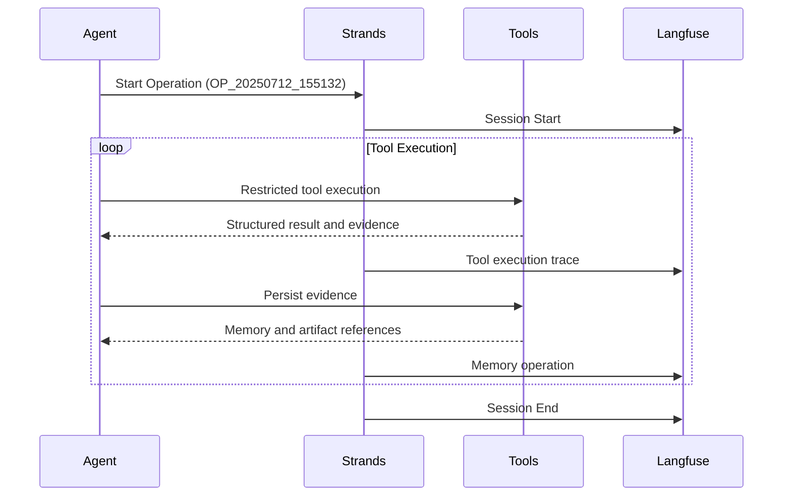

# Observability & Evaluation Guide

Cyber-AutoAgent provides built-in observability via Langfuse tracing and automated evaluation using Ragas metrics to monitor and improve penetration testing operations.

Max-token failures are recorded as failure-aware generation diagnostics. They include the stop reason, failure type,
classification, available token counters, and bounded redacted reasoning/output excerpts. Prompt-review exports attach
these records by generation ID when available; otherwise they use the same agent run and trace timestamp and mark the
association as inferred. The exporter uses the shared secret-redaction utility, so raw credentials are not exported.

## Architecture Overview

### Observability Stack


### Evaluation Flow


### Operation Trace Flow


## Quick Start

```bash
# 1. Start monitoring stack
docker compose -f docker/docker-compose.yml up -d

# 2. Run with full observability
docker run --rm \
  --network cyber-autoagent_default \
  -e LANGFUSE_HOST=http://langfuse-web:3000 \
  -e ENABLE_AUTO_EVALUATION=true \
  cyber-autoagent \
  --target "http://testphp.vulnweb.com" \
  --objective "Find SQL injection vulnerabilities"

# 3. View at http://localhost:3000 (admin@cyber-autoagent.com / changeme)
```

**What you get:**
- Real-time trace of every tool execution
- Token usage and performance metrics
- Automated scoring of agent effectiveness
- Complete evidence trail

## Evaluation Metrics

When enabled, the system performs at most two bounded operation evaluations per operation:

1. An operation evaluation combining task-executor, swarm-agent, and validation-specialist traces while excluding
   planning, prompt-building, task-creation, and evaluator roles.
2. A report evaluation of the assembled `security_assessment_report.md` artifact, when the report exists.

The operation evaluation uses all 6 public metrics. The report evaluation uses evidence quality, goal accuracy, and
cybersecurity focus because tool selection and execution methodology do not apply to a completed report artifact.
Scores are written to dedicated Langfuse traces using `operation/` and `report/` prefixes instead of being attached to
the last role-agent call. Version-3 public scores preserve these names but use controller-owned facts and a
schema-validated continuous rubric: verified-finding completeness determines evidence quality, controller completion
determines goal accuracy, and the remaining applicable dimensions use the canonical operation digest. Ragas binary
metrics are uploaded only as `diagnostic/ragas/...` scores and must not be interpreted as calibrated quality values.

The existing `ENABLE_OBSERVABILITY` and `ENABLE_AUTO_EVALUATION` variables remain authoritative. If either required
gate is disabled, trace discovery, evaluator initialization, Ragas model calls, and score uploads are skipped.

While evaluation is enabled and running, each scheduled Ragas metric emits an indexed `progress_update` event before
the metric call. The event uses `operation_stage: "ragas_evaluation"` and includes `evaluation_step_index`,
`evaluation_step_total`, `evaluation_scope`, `evaluation_metric`, and `evaluation_step_label`. The total spans the
bounded operation and optional report metric sets; progress reporting does not add model calls. No evaluation progress
events are emitted when the existing evaluation gates disable evaluation.

Multi-turn evaluation constructs native Ragas human and AI messages. Tool activity is represented as typed AI
execution narratives because Ragas can project away tool-call metadata before re-validating a metric sample. The
canonical operation digest contains only current-operation tool observations and verified finding records; generated
report text, previous evaluation summaries, planning traces, and other non-execution output are excluded. This
prevents a historical narrative from contradicting the durable evidence ledger.

Multi-turn evaluation also emits an unindexed preparation event immediately before reference-topic generation. It uses
`step: "RAGAS_PREPARATION"` and `evaluation_step_kind: "reference_topics"`, along with the current scope and a display
label. Evaluation-data assembly and rubric judging use the same event shape with `evaluation_step_kind` set to
`evaluation_data` or `rubric_judge`. Preparation events do not
change the metric `evaluation_step_index` or `evaluation_step_total` values.

Each announced metric or preparation stage emits one `evaluation_step_complete` event with a `completed`, `skipped`,
or `failed` status. Skipped and failed events include a short user-safe message. After an attempted evaluation,
`evaluation_complete` carries finalized calibrated scores, their average, and an overall status. Evaluation
internals never emit synthetic `tool_start` or `tool_end` events; those remain reserved for actual agent tools.
Auxiliary evaluator calls for reference topics and rubric judging prefer provider-native
structured output. When that protocol is unavailable or returns malformed structured data, the evaluator makes one
plain-JSON compatibility retry, extracts and repairs one unambiguous JSON value, and validates it against the same
strict output schema before using it. Provider transport failures and invalid or ambiguous repaired payloads remain
failures; repaired model text is never written to evaluation events or logs. Evaluator models explicitly disable
provider reasoning where supported, and text extraction omits reasoning-only blocks while serializing structured
payloads as JSON rather than Python representations. A schema-bound HTTP 501 marks native structured output as
unavailable for the evaluation replay, so later auxiliary calls use the prompted-JSON path directly. Ollama
structured-format request errors are retried as prompted JSON only for compatible client errors; outages and
context-window failures are not retried.
After every evaluation model response with provider usage metadata, the evaluator publishes its cumulative usage into
the operation-wide accounting. The existing `metrics_update` event then reports assessment, reporting, and evaluation
tokens and cost as one running total; evaluation does not define a separate cost event. When an integration supplies
LangChain `input_token_details`, `cache_read` and `cache_creation` are reported as `cacheReadTokens` and
`cacheWriteTokens`. The event handler prices all evaluation usage with the same precedence as assessment and reporting:
configured `CYBER_AGENT_PRICING_INPUT`, `CYBER_AGENT_PRICING_OUTPUT`, `CYBER_AGENT_PRICING_CACHE_READ`, and
`CYBER_AGENT_PRICING_CACHE_WRITE` overrides first, then models.dev rates, then the configured zero-cost fallback.

### Core Metrics

### Core Metrics Overview

| Metric                       | Type    | What It Measures                         | Good Example                             | Poor Example                         |
|------------------------------|---------|------------------------------------------|------------------------------------------|--------------------------------------|
| **Tool Selection Accuracy**  | 0.0-1.0 | Strategic tool choice and sequencing     | `nmap -sV` → `nikto` → `sqlmap`          | Using `nmap` for SQL injection       |
| **Evidence Quality**         | 0.0-1.0 | Vulnerability documentation completeness | Full exploit chain with payloads/outputs | "Found SQL injection" (no details)   |
| **Goal Accuracy**            | 0 or 1  | Binary - objective achieved              | SQLi found when looking for SQLi         | No findings despite thorough testing |
| **Topic Adherence**          | 0.0-1.0 | Security focus consistency               | Consistent pentesting terminology        | Drifting to non-security topics      |
| **Methodology Adherence**    | 0.0-1.0 | Following penetration testing standards  | PTES: recon→enum→exploit→report          | Random testing without method        |
| **Penetration Test Quality** | 0.0-1.0 | Holistic assessment of entire operation  | Critical findings with full evidence     | No findings or poor methodology      |

### Key Metric Details

**Tool Selection Accuracy**: Evaluates appropriate cybersecurity tool choice and sequencing. Excellent scores use strategic combinations like `nmap+nikto` for recon followed by targeted `sqlmap`. Poor scores use wrong tools like `metasploit` before reconnaissance.

**Evidence Quality**: Assesses vulnerability documentation completeness. Excellent scores include full exploitation chains with URLs, payloads, outputs, and impact. Poor scores have vague statements without technical details.

**Penetration Test Quality**: Comprehensive assessment requiring excellence in all areas - reconnaissance, vulnerability identification, validation, documentation, and remediation recommendations.

### Score Interpretation

| Score Range  | Assessment  | Action Required                    |
|--------------|-------------|------------------------------------|
| **0.9-1.0**  | Excellent   | None - exemplary performance       |
| **0.7-0.89** | Good        | Minor improvements possible        |
| **0.5-0.69** | Fair        | Review approach and tool selection |
| **0.0-0.49** | Poor        | Significant issues need addressing |

### Common Score Patterns

1. **High Tool Selection, Low Evidence Quality**: Agent uses correct tools but doesn't collect proper evidence → Improve memory storage after findings
2. **Low Methodology Adherence**: Agent skipping assessment phases → Ensure systematic progression through recon, enumeration, exploitation
3. **Low Topic Adherence**: Agent drifting off-topic → Strengthen system prompts

## Configuration

```bash
# Essential environment variables
ENABLE_OBSERVABILITY=true        # Default: true
ENABLE_AUTO_EVALUATION=false     # Default: false (enable for scoring)
LANGFUSE_HOST=http://langfuse-web:3000
LANGFUSE_PUBLIC_KEY=cyber-public
LANGFUSE_SECRET_KEY=cyber-secret

# For production, generate secure keys:
export LANGFUSE_ENCRYPTION_KEY=$(openssl rand -hex 32)
export LANGFUSE_ADMIN_PASSWORD=$(openssl rand -base64 32)
```

When remote observability is enabled but the Langfuse health check or OTLP exporter setup fails, the assessment
continues with local Strands token and cost telemetry. A warning identifies the unavailable remote exporter.

**Model Support:**
- AWS Bedrock: `-e SERVER=remote` (default)
- Ollama: `-e SERVER=local -e OLLAMA_HOST=http://localhost:11434`

## Troubleshooting

| Issue         | Fix                                                |
|---------------|----------------------------------------------------|
| No traces     | Check `LANGFUSE_HOST` and network connectivity     |
| No evaluation | Set `ENABLE_AUTO_EVALUATION=true`                  |
| Auth errors   | Verify PUBLIC_KEY and SECRET_KEY match             |
| Slow traces   | Reduce `LANGFUSE_INGESTION_QUEUE_DELAY_MS` to 1000 |

```bash
# Debug commands
curl -I http://localhost:3000/api/public/otel/v1/traces
docker logs cyber-autoagent 2>&1 | grep -i evaluation
```

## Prompt Review Export

Export one session as a compact JSON or YAML packet for an LLM to review prompt clarity, effectiveness, and
improvements.
The exporter reads `LANGFUSE_HOST` and defaults to `http://localhost:3000`; it uses the existing
`LANGFUSE_PUBLIC_KEY` and `LANGFUSE_SECRET_KEY` credentials.

```bash
caa-export-langfuse-session --session-id OP_20250712_155132 --output prompt-review.yaml
```

The packet contains system and user prompts, explicitly recorded reasoning, model responses, and tool decisions. It
excludes tool outputs, scores, token/cost data, and unrelated trace metadata. Common credentials and authorization
values are always replaced with `[REDACTED]`. Use `--format json` or `--format yaml` to select a format explicitly;
otherwise `.json`, `.yaml`, and `.yml` output filenames select their matching format and YAML is the fallback.

## Advanced

Ragas sample size is derived from the configured evaluation model's context window. The evaluator reserves part of
that window for Ragas prompts and output, so no separate sample-size environment variable is required. It measures
payloads with the evaluator tokenizer when available and otherwise uses UTF-8 byte length as a conservative bound.
When a trace is too large, evaluator replay keeps the objective and recent conversation, then selects a small set of
deduplicated contexts using typed provenance; current-operation validated findings take precedence over generic tool
output. Verified findings from the operation store are rendered as a pinned, deterministic evidence manifest for both
operation and report multi-turn evaluation, so trace compaction cannot discard them. Summary, topic, rubric, and
policy helper calls use the same context-derived input budget. Score metadata records the token budget and the number
of authoritative verified findings available to the evaluation.

Each evaluation attempt has its own Langfuse score-host traces, identified by `evaluation.run_id`. This keeps a
failed replay from being confused with scores retained from an earlier attempt. Scope-preparation errors are reported
separately from metric failures and never create replacement zero scores.

- **Custom metrics**: Extend `CyberAgentEvaluator` in `src/modules/evaluation/evaluation.py`
- **Performance**: Scale with `langfuse-worker` replicas
- **Export data**: Coming in next release

---

For detailed configuration and examples, see the [Langfuse docs](https://langfuse.com/docs) and [Ragas framework](https://github.com/explodinggradients/ragas).
