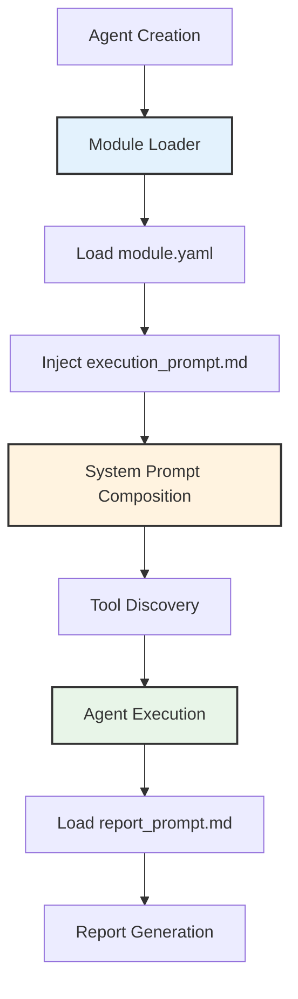
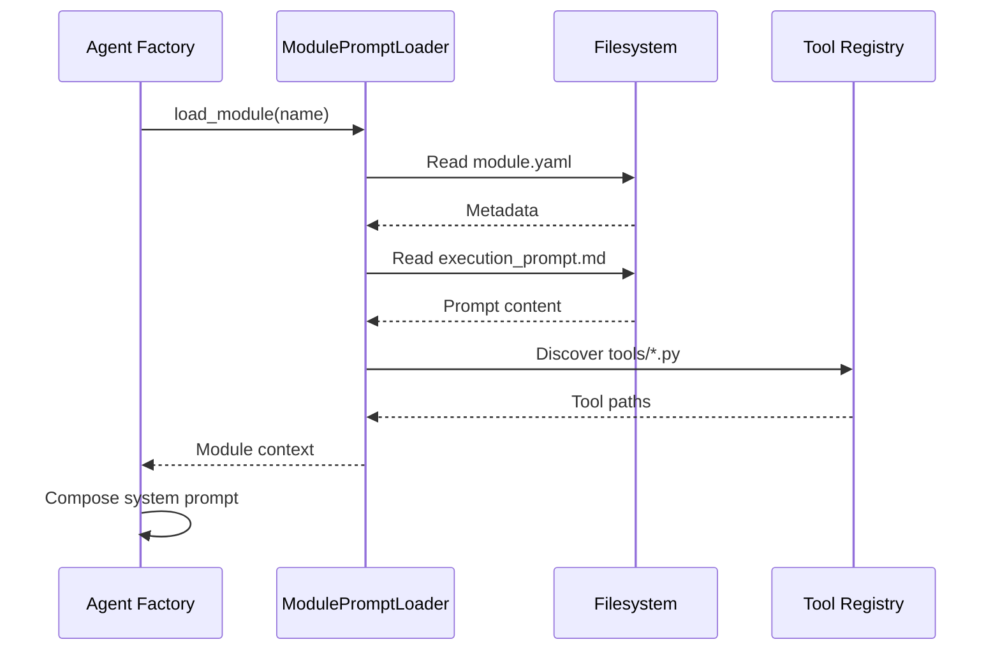
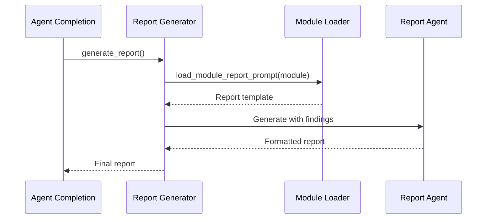

# Operation Modules

Operation modules extend Cyber-AutoAgent capabilities through domain-specific prompts, tools, and reporting templates. Each module specializes the agent's behavior for particular security assessment scenarios.

## Module Status

- **Production**: Battle-tested modules validated through extensive real-world use
- **Experimental**: New modules under active development - use with caution and provide feedback

## Architecture



## Module Structure

```
operation_plugins/
└── <module_name>/
    ├── module.yaml           # Metadata and configuration
    ├── execution_prompt.md   # Domain-specific system prompt
    ├── report_prompt.md      # Report generation guidance
    └── tools/               # Module-specific tools
        ├── __init__.py
        └── custom_tool.py   # @tool decorated functions
```

## Component Functions

### Specialist Agents (Web Module)
The `web` module currently ships with a `validation_specialist` tool that spins up its own Strands `Agent` to run the seven-gate validation checklist before a finding is accepted. The tool lives under `tools/validation_specialist.py` and follows a repeatable pattern:

- An `agent_factory` property is injected on the `@tool` function. It is a function that builds a Strands `Agent` using the swarm model configuration, with the necessary components for context window management and observability.
- An agent is built with a focused system prompt plus the minimal tool set (`shell`, `http_request`, etc.) required for validation.

You can add additional specialists (e.g., SQLi, XSS, SSRF) by copying this file, adjusting the prompt/available tools, and registering the new tool name in `module.yaml`. The runtime orchestration automatically exposes any `tools/*.py` entry that uses this pattern.

The `agent_factory` function allows custom model configuration, such as purpose-built models for the specialist.

```python
import json
from strands import tool
from typing import Dict, Any

@tool
def custom_tool() -> Dict[str, Any]:
    agent_factory = getattr(custom_tool, "agent_factory", None)
    assert agent_factory is not None

    agent = agent_factory(
        name="...",
        agent_type="custom_tool",
        model_spec={"model_settings": {"model_id": "purpose-built-model", "params": {"temperature": 0.8}}},
        # remaining arguments are passed to strands.Agent constructor
        system_prompt="...",
        tools=[tool1, tool2],
    )
    agent()
    result = agent("...")
    result_text = str(result)
    return json.loads(result_text)
```

### module.yaml
Defines module metadata and capabilities:

```yaml
name: module_name
display_name: Human Readable Name
description: Module purpose and scope
version: 1.0.0
cognitive_level: 4              # Sophistication rating (1-5)
capabilities:
  - capability_description
extend:
  - web
tools:
  - tool_name
  - 'browser_*'
  - '*_search'
supported_targets:
  - web-application
  - api-endpoint
configuration:
  approach: Assessment methodology description
```

### execution_prompt.md
Specialized instructions injected into agent system prompt during operation. Defines domain expertise, methodology, and tool usage patterns specific to the module's security domain.

### report_prompt.md
Report generation template specifying structure, visual elements, and domain-specific analysis sections for final assessment reports.

### tools/
Optional directory containing module-specific tool implementations using Strands `@tool` decorator.

## Loading Process



## Prompt Composition

Module execution prompts integrate with base agent instructions:

```python
# System prompt assembly
system_prompt = f"""
{base_agent_prompt}

## MODULE CONTEXT
{module_execution_prompt}

## AVAILABLE TOOLS
{discovered_module_tools}

## ASSESSMENT OBJECTIVE
{user_objective}
"""
```

## Module Discovery

Modules are discovered from multiple sources:

**Search Paths:**
1. Python CLI Custom: `CYBER_PLUGIN_PATH` environment variable, multiple paths separated by `:`
2. Docker Custom: `./external_plugins/`        (mounted by docker-compose.yml)
3. User-defined: `~/.cyber-autoagent/modules/` (mounted by docker-compose.yml)
4. Built-in: `src/modules/operation_plugins/`

**Validation Requirements:**
- Valid `module.yaml` or `module.yml` file
- At least one prompt file (execution or report)
- Proper directory structure

### Nested Module Directories

Modules can be organized logically inside nested directories, which is useful when organizing collections of plugins or cloning entire repositories of modules into an `external_plugins/` directory.

The agent will automatically perform a deep recursive search within your module roots to discover any directory that contains a `module.yaml` manifest.

**Example Structure**:
```text
external_plugins/
  my-custom-collection/
    recon/
      nmap-scanner/
        module.yaml   <-- Discovered!
        tools/
    exploitation/
      sql-injector/
        module.yaml   <-- Discovered!
        tools/
```
*(Note: A `module.yaml` or `module.yml` manifest is strictly **required** for a module to be detected and loaded.)*

## Tool Integration

Module tools extend agent capabilities for specific domains:

```python
# Example module tool
from strands import tool

@tool
def domain_scanner(target: str, options: dict = None) -> str:
    """Domain-specific security scanner."""
    # Implementation
    return "Scan results"
```

Tools discovered from `tools/*.py` are made available via `load_tool`:

```python
# Agent runtime
load_tool(tool_name="domain_scanner")
result = domain_scanner(target="example.com")
```

### Selecting built-in tools

Elements in the `tools` list that do not match a tool in the module `tools/` directory are considered allow patterns
for built-in tools. If `tools` is specified, the module must allow list the built-in tools required.

The following built-in tools are always included and do not require to be in the `tools` list:
- swarm
- shell
- editor
- load_tool
- mem0_*
- stop
- prompt_optimizer (if prompt optimization is enabled)

## Report Generation

Report generation integrates module-specific guidance:



Report prompts guide structure and emphasis:
- Executive summary focus
- Visual element requirements
- Domain-specific analysis sections
- Remediation guidance format

## Creating Custom Modules

### Directory Setup

```bash
mkdir -p ~/.cyber-autoagent/modules/custom_module/tools
cd ~/.cyber-autoagent/modules/custom_module
```

### Minimal Module

**module.yaml:**
```yaml
name: custom_module
display_name: Custom Security Module
description: Specialized assessment for custom domain
version: 1.0.0
cognitive_level: 3
capabilities:
  - Domain-specific vulnerability detection
supported_targets:
  - custom-application
```

**execution_prompt.md:**
```xml
<role>
Specialized security assessor for [domain]
</role>

<assessment_methodology>
1. Initial reconnaissance
2. Vulnerability identification
3. Exploitation validation
</assessment_methodology>
```

### Tool Implementation

```python
# tools/custom_tool.py
from strands import tool

@tool
def custom_scanner(target: str, depth: int = 3) -> str:
    """Execute domain-specific security scan."""
    # Scanner implementation
    return f"Scan completed: {target}"
```

### Extending Other Modules

A module may extend from one or more modules. The module "inherits" the prompts and custom tools from other modules. This
allows specific customizations to existing modules. If a module does not provide a prompt or tool, it is used from the
inherited modules.

```yaml
extend:
  - web
  - some_other_module
```

In the example above, the module `web` is checked, then `some_other_module`.

The following are inherited:
- `execution_prompt.md`
- `report_prompt.md`
- `tools`  # The tools property is NOT inherited. If missing, all built-in and custom tools are included.
- tools/   # The tools directory is inherited from all modules. If two custom tools have the same name, the first in the extend list is used.

Extending modules, is transitive, i.e. my_custom_ctf → ctf → web.

## Development Guidelines

**Prompt Design:**
- Use XML tags for critical sections
- Follow confidence-based decision framework
- Maintain concise, technical language
- Include specific tool usage guidance

**Memory Integration:**
- Store findings with standardized metadata
- Use consistent category taxonomy
- Include confidence scores
- Reference module name in metadata

**Tool Development:**
- Implement error handling
- Return structured results
- Document parameters and return types
- Follow Strands tool conventions

## Module Validation

Validate module structure before deployment:

```python
from modules.prompts.factory import ModulePromptLoader

loader = ModulePromptLoader()
if loader.validate_module("custom_module"):
    print("Module valid")
```

## Available Modules

| Module                | Cognitive Level  | Domain                                    | Key Capabilities                                                       | Tools               | Status           |
|-----------------------|------------------|-------------------------------------------|------------------------------------------------------------------------|---------------------|------------------|
| **ctf**               | 4                | CTF challenges and competitions           | Flag extraction, vulnerability exploitation, success-state detection   | None                | Production       |
| **web**               | 3                | Web application security assessment       | Advanced reconnaissance, payload coordination, authentication analysis | 3 specialized tools | Production       |
| **threat_emulation**  | 4                | APT simulation and threat actor emulation | MITRE ATT&CK execution, IoC generation, detection engineering          | None                | **Experimental** |
| **context_navigator** | 3                | Post-access environment discovery         | Layered enumeration, topology mapping, business context                | None                | **Experimental** |
| **code_security**     | 4                | Static code security analysis             | Vulnerability detection, dependency scanning, chain analysis           | None                | **Experimental** |

### CTF Module

**Purpose:** Specialized for Capture The Flag competitions and challenge environments

**Key Features:**
- Flag pattern recognition (UUID, hash, token formats)
- Curated-first endpoint discovery
- Family-driven vulnerability exploitation
- XSS sink-oriented testing with state detection
- IDOR parameter tampering with context variation
- Authentication chain analysis
- Multi-class injection strategies (SQLi, SSTI)
- File upload and path traversal validation
- SSRF and network probing
- GraphQL introspection and API abuse testing

**Configuration:**
- Approach: Family-driven discovery with curated-first probes

### General Module

**Purpose:** Comprehensive web application security assessments

**Key Features:**
- Coordinated reconnaissance (subfinder, assetfinder, httpx, katana)
- Intelligent payload testing (dalfox, arjun, corsy)
- Deep authentication flow analysis (JWT, OAuth, SAML)
- Business logic vulnerability detection
- Injection vulnerability identification

**Module Tools:**
- `specialized_recon_orchestrator`: Coordinates external recon tools
- `advanced_payload_coordinator`: Orchestrates payload testing tools
- `auth_chain_analyzer`: Analyzes authentication mechanisms
- `validation_specialist`: Rigorous false positive prevention

**Configuration:**
- Approach: Intelligence-driven assessment with specialized tools

### Threat Emulation Module ⚠️ **EXPERIMENTAL**

**Purpose:** APT and threat actor emulation following MITRE ATT&CK framework

> **Note**: This module is experimental and under active development. Use with caution in production environments.

**Key Features:**
- Systematic TTP execution from threat intelligence reports
- Kill chain progression tracking (Initial Access → Exfiltration)
- Marker-based simulation (no actual harm)
- IoC generation for blue team training
- Detection opportunity documentation
- Operational security and cleanup verification

**Usage Example:**
```bash
--target "192.168.1.0/24"
--objective "Emulate APT28 lateral movement using Kerberoasting and WMI per M-Trends 2024"
--module threat_emulation
```

**Configuration:**
- Approach: TTP-driven adversary emulation with marker-based tracking

### Context Navigator Module ⚠️ **EXPERIMENTAL**

**Purpose:** Post-access system exploration and contextual understanding

> **Note**: This module is experimental and under active development. Use with caution in production environments.

**Key Features:**
- 7-layer discovery framework (system/user/network/application/data/security/business)
- Passive enumeration to avoid detection
- Structured context building with completeness tracking
- Trust relationship mapping
- High-value target identification
- Business context understanding

**Usage Example:**
```bash
--target "compromised-host-01"
--objective "Map Active Directory environment, identify domain controllers and high-value targets"
--module context_navigator
```

**Configuration:**
- Approach: Passive discovery and context mapping without triggering alerts

### Code Security Module ⚠️ **EXPERIMENTAL**

**Purpose:** Static code analysis for security vulnerabilities and supply chain risks

> **Note**: This module is experimental and under active development. Use with caution in production environments.

**Key Features:**
- Multi-language SAST (Python, JavaScript, Go, Java, PHP)
- Dependency scanning with CVE detection
- Hardcoded secret detection (API keys, credentials)
- Vulnerability chain analysis
- Impact-based remediation prioritization
- File:line precision for all findings

**Usage Example:**
```bash
--target "/repos/webapp"
--objective "Analyze Flask application for injection vulnerabilities and hardcoded secrets"
--module code_security
```

**Configuration:**
- Approach: Multi-layered SAST with dependency scanning and secret detection

## Implementation Reference

**Module Loading:** `src/modules/prompts/factory.py:ModulePromptLoader`
**Agent Integration:** `src/modules/agents/cyber_autoagent.py:create_agent`
**Report Generation:** `src/modules/tools/report_generator.py`
