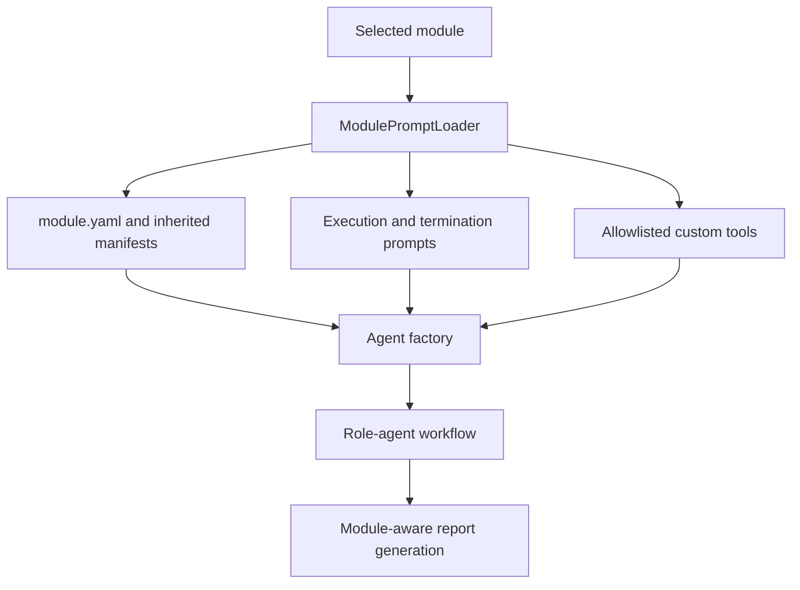

# Module-Based Prompt System

Cyber-AutoAgent loads domain-specific prompts and custom tools from operation modules. The Python agent factory
combines the selected module with the base workflow prompt; the module does not replace workflow ownership of plans,
tasks, or operation state.

## Loading flow



`ModulePromptLoader` is implemented in `src/modules/prompts/factory.py`. Agent integration is implemented in
`src/modules/agents/cyber_autoagent.py`, and report integration is implemented in
`src/modules/handlers/report_generator.py`.

## Module files

Modules are directories under `src/modules/operation_plugins/` or under a configured plugin root. A module must have
`module.yaml` or `module.yml`; prompt and tool files are optional when they are supplied by an inherited module.

```text
<module>/
├── module.yaml
├── execution_prompt.md
├── termination_policy.md
├── report_prompt.md
├── report_agent_executive_system_prompt.md
├── report_agent_finding_system_prompt.md
├── report_agent_observation_system_prompt.md
├── report_agent_appendix_system_prompt.md
└── tools/
    └── custom_tool.py
```

The report-agent prompt files are used for separate report sections. The next-steps prompt is supported by some
bundled modules, but is not a required loader method; module-specific files are used when the report workflow requests
them.

## Prompt inheritance

The loader searches plugin roots in this order:

1. Paths in `CYBER_PLUGIN_PATH`, separated by `:`.
2. `~/.cyber-autoagent/modules/`.
3. The bundled `src/modules/operation_plugins/` directory.

The Docker Compose configuration maps its external and home-plugin mounts into the first two categories. Within a
module, the `extend` list is followed transitively. A child prompt takes precedence over an inherited prompt, while
the first matching parent wins. Cycles in the inheritance graph are rejected.

The loader exposes execution, termination, report, and report-agent prompt loading methods. If Langfuse prompt
loading is enabled, the remote prompt is tried first and the local file remains the fallback.

## Tool discovery

Python files in a module's `tools/` directory are discovered as custom tools. The module's `tools` manifest key is an
allowlist for custom and built-in tools; it is not inherited. Tool directories are inherited, and a child tool takes
precedence over a same-named inherited tool. The agent factory imports the selected files and exposes their decorated
functions to the agent.

The workflow always provides its core tools according to the active role. Module documentation should describe tool
capabilities and allowlists rather than instructing users to issue internal runtime tool-loading calls.

## Workflow responsibilities

`execution_prompt.md` defines domain methodology, target-access rules, evidence requirements, and prohibited actions.
`termination_policy.md` defines evidence-backed completion outcomes. Python owns phase and task transitions; role agents
work on assigned tasks, persist evidence, and record follow-up work.

Report prompts provide domain-specific structure and emphasis. They do not replace the report generator's required
sections, evidence validation, taxonomy handling, or output persistence.

## Adding a module

Create a directory beneath a plugin root with a manifest and the prompts needed by the module. Use the fields already
used by bundled manifests:

```yaml
name: custom_module
version: 1.0.0
description: Specialized assessment for a custom domain
license: Apache-2.0
cognitive_level: 3
capabilities:
  - Domain-specific assessment
supported_targets:
  - custom-application
tools:
  - custom_scanner
configuration:
  approach: Evidence-driven assessment
```

Test module discovery, inheritance, prompt fallback, and tool allowlisting before deployment. The authoritative loader
behavior is covered by the prompt-loader and operation-plugin tests.
