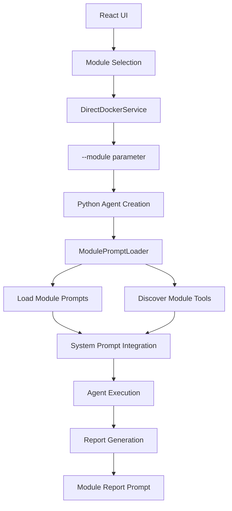
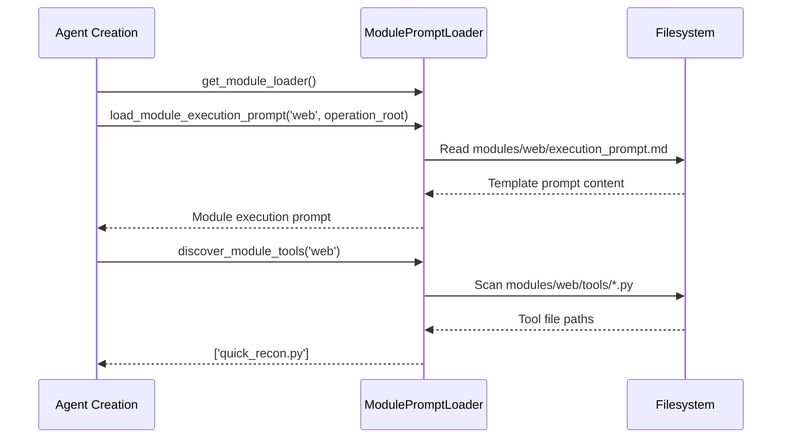
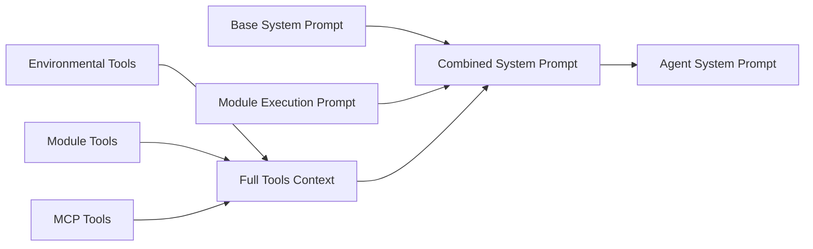
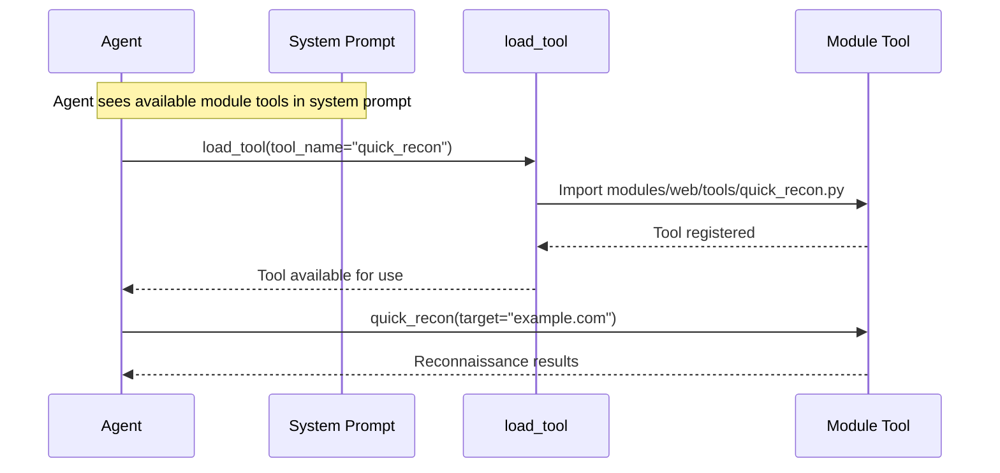
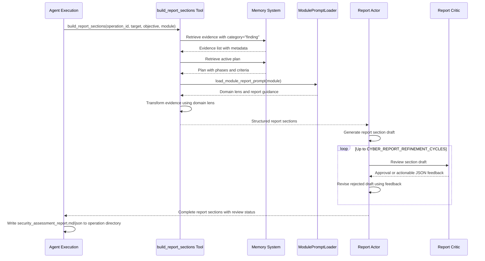

# Module-Based Prompt System

Cyber-AutoAgent uses a modular prompt architecture that enables specialized security assessments with domain-specific expertise, tools, and reporting.

## Architecture Overview



## Module Selection Flow

### 1. User Interface Selection
```typescript
// React UI - Module selection
interface AssessmentParams {
  module: string;  // 'web'
  target: string;
  objective?: string;
}
```

### 2. Parameter Passing
```typescript
// DirectDockerService.ts - Docker execution
const args = [
  '--module', params.module,
  '--objective', objective,
  '--target', params.target,
  '--max-duration', String(config.budgetMaxDuration || 60),
  '--provider', config.modelProvider || 'bedrock',
];
```

### 3. CLI Argument Processing
```python
# cyberautoagent.py - Command line parsing
parser.add_argument(
    "--module",
    type=str,
    default="web",
    help="Security module to use (e.g., web)",
)
```

## Module Structure

```
src/modules/operation_plugins/  (CYBER_PLUGIN_PATH, ~/.cyber-autoagent/modules/)
├── web/
│   ├── execution_prompt.md                        # Domain-specific system prompt
|   ├── termination_policy.md                      # Domain-specific operation termination policy
│   ├── report_prompt.md                           # General report generation guidance
│   ├── report_agent_executive_system_prompt.md    # Executive summary guidance
│   ├── report_agent_finding_system_prompt.md      # Finding report guidance
│   ├── report_agent_observation_system_prompt.md  # Observation report guidance
│   ├── report_agent_appendix_system_prompt.md     # Report appendix guidance (additional sections can be specified)
│   ├── report_agent_next_steps_system_prompt.md   # Structured Appendix B recommendations
│   ├── module.yaml                                # Module configuration
│   └── tools/                                     # Module-specific tools
└── ctf/
    ├── execution_prompt.md
    ├── report_prompt.md
    ├── module.yaml
    └── tools/
        └── __init__.py
```

**Module Configuration** (module.yaml):
```yaml
cognitive_level: 4
configuration:
  approach: Family-driven discovery and exploitation with curated-first probes and explicit success-state termination
```

**Available Modules**:
- **web**: Comprehensive web application and network security testing
  - Finding validation is performed by the workflow's independent evidence-validation task.
- **ctf**: CTF challenge solving with flag recognition and success detection

## Prompt Loading System

### ModulePromptLoader Class

```python
# modules/prompts/module_loader.py
class ModulePromptLoader:
    def load_module_execution_prompt(self, module_name: str) -> Optional[str]
    def load_module_report_prompt(self, module_name: str) -> Optional[str]
    def discover_module_tools(self, module_name: str) -> List[str]
    def get_available_modules(self) -> List[str]
    def validate_module(self, module_name: str) -> bool
```

### Loading Process



The current workflow does not rewrite prompts on disk during an operation. Role-agent prompt adaptation happens in Python from plan state, task history, memory, and selected tools.

### Workflow Responsibilities

Operation plugin prompts intentionally separate domain policy from workflow control:

- `execution_prompt.md` defines operation intent, the module's explicit target-access model, domain execution rules,
  evidence requirements, and prohibited actions. This guidance directs plan creation and applies to task execution.
- `termination_policy.md` defines the evidence-backed module outcomes used by the plan creator, plan critic, plan
  revision role, and phase evaluator. Planning roles translate these outcomes into ordered phases and measurable criteria.
- The Python workflow supplies one shared task-executor contract. An executor works only its assigned task, stores
  evidence, captures follow-up work as pending tasks, and does not own task, phase, or operation transitions.

Access modes are stated by each module rather than inferred from tool availability. For example, web modules are
network-only, code security is limited to the authorized repository, and context navigation is limited to the explicitly
granted post-access channel.

## System Prompt Integration

### Base + Module Prompt Composition

```python
# modules/agents/cyber_autoagent.py - Agent creation
def create_agent(module: str = "web"):
    # Load module-specific execution prompt
    module_loader = get_module_loader()
    module_execution_prompt = module_loader.load_module_execution_prompt(module)
    
    # Discover module tools
    module_tool_paths, module_tools_remaining = module_loader.discover_module_tools(module)
    tool_names = [Path(tool_path).stem for tool_path in module_tool_paths]
    
    # Build tools context
    module_tools_context = f"""
## MODULE-SPECIFIC TOOLS
Available {module} module tools (use load_tool to activate):
{", ".join(tool_names)}
"""
    
    # Generate enhanced system prompt
    system_prompt = get_system_prompt(
        target=target,
        objective=objective,
        tools_context=full_tools_context,
        module_context=module_execution_prompt,
    )
```

### Prompt Composition Flow



### Example: General Module Integration

```text
# Ghost - Cyber Operations Specialist
[Base system prompt with core behaviors]

## MODULE-SPECIFIC GUIDANCE
<role>
You are a comprehensive security assessment specialist conducting general penetration testing.
</role>

<assessment_methodology>
1. Initial Reconnaissance
2. Service Classification  
3. Adaptive Testing Strategy
</assessment_methodology>

## MODULE-SPECIFIC TOOLS
Available general module tools (use load_tool to activate):
quick_recon

Load these tools when needed: load_tool(tool_name="tool_name")
```

## Tool Discovery System

### Discovery Process

```python
# modules/prompts/module_loader.py
def discover_module_tools(self, module_name: str) -> List[str]:
    tools_path = self.modules_path / module_name / "tools"
    tools = []
    
    if tools_path.exists():
        for tool_file in tools_path.glob("*.py"):
            if tool_file.name != "__init__.py":
                tools.append(str(tool_file))
    
    return tools
```

### Tool Integration Flow



## Report Generation System

### Module Report Prompt Integration

```python
# modules/handler/report_generator.py
def build_report_sections(
    operation_id: str,
    target: str,
    objective: str,
    module: str = "web",
    steps_executed: int = 0,
    tools_used: List[str] = None,
) -> Dict[str, Any]:
    """Build structured sections for the security assessment report.

    Retrieves operation-scoped evidence and plan, summarizes findings,
    and returns preformatted sections for the final report template.
    """
    # Load module report prompt for domain lens
    module_loader = get_module_loader()
    module_prompt = module_loader.load_module_report_prompt(module)
    domain_lens = _extract_domain_lens(module_prompt)

    # Transform evidence to content using domain lens
    report_content = _transform_evidence_to_content(
        evidence=evidence,
        domain_lens=domain_lens,
        target=target,
        objective=objective
    )

    # Return structured sections for report generation
    return {
        "overview": report_content.get("overview", ""),
        "evidence_text": evidence_text,
        "findings_table": findings_table,
        "analysis": report_content.get("analysis", ""),
        "recommendations": report_content.get("immediate", ""),
        # ... additional sections
    }
```

### Report Generation Flow



Each LLM-generated executive, finding, observation, Appendix A, and Appendix B section uses this bounded
actor/critic cycle.
Critic JSON uses the workflow's tolerant JSON repair and retry path. A final rejection does not suppress the report:
the actor applies the feedback once more, the assembled report retains that latest actor revision, and the critic's
feedback prose appears under **Further Review Required** inside the section that produced it. Appendix A contains the
assessment methodology. Appendix B contains validated coverage gaps, completion criteria, projected configured-budget
recommendations, agent/tooling improvements, and manual investigations. Log-derived report inputs use only the final
session in `cyber_operations.log`. The final Markdown report also carries an AI-generated-content disclaimer at its top
and bottom.

### Canonical Report Layouts

The free-form executive, finding, observation, and Appendix A prompts include concise canonical Markdown layouts.
These layouts are format-only skeletons: placeholders such as `{{TITLE_FROM_FINDING_DATA}}` identify where canonical
operation data belongs and must never be copied into a report. The skeletons intentionally contain no realistic hosts,
identifiers, severities, counts, payloads, or artifact paths that a model could mistake for assessment evidence.

Actors must keep the canonical headings and order, use only supplied operation data, and state when an optional detail
was not established instead of filling the layout with invented content. Critics review the same layout and reject
placeholder leakage, unsupported filler, missing headings, and incorrect heading order. This is prompt-based guidance;
the report assembler does not reject Markdown mechanically. A module-specific report prompt may explicitly override
the canonical layout when a domain requires a different presentation.

For findings and observations with attached artifacts, the report assembler adds bounded, relevance-selected excerpts
from up to four artifact files. Excerpts retain the recorded content, including sensitive assessment data, and include
the canonical artifact reference plus source line numbers. Artifact lines are length-bounded for report stability, but
content is not redacted because operation reports are treated as confidential. Unsupported artifact citations are
removed without replacing the rest of the generated section. Grounding accepts canonical `artifact:artifacts/...`,
`artifact_id:...`, and normalized bare `artifacts/...` or `outputs/...` references; URLs, endpoint paths, Markdown
labels, and code comments are not treated as artifact references.

## Module Examples

### Web Security Module

**Execution Prompt Features:**
- Multi-domain security coverage (Network, Web, API, Infrastructure, Cloud)
- Adaptive testing methodology based on discovered services
- Risk-based vulnerability prioritization
- Comprehensive reconnaissance approach
- Evidence-driven exploitation with artifact validation

**Available Tools:**
- `quick_recon`: Basic reconnaissance and port scanning
- Module tools can be pre-loaded or loaded dynamically via `load_tool()`

**Report Characteristics:**
- Multi-domain vulnerability grouping
- Context-aware findings explanation
- Vulnerability chaining analysis
- Executive summary for business risk
- Structured findings with severity-based prioritization

### CTF Module

**Execution Prompt Features:**
- Flag recognition patterns and success detection
- Family-driven vulnerability discovery
- Curated-first probes for common CTF patterns
- Explicit success-state termination
- Challenge-specific exploitation strategies

**Report Characteristics:**
- Challenge solution documentation
- Flag extraction methodology
- Tool usage and command sequences
- Lessons learned and technique breakdown


## Implementation Details

### Agent Creation with Modules

```python
# modules/agents/cyber_autoagent.py
agent, callback_handler = create_agent(
    target=args.target,
    objective=args.objective,
    budget=args.budget,
    available_tools=available_tools,
    op_id=local_operation_id,
    model_id=args.model,
    region_name=args.region,
    provider=args.provider,
    memory_path=args.memory_path,
    memory_mode=args.memory_mode,
    module=args.module,  # Module parameter passed through
)
```


The module system provides a powerful way to specialize Cyber-AutoAgent for different security domains while maintaining consistent core functionality and user experience.
