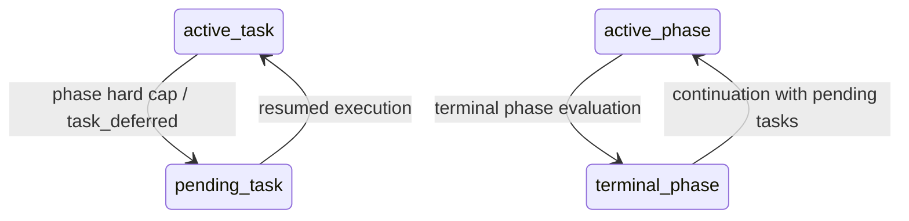
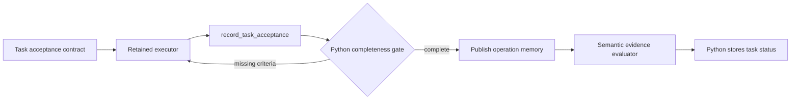

# Task Tracking and Workflow

The task tracking system implements **phase-aware persistent state** using a local SQLite database. The top-level workflow is now owned by Python code, not by a long-lived orchestrator agent prompt. Short-lived role agents work on narrow objectives, while Python applies plan, phase, and task state transitions.

## Design Philosophy: Python-Owned Workflow

Long operations degrade when a single model conversation owns all orchestration. The current design separates durable workflow control from model reasoning:

- **Python controller**: owns plan creation/recovery, active phase selection, task activation, phase advancement, budget checks, and task closure.
- **Short-lived agents**: create plans, build prompts, execute task objectives, create new tasks when permitted, and evaluate task/phase outcomes.
- **SQLite plan store**: persists plans and tasks across context pruning, model failures, and continued runs.
- **Mem0 memory**: stores semantic memories such as observations, findings, evidence summaries, and lessons.

This keeps strategic state deterministic while still using agents for security reasoning and prompt tailoring.

## Workflow Roles

The workflow controller creates focused agents as needed:

| Role | Purpose | Can mutate plan/task state? |
|------|---------|-----------------------------|
| `plan_creator` | Create or revise an initial high-level plan | No; returns structured plan data for Python to store |
| `plan_critic` | Approve a proposed plan or return actionable revision feedback | No |
| `task_creator` | Create concrete tasks for the current phase | May call `create_tasks` only |
| `task_prompt_builder` | Build a task-specific execution prompt and select applicable memory/tools | No |
| `task_prompt_critic` | Approve a proposed task prompt or return actionable revision feedback | No |
| `task_executor` | Execute one active task objective | Records acceptance results and may create contracted follow-up work |
| `task_evaluator` | Decide whether the active task is `done`, `partial_failure`, or `blocked` | No; returns a structured decision |
| `phase_evaluator` | Decide whether the active phase should continue or become terminal | No; returns a structured decision |

Task and phase evaluators are review-only roles. They receive only `editor` for reading referenced artifacts and
`mem0_retrieve` for reviewing existing memories. They do not receive shell or execution tools and must not perform the
task, phase, or operation objective while classifying existing evidence.

Agents may create follow-up work with `create_tasks` when their role permits it. Plan reads/writes, task activation, active-task lookup, task closure, and uncompleted-task listing are applied directly by Python rather than agent-callable tools.

The task creator receives a deterministic controller-owned prompt and a flat `TaskProposal` contract. A proposal
contains its title, objective, required limits object, one concise criterion, and optional procedure, snapshot, and
target fields. For snapshot proposals, Python silently discards `limits` and `output_kind`; procedure methods remain
invalid. Python compiles the full
immutable acceptance contract, assigns pending status and the active phase, and infers target scope from `target_ids`.
The controller permits a configurable number of corrected calls after an initial rejection (four by default) in the
same retained conversation and stops the role when that allowance is exhausted. It never retries after tasks are
successfully stored.

Agents also do not have a stop tool. Operation completion is a Python workflow decision; the controller emits a `termination_reason` event with reason `complete`.

The task executor's workflow boundary is controller-owned and shared by every module. Module prompts add distinct access,
safety, domain-execution, and evidence policies without redefining task lifecycle behavior. Module termination policies
are planning inputs as well as phase-evaluation criteria, ensuring that required outcomes shape the durable phase plan.

## State Model

### Plan Phase Status

Plan phases support:

- `active`: the phase currently being worked
- `pending`: future phase not yet active
- `done`: phase objective was achieved
- `partial_failure`: phase made useful progress but could not fully satisfy criteria within constraints
- `blocked`: phase cannot proceed because of a dependency or hard blocker

`done`, `partial_failure`, and `blocked` are terminal phase states. `done` remains the successful completion state.

### Task Status

Tasks support:

- `active`: the task currently being executed
- `pending`: queued work
- `done`: task objective achieved
- `partial_failure`: task made useful progress but did not fully achieve the objective
- `blocked`: task cannot proceed because of a missing dependency, authorization, capability, or prerequisite

Task evaluators decide terminal task status, but Python stores that status.

## Data Model

### Plan Object

```json
{
  "objective": "Assess the web application",
  "current_phase": 1,
  "total_phases": 3,
  "assessment_complete": false,
  "phases": [
    {"id": 1, "title": "Reconnaissance", "status": "active", "criteria": "Map reachable attack surface"},
    {"id": 2, "title": "Validation", "status": "pending", "criteria": "Validate high-signal hypotheses"},
    {"id": 3, "title": "Reporting Prep", "status": "pending", "criteria": "Ensure evidence is complete"}
  ]
}
```

Plans are high-level and do not reference specific tools.

### Task Object

```json
{
  "task_uid": "uuid",
  "title": "Enumerate login flows",
  "objective": "Identify reachable authentication endpoints and store evidence paths.",
  "acceptance": {
    "mode": "coverage",
    "basis": {
      "kind": "snapshot",
      "description": "Authentication endpoints frozen by the prerequisite route inventory task",
      "source_refs": ["artifact:/outputs/example/OP_.../artifacts/route_inventory.json"],
      "snapshot_hash": "controller-populated-sha256"
    },
    "criteria": [
      {
        "id": "authentication-surface",
        "description": "Assess every item ID in the frozen authentication inventory",
        "evidence_requirements": [
          {"kind": "observation", "min_count": 1},
          {"kind": "artifact", "min_count": 1}
        ]
      }
    ]
  },
  "evidence": ["/outputs/example/OP_.../artifacts/recon.txt:42"],
  "phase": 1,
  "status": "pending",
  "status_reason": "Created from initial recon evidence."
}
```

Tasks are concrete units of work. Their acceptance manifest is required and immutable after creation. A `procedure`
basis declares methods, positive numeric limits, a first-limit stopping condition, explicit gap recording, and an
`output_kind`. Use `inventory_manifest` for finite inventories and `artifact` for workflow maps, reports, and other
files. A coverage task consumes a version-1 JSON inventory through a `snapshot` basis. Python hashes that manifest
when the task is created and rejects missing, changed, or incomplete prerequisites.

Inventory manifests use this shape:

```json
{
  "schema_version": 1,
  "items": [
    {
      "id": "login-name-parameter",
      "target_id": "target-1",
      "kind": "parameter",
      "value": "POST /login name",
      "attributes": {}
    }
  ],
  "unassessed_gaps": []
}
```

Inventory item `kind` is one of `endpoint`, `parameter`, `workflow`, `service`, or `technology`. Store item-specific data,
such as discovered parameters, in `attributes`. The executor receives this exact contract whenever a criterion
requires `inventory_manifest`; ordinary JSON outputs must use the generic `artifact` evidence kind.

Before an inventory is frozen, Python extracts same-scope navigation and form destinations from current-operation HTML
artifacts and merges unambiguous missing routes. Fan-out then dispatches by kind: endpoints and their parameters share
route tasks, workflows and services receive matching assessment tasks, and technologies receive component-validation
tasks. An exhausted snapshot with explicit `unassessed_gaps` creates one bounded inventory-refinement task.

## Controller Loop

The controller runs this loop:

1. Load the current plan.
2. If no plan exists, run `plan_creator`, then apply the configured critic/revision cycle before storing an approved
   plan. A final critic rejection fails the workflow without persisting the draft.
3. If a plan was previously marked complete at startup, reopen the earliest phase with active or pending tasks and
   mark later phases with actionable tasks pending.
4. Ensure exactly one active phase, or mark the plan complete if all phases are terminal.
5. If an active task exists for the active phase, run it first.
6. If no active task exists, choose the next pending task unless the phase is at or beyond its soft budget cap.
7. If no task should be activated, run `phase_evaluator`.
8. If the phase evaluator returns a terminal status, Python marks the phase and activates the next pending phase.
9. If the phase should continue but has no active/pending task, run task creation. Missing snapshot prerequisites
   reject dependent coverage tasks; the repair pass creates a bounded inventory task in the active phase first.
10. If task creation and its bounded prerequisite repair both produce no tasks, raise a workflow invariant error.
11. For each active task:
    - run `task_prompt_builder`, then apply the configured critic/revision cycle
    - create one `task_executor` agent with restricted tools
    - run `task_executor` and require one atomic terminal acceptance submission for every frozen criterion
    - validate typed evidence references and exact coverage of frozen manifest item IDs before persistence
    - if criterion IDs are missing, skip semantic evaluation and return the exact missing IDs to the retained executor
    - once the ledger is structurally complete, publish its concrete summaries as one operation observation and run
      `task_evaluator` as its semantic evidence critic
    - treat the semantic evaluator verdict as terminal because the atomic acceptance ledger is immutable
    - stop the executor event loop immediately after complete acceptance is stored
    - after the configured cycle limit, Python marks the task with the evaluator's final status and reason
    - loop back to active phase/task selection
12. When all phases are terminal, Python marks the plan complete and emits the completion `termination_reason` event for UI consumers.

Final report generation receives the workflow completion status before it runs. If the plan has not reached
`assessment_complete=true` or the termination reason is not `complete`, the report is marked as incomplete and states
that findings, observations, validation counts, and target coverage are partial. The progress value itself is reported
unchanged from budget utilization.

Task prompt refinement is controlled by `CYBER_WORKFLOW_TASK_PROMPT_REFINEMENT_ITERATIONS`, which defaults to two
critic reviews. Setting it to `0` uses the initial builder output without critique. A final rejection or invalid
builder/critic response after configured JSON retries marks the active task `partial_failure`; the executor and
evaluator are not invoked for that task.

Task execution cycling is controlled by `CYBER_WORKFLOW_TASK_EXECUTION_CYCLES`, which defaults to three passes, has a
minimum of one, and has
an independent `CYBER_TASK_ACCEPTANCE_MAX_CORRECTIONS` allowance for terminal acceptance schema or evidence repairs.
Acceptance evidence is stored as portable `artifact:artifacts/<file>` references, and every result declares whether
it is negative, observational, a new finding candidate, or evidence for an existing finding. The task-executor agent
and conversation are retained when no valid complete acceptance ledger was
recorded. Once the atomic ledger passes structural validation, one short-lived semantic evaluator returns the terminal
`done`, `partial_failure`, or `blocked` verdict; immutable acceptance results are not replayed through another pass.

Correctable tool invocation failures receive one bounded recovery turn in the same retained executor conversation.
The executor may inspect or create prerequisites, continue independent work, select another executable, and make a
bounded number of corrected invocations. A correction must change the failed input; an identical failed call is blocked.
Validation failures from structured memory and acceptance tools are correctable, but repeated equivalent failures are
counted across retained executor cycles and terminate the task deterministically.
Acceptance corrections identify prerequisites: executors create a finding before a candidate disposition, create
durable evidence before citing it, or repair a malformed version-1 inventory before submitting changed acceptance.
The persisted acceptance ledger is authoritative after each actor and recovery pass. A later complete or idempotently
replayed acceptance supersedes earlier rejected attempts; repeated-rejection termination applies only while frozen
criteria remain missing.
Generic startup and dependency failures quarantine only the failed executable for the current operation. Other
executables and durable operations remain available, but failed output cannot be cited as successful evidence.
Recovery does not consume an actor/critic pass;
if it remains unresolved, Python marks the task `partial_failure` without asking the evaluator to approve it. Evaluators
receive controller-observed tool outcomes and treat them as authoritative over contradictory worker narration.

Every `store_finding` call requires at least one durable artifact reference and returns canonical `finding_ref` and
`verification_task_ref` values. Python links the finding to the currently active source task and creates one narrow,
same-phase `finding_validation` task. The linked task must call
`record_finding_validation`; only an evaluator-approved confirmation is promoted to a verified finding. Failed or
unfinished validations remain visible in the final report under **Findings Requiring Validation**. Evaluators and
report agents can inspect operation artifacts with the read-only `read_artifact` tool, limited by
`CYBER_WORKFLOW_ARTIFACT_READ_LIMIT` (default four reads per agent invocation).

After creating or durably changing a plan, the controller also emits a standard `output` event containing the
objective, current phase, and status of every phase. These snapshots appear in interactive and headless output.
Unchanged plan reads do not emit an event, and display failures do not interrupt persistence or workflow execution.

## Budget Policy

Budget progress is distributed across phases using mandatory proportional caps:

```text
phase_cap = phase_id / total_phases * 100
```

When a phase reaches its cap, the controller performs no more task work for that phase. An active task returns to
`pending` with a hard-cap deferral reason, existing pending tasks remain pending, and `phase_evaluator` must return
`done`, `partial_failure`, or `blocked` before Python advances the plan. Task deferral emits `task_deferred`; it does
not emit `task_done` or finalize a pending finding validation as failed. If terminal evaluation fails, Python closes
the phase as `partial_failure` so the current run still advances to later phases.

On continuation, phases containing deferred work reopen in plan order. The earliest actionable phase becomes active,
later actionable phases become pending, and the normal phase transition processes all of them within the continued
run's new budget.



The controller also tracks advisory budget checkpoints at 20%, 40%, 60%, 80%, and 90%. Below the phase cap, crossing
a checkpoint asks the phase evaluator whether continuing the current phase is still the best use of remaining budget.
These checkpoints may return `continue` and are not injected as prompt instructions.

This design prefers reaching all phases and deferring unfinished tasks for an explicitly continued operation over
spending too much of the current run's budget on one phase.

## Tool Policy

Worker agents receive restricted tool lists.

Core tools are always available to appropriate workers:

- shell and execution helpers
- memory retrieval and storage tools
- browser/channel/OAST basics when included in core runtime setup
- `tool_catalog`

Optional tools are selected as needed:

- module-specific tools
- MCP tools
- any other discovered non-core tools

Selection happens in two passes:

1. Python narrows candidates based on objective, phase/task context, available tools, MCP metadata, and memories.
2. A prompt-builder agent sees separate `core_tools` and `optional_tools` TOON catalogs, then selects the final
   applicable optional tools and memory references. Core capabilities are supplied automatically and are not returned
   in the prompt-builder's `tools` selection. If a model nevertheless returns a core tool in either selection field,
   workflow normalization silently removes it because the executor already receives that tool.

When shell is available, the prompt-builder also receives a compact `shell_commands` TOON catalog containing installed
command names, bounded descriptions, and capabilities. The builder may select
every tool and command reasonably applicable to the task, including capabilities that overlap across native, optional,
and shell methods. Overlap, apparent redundancy, and selection count are not critic rejection reasons; selection makes
a capability available without requiring its use or excluding another method. Selected commands do not restrict shell
execution or replace runtime `tool_catalog` discovery. The builder should return optional tools in `tools` and
command-line programs in `shell_commands`; workflow validation tolerates either selection list and normalizes
recognized names into their correct runtime categories.

Prompt-builder agents also receive compact task history. Successful tasks become useful context for prioritizing similar paths, while `partial_failure` and `blocked` tasks provide dead-end context so workers can pivot without rewriting module prompts on disk.

`create_tasks` is exposed only to task creation roles and task executors that may create follow-up work. Other plan/task mutation tools are withheld from worker agents.

## Task Creation

Task creation still uses the `create_tasks` tool so agents can turn discoveries into durable work. There is no separate
active-task fetch tool; active task context is selected by Python and included in the task executor prompt. Agents
submit flat `TaskProposal` objects, and Python compiles each into a controller-frozen acceptance contract containing a
basis, source references, unique criteria, and evidence requirements. The rules are:

- create one task per cohesive actionable deliverable; Python expands inventory snapshots by target and normalized route
- omit phase, status, task evidence, target scope, and the nested acceptance contract
- provide exactly one criterion description; Python generates its ID and evidence requirement in the frozen contract
- provide procedure methods and positive limits, or provide existing snapshot references; snapshot-only limits and
  output kinds are ignored
- omit `target_ids` for all targets or provide exact IDs for a subset
- do not create duplicates; Python also skips proposals with an exact frozen contract match
- do not reduce task coverage based only on likelihood or convenience
- create prerequisite inventory work before dependent coverage tasks
- create a follow-up task for discoveries outside an active task's frozen manifest

Snapshot references use explicit `task:<uid>`, `memory:<id>`, `artifact:<path>`, or `finding:<uid>` namespaces. A
snapshot that resolves to a canonical inventory automatically becomes coverage work. For procedures, Python generates
target and active-phase source references, injects fixed stopping and gap policies, defaults `output_kind` to
`artifact`, and generates readable unique criterion IDs from descriptions.

Inventory-wide or otherwise moving collections must first be frozen as canonical snapshot references. Procedure tasks
may still use narrow, bounded methods alongside snapshot tasks in the same `create_tasks` submission.

Set procedure `output_kind` to `inventory_manifest` only for a canonical versioned inventory. Snapshot work uses
generic durable evidence, so assessed-negative coverage can be supported by an artifact or operation memory without
requiring a vulnerability finding.

Inventory coverage groups endpoint and parameter/query entries with the same target and normalized URL path. Each
route becomes an independently executable task; workflows, services, non-URL entries, and other inventory units remain
isolated tasks. The configured or detected context window is only a safety limit ensuring one route fits its prompt. It
does not increase the number of routes assigned to one executor.

For example, `/login` and its username/password parameter entries share one retained executor, while `/security` is a
separate task. Stateful workflow entries remain individually bounded so browser and cookie state stay focused.

Python decides when any pending task becomes active.

`create_tasks` returns structured JSON containing `complete`, `created_count`, and `duplicate_count`. It does not
activate pending tasks or return active-task XML. Exact task identities and completed snapshot item filtering are
scoped to the active phase: reuse of one inventory in a later phase creates new work for that phase. A duplicate-only
result does not close the retained creator tool, so a bounded correction can still create actionable tasks.

Shell command arrays are fail-fast: sequential arrays stop at the first failed command, while parallel arrays finish
already-started commands and return an error if any command failed. Every command retains its exit code, standard
output, and standard error. The shell tool does not expose an option to mask failures.

## Evaluation

Task and phase closure is evaluator-driven but Python-applied.



The executor submits one terminal status for the frozen criterion: `satisfied`, `assessed_negative`, `inaccessible`,
`excluded`, or `duplicate`, plus a concrete summary and evidence references. Python injects the bound task, criterion,
and route coverage IDs, then publishes one
bounded observation per completed task so later prompt builders can select the accepted information without a separate
post-acceptance executor turn. `store_observation` remains available for useful interim facts outside the ledger, and
returns structured JSON with a durable `memory_ref`. When a frozen criterion requires observation evidence, the
executor copies that reference into `record_task_acceptance.evidence_refs`; artifact evidence does not satisfy an
observation requirement. Finding evidence remains separate. Python skips semantic evaluation while criterion IDs are missing and returns the
exact missing IDs to the next executor cycle. The evaluator runs only after structural completeness and decides whether
the referenced evidence actually supports each result; memory is required only by an explicit frozen evidence kind.
Common semantic aliases such as `completed`, `no_finding`, `informational`, and `finding` are normalized to their
canonical status or disposition before validation. Unknown values and invalid or nonexistent evidence references
remain errors.

The controller binds `record_task_acceptance` to the assigned task before creating its retained executor conversation.
The model submits `status`, `summary`, `disposition`, and `evidence_refs`; it cannot select, guess, or replace task,
criterion, or coverage IDs. For `finding_candidate`, Python replaces a supplied placeholder with the sole finding
created by that task. Multiple source-task findings require an unambiguous canonical reference, while
`existing_finding` remains explicit. `create_tasks` remains
limited to new follow-up work and never completes or records acceptance for the assigned task.

`task_evaluator` returns:

```json
{
  "status": "done|partial_failure|blocked",
  "reason": "short evidence-based reason",
  "instructions": "prescriptive next-cycle guidance"
}
```

The controller uses `instructions` only as critic guidance when another task-executor cycle is available. It does not
persist instructions as task state or emit them in task completion events.

`phase_evaluator` returns:

```json
{"status": "continue|done|partial_failure|blocked", "reason": "short evidence-based reason"}
```

Invalid statuses are treated as workflow errors.

## Context Management

Short-lived agents reduce dependence on preserving one huge conversation. Each worker prompt is built from:

- base Cyber-AutoAgent system prompt
- module execution guidance
- current plan and active phase objective
- active task objective, when applicable
- relevant mem0 items
- selected tool names and short descriptions

Conversation pruning still protects useful evidence and memory context, but plan/task authority lives in SQLite and Python helpers rather than prompt state.

## UI Events and Telemetry

Tool events still flow through the React event handler. Task activation and task closure are Python workflow decisions rather than model tool calls.

The UI should treat plan/task state as controller-owned state and tool events as supporting evidence.

Every workflow `progress_update` may also include a versioned `health` snapshot. `progressPercent` continues to mean
budget utilization; health measures the current plan, phase, and task state against an optimal successful operation.
Successful work scores highest, active work has a small cost, pending/deferred work has a larger cost, and
`partial_failure` or `blocked` work has the largest cost. A phase marked `done` cannot receive perfect health while it
contains unfinished or failed tasks. Pending future phases do not count as failures.

When the previous phase produced a valid inventory manifest, Python reuses the deterministic task fan-out grouping to
predict the number of tasks expected in the current phase. Missing fan-out modestly reduces health after that phase is
active. Prediction is telemetry only and never creates tasks or changes workflow state.

The event carries diagnostic fields for logs and automation, while terminal interfaces deliberately render only the
rounded score and band, for example `🩺🟢 82% GOOD`. The stethoscope distinguishes operation health from progress.
Health bands are `excellent` (90–100%), `good` (75–89%), `degraded`
(50–74%), and `poor` (below 50%). If plan state or health computation is unavailable, the progress event is still
emitted and the interfaces omit the health indicator.

The interactive terminal also retains the latest valid health snapshot in its footer. Completion does not erase that
snapshot; it is cleared when a new operation starts.

## Implementation Components

| Component                    | File                                             | Purpose                                                           |
|------------------------------|--------------------------------------------------|-------------------------------------------------------------------|
| Workflow controller          | `src/modules/agents/multi_agent_workflow.py`     | Python-owned phase/task loop and role-agent coordination          |
| Agent runtime resources      | `src/modules/agents/cyber_autoagent.py`          | Shared memory, handlers, hooks, tool lists, prompt payloads       |
| Plan/task models and storage | `src/modules/tools/memory.py`                    | SQLite persistence and `TaskProposal` compilation                 |
| Base prompt                  | `src/modules/prompts/templates/system_prompt.md` | Methodology, evidence discipline                                  |
| Task Capture                 | `src/modules/prompts/templates/task_capture.md`  | Task creation guidance                                            |
| Prompt factory               | `src/modules/prompts/factory.py`                 | Memory guidance and prompt assembly                               |
| CLI entry point              | `src/cyberautoagent.py`                          | Runtime setup, fatal failure handling, report generation, cleanup |

## Summary

The task system now combines durable state with multi-agent execution:

- Python owns state transitions.
- Agents do short, defined work.
- Active tasks run before pending tasks.
- Budget progress is a soft phase cap.
- `create_tasks` remains available for durable work capture.
- Phase and task terminal states are explicit: `done`, `partial_failure`, and `blocked`.
