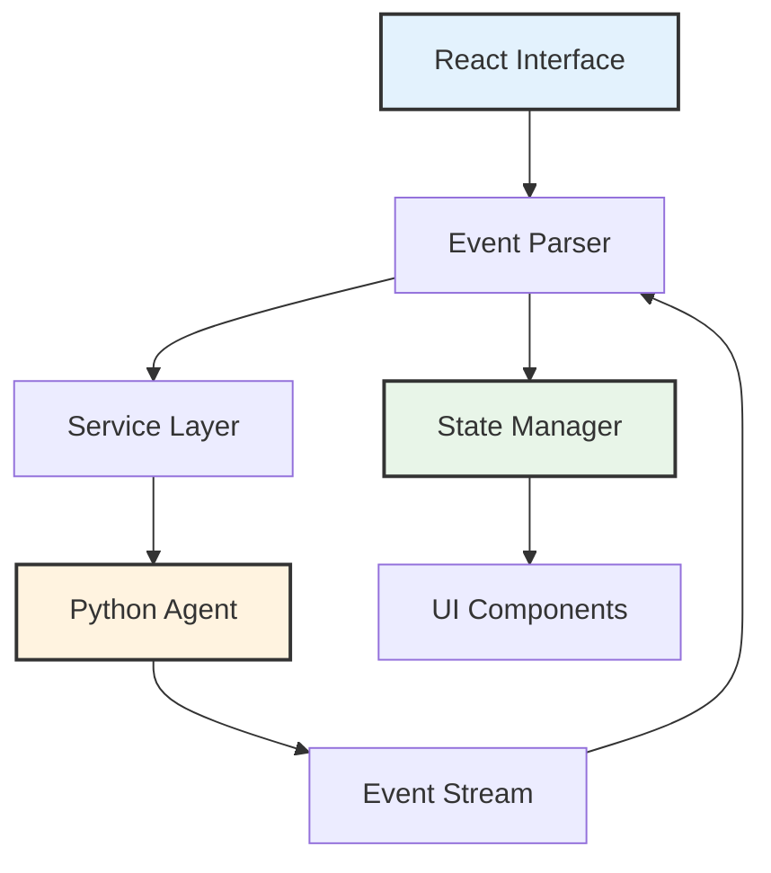
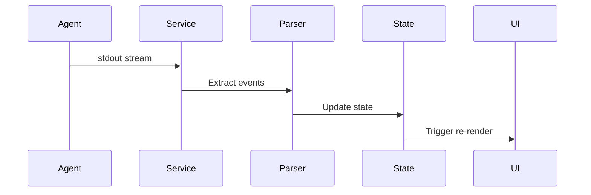

# Terminal Interface Architecture

The Cyber-AutoAgent terminal interface provides real-time streaming of agent operations through a React-based presentation layer built on Ink and TypeScript.

## Design Overview

The interface implements event-driven architecture with minimal parsing, maintaining separation between agent execution logic and user interface concerns.



## Core Technologies

**React Ink**: Terminal-based React renderer for CLI applications
**TypeScript**: Type-safe component and service implementation
**Event Protocol**: Structured JSON events via stdout

## Architecture Layers

### Service Layer

**DirectDockerService**: Container-based execution
- Spawns Python agent in Docker container
- Manages process lifecycle
- Buffers and parses event stream
- Handles errors and termination

**PythonExecutionService**: Local execution adapter
- Direct Python subprocess management
- Development mode support
- Identical event protocol

### Event Protocol

Python agent emits structured events through stdout:

```
__CYBER_EVENT__{"type":"tool_start","tool_name":"shell","tool_input":{...}}__CYBER_EVENT_END__
```

**Event Types:**

- `tool_start`: Tool invocation with parameters
- `tool_output`: Execution results
- `task_started` / `task_deferred` / `task_done`: Workflow lifecycle events; deferred tasks return to the pending queue,
  while completed finding-validation tasks include their candidate reference and final `verified` or
  `validation_failure` resolution
- `output`: User-visible text, including controller-owned plan creation and update snapshots
- `reasoning`: Agent decision context
- `metrics_update`: Operation-wide token, cost, duration, and budget progress, including reporting and evaluation usage
- `progress_update`: Progress updates, including indexed final-report and Ragas metric stages and unindexed Ragas
  preparation stages
- `evaluation_step_complete`: Semantic completion status for a Ragas metric or preparation stage
- `evaluation_complete`: Finalized assessment evaluation status and numeric scores
- `assessment_complete`: Terminal lifecycle event emitted after report generation and any evaluation attempt

The terminal gives `store_observation`, `store_knowledge`, `store_finding`, and `record_finding_validation` distinct
summaries. Finding submission is displayed as pending verification, never as a confirmed vulnerability. Final-report
progress with `report_step_kind=validation_failure` is labeled as requiring validation in interactive and auto-run
output.

When automatic evaluation is enabled, terminal event ordering is report events, Ragas evaluation progress and step
results, `evaluation_complete`, and finally `assessment_complete`. An attempted evaluation emits
`evaluation_complete` with `status` set to `completed`, `no_results`, or `failed`; disabled evaluation emits no
evaluation events. `assessment_complete` is always emitted after the evaluation decision so execution services can
close without hanging. The periodic metrics thread remains active through final reporting and evaluation and stops when
this terminal lifecycle event is emitted.
The React terminal keeps report and evaluation events in one append-only completion stream and shows an
`Evaluating assessment` spinner with the current preparation or metric label until evaluation finishes.

Evaluation work is not represented as `tool_start` or `tool_end`: those event types are reserved for actual callable
tools. Metric progress identifies the scope and metric, while preparation labels cover evaluation-data assembly,
reference-topic generation, rubric judging, and policy calibration. Successful `evaluation_complete` events include
`metrics_evaluated`, `average_score`, and the finalized `scores` mapping.

Evaluation model calls contribute to the same cumulative `metrics_update` totals as assessment and reporting calls.
Auto-run therefore keeps showing one cost value while evaluation progresses; there is no separate
evaluation-cost event or subtotal. Token totals remain available in the structured event and interactive footer.
Provider-reported evaluation cache reads and cache creation also contribute to the structured event's
`cacheReadTokens`, `cacheWriteTokens`, and total cost. Evaluation uses the same `CYBER_AGENT_PRICING_*` environment
overrides and models.dev fallback as assessment and reporting.

### Event Processing



**Processing Flow:**
1. Agent emits events to stdout
2. Service buffers and extracts structured events
3. Parser validates event format
4. State manager updates application state
5. React components re-render based on state changes

## State Management

Application state follows unidirectional data flow using centralized state store:

**State Categories:**
- Operation metadata (target, objective, operation ID)
- Execution progress (current step, status)
- Event history (tool executions, outputs)
- Configuration (provider, model, duration/token/cost budgets)

**State Updates:**
- Event-driven mutations from agent operations
- Immutable state transformations
- Selective component subscriptions

## Component Structure

```
src/modules/interfaces/react/
├── src/
│   ├── components/
│   │   ├── Terminal.tsx          # Event rendering
│   │   ├── StreamDisplay.tsx     # Output formatting
│   │   └── ConfigEditor.tsx      # Configuration UI
│   ├── services/
│   │   ├── DirectDockerService.ts
│   │   ├── PythonExecutionService.ts
│   │   └── MemoryService.ts
│   ├── stores/
│   │   └── configStore.ts
│   └── types/
│       └── events.ts
```

## Configuration Management

Configuration persists to `~/.cyber-autoagent/config.json`:

**Managed Settings:**
- Model provider selection (Bedrock, Ollama, LiteLLM)
- Model identifiers and parameters
- Execution limits (duration, tokens, cost)
- Memory persistence mode
- Observability endpoints

**Configuration Flow:**
1. Load from persistent storage
2. Merge with environment variables
3. Validate against schema
4. Provide to execution services

## Performance Characteristics

**Event Buffering**: Handles high-frequency event streams without blocking
**Efficient Rendering**: Minimizes re-renders through selective subscriptions
**Memory Management**: Bounded buffer sizes prevent memory leaks
**Stream Processing**: Non-blocking event parsing in separate execution context

## Integration Points

### Python Agent Integration

Interface communicates with Python agent exclusively through stdout events:
- No direct function calls
- No shared memory
- Clean process isolation

### Docker Integration

Service spawns containers with:
- Environment variable injection
- Volume mounts for output directories
- Network configuration for observability
- Resource limits where configured

### Configuration Storage

Persistent configuration enables:
- Provider settings across sessions
- Model preferences
- Execution parameter defaults
- Observability configuration

## Event Protocol Specification

### Event Structure

```typescript
interface CyberEvent {
  type: string;
  timestamp: string;
  data: Record<string, any>;
}
```

### Event Emission

Python agent emits events using:
```python
print(f"__CYBER_EVENT__{json.dumps(event)}__CYBER_EVENT_END__\n", end="", flush=True)
```

### Event Parsing

Interface extracts events using pattern matching:
```typescript
const eventPattern = /__CYBER_EVENT__(.*?)__CYBER_EVENT_END__/;
const match = buffer.match(eventPattern);
if (match) {
  const event = JSON.parse(match[1]);
  processEvent(event);
  buffer = buffer.slice(match.index + match[0].length);
}
```

## Development Workflow

**Local Development:**
```bash
cd src/modules/interfaces/react
npm install
npm run build
npm start
```

**Testing:**
```bash
npm test              # Run test suite
npm run typecheck    # TypeScript validation
npm run test:watch   # Watch mode
```

**Build Process:**
- TypeScript compilation to JavaScript
- Type checking and validation
- Dependency bundling

## Deployment Modes

### Standalone Execution

Interface spawns Python agent directly:
- Uses system Python installation
- Direct subprocess management
- Suitable for development

### Container Execution

Interface spawns Dockerized agent:
- Isolated environment
- Consistent dependencies
- Production deployment mode

### Observability Integration

When configured, interface connects to Langfuse:
- Passes observability endpoints to agent
- No direct event processing
- Agent handles trace submission

## Implementation Notes

**Minimal Parsing**: Events stream through with minimal interpretation
**State Isolation**: React state limited to UI concerns
**Process Management**: Clean shutdown and error handling
**Event Ordering**: Maintains event sequence from agent

## Extension Points

**Custom Event Types**: Add new event types through protocol extension
**Service Adapters**: Implement alternative execution services
**State Middleware**: Add logging or analytics through state layer
**Component Customization**: Replace UI components while maintaining event contract

This architecture enables clean separation between agent execution and user interface while maintaining real-time operation visibility and minimal coupling between layers.
