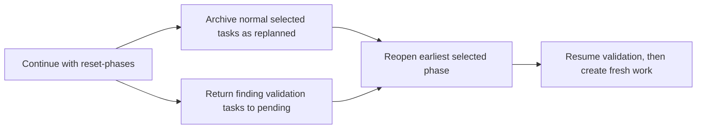

# User Guide

Cyber-AutoAgent is an autonomous security assessment tool with a React terminal interface and a Python command-line runner. Use either interface only
against systems you own or are explicitly authorized to assess.

## Prerequisites

| Requirement | Purpose |
|---|---|
| Node.js 22+ | React terminal interface |
| Python 3.12+ and `uv` | Python runner and development workflows |
| Docker | Containerized execution modes |
| Provider credentials or a running Ollama instance | Model access |
| Written authorization | Legal and operational scope |

**Legal Notice:** Only test systems you own or have explicit written permission to assess. Unauthorized testing is illegal. Users assume full responsibility for legal and ethical use.

## React terminal

```bash
cd src/modules/interfaces/react
npm install
npm run build
npm start
```

The first launch guides Docker setup, deployment mode, and provider configuration. The React CLI supports interactive
commands such as `/config`, `/module`, `/setup`, `/health`, `continue`, and `report`.

### React CLI options

The executable is `cyber-react` after the React package is built, or `npm start --` during development. Supported
options include:

| Option | Description |
|---|---|
| `--target, -t` | Target system or network |
| `--objective, -o` | Assessment objective |
| `--module, -m` | Module name; defaults to `web` |
| `--max-duration` | Duration budget in minutes |
| `--max-tokens` / `--max-cost` | Optional token and cost budgets |
| `--auto-run` | Start an assessment without the interactive UI |
| `--auto-approve` | Skip interactive tool confirmations |
| `--memory-mode` | `operation` (current operation only) or `shared` (same target across operations) |
| `--provider` / `--model` / `--region` | Model configuration |
| `--continue` / `--report` / `--evaluate` | Continue, regenerate a report, or re-run evaluation for the latest operation, optionally by ID |
| `--reset-failed` | With `--continue`, retry all partial-failure and blocked tasks and phases |
| `--reset-phases` | With `--continue`, archive selected phase tasks and create fresh work; accepts `3,5-` style selectors |
| `--deployment-mode` | `local-cli`, `single-container`, or `full-stack` |
| `--mcp-enabled` / `--mcp-conns` | Enable and configure MCP servers |
| `--headless` / `--recording` / `--debug, -d` | Output and diagnostic modes |

The React help text is the authoritative list for optional flags. Provider availability depends on the Python
configuration and installed credentials; current Python provider choices are `bedrock`, `ollama`, `litellm`, and
`gemini`.

## Python command line

Run the Python entry point with `uv`:

```bash
uv run python src/cyberautoagent.py \
  --target "https://example.com" \
  --objective "Authorized web security assessment" \
  --module web \
  --provider bedrock
```

The Python CLI requires `--target` and `--objective` for a new operation unless `--service-mode` is used. Its module
default is `web`; its provider choices are `bedrock`, `ollama`, `litellm`, and `gemini`.

### Python CLI options

| Option | Description |
|---|---|
| `--module` | Operation module; defaults to `web` |
| `--target` / `--objective` | Required inputs for a new operation |
| `--service-mode` | Run without a target/objective |
| `--max-duration` / `--max-tokens` / `--max-cost` | Operation budgets |
| `--provider` / `--model` / `--region` | Model configuration |
| `--confirmations` | Enable confirmation prompts |
| `--memory-path` / `--memory-mode` / `--keep-memory` | Memory configuration |
| `--output-dir` | Output directory override |
| `--continue` / `--report` / `--evaluate` | Continue, regenerate a report, or re-run evaluation for an operation |
| `--reset-failed` | With `--continue`, reset partial-failure and blocked work before retrying the operation |
| `--reset-phases SELECTOR` | With `--continue`, archive selected phase work and create fresh work |
| `--eval-rubric` | Enable evaluation with the selected rubric |
| `--mcp-enabled` / `--mcp-conns` | Enable and configure MCP servers |
| `--bug-bounty-header NAME=VALUE` | Add an authorized request header; repeatable |
| `--verbose` / `--heap-monitor` | Diagnostics |

The Python parser does not provide the React short aliases for these options.

### Re-running evaluation

Re-run Ragas evaluation without executing targets or regenerating the report. The evaluator uses the exact
operation ID's Langfuse session; omitting the ID selects the latest operation for the target.

```bash
uv run python src/cyberautoagent.py --target example.com --objective "via environment" --evaluate
uv run python src/cyberautoagent.py --target example.com --objective "via environment" \
  --evaluate OP_20260904_120000
```

In the React terminal, use `evaluate` or `evaluate OP_20260904_120000`. Evaluation input is automatically bounded
from the configured evaluator model's context window; failed metric calls are reported as failures and are not
recorded as zero scores.

### Retrying failed work

Normal continuation resumes only pending or active work. To retry the tasks and phases that ended in
`partial_failure` or `blocked`, add `--reset-failed`; durable artifacts, acceptance records, and recovery context
remain intact:

```bash
# Retry failed work in the latest operation for this target
uv run python src/cyberautoagent.py --target example.com --objective "via environment" --continue --reset-failed

# Retry failed work in one specific operation
uv run python src/cyberautoagent.py --target example.com --objective "via environment" \
  --continue OP_20260904_120000 --reset-failed
```

In the interactive React terminal, use `continue [operation_id] reset-failed`; the operation ID and
`reset-failed` argument may be supplied in either order.

### Replanning selected phases

Use `--reset-phases` when an entire phase needs fresh work rather than a retry of its existing tasks. The
selector accepts comma-separated phase IDs, inclusive ranges, and an open-ended range through the final phase:

```bash
# Replan phases 3 and 5 through the final phase of one operation
uv run python src/cyberautoagent.py --target example.com --objective "via environment" \
  --continue OP_20260904_120000 --reset-phases 3,5-
```

Prior phase tasks are retained with status `replanned` together with their evidence and acceptance history.
`finding_validation` tasks are instead returned to `pending`, preserving their finding binding and independent
verification context so they resume before new work is proposed. The selected phase's normal contracts and target
constraints still apply to new proposals. In the interactive React terminal, use
`continue [operation_id] reset-phases <selector>`. `reset-phases` cannot be combined with `reset-failed`.



### Comprehensive hypothesis testing

When a plan places a hypothesis-producing phase before vulnerability discovery, the controller uses
`hypothesis_dependent` task creation for the testing phase. It creates one route-scoped testing task for every completed
hypothesis coverage group and records the source hypothesis task IDs and artifact references with each test task.
Executors must assess every documented hypothesis in those source artifacts for the assigned group. If a hypothesis
producer is failed, blocked, missing, or does not cover an assigned group, task creation stops with an explicit coverage
error; the operation does not silently treat that group as tested.

## Deployment modes

The first-run setup wizard asks which environment you want to use. You can select a different environment later with
`/setup`. The wizard shows friendly names; the values in configuration files and command-line options are shown in
parentheses below.

| Setup choice | How it runs | Requirements | Choose it when |
|---|---|---|---|
| **Python / Local CLI** (`local-cli`) | Runs the agent directly in a local Python process. | Python 3.12+, `uv`, and direct access to your model provider. | You want the smallest setup, local tools, or a development environment. |
| **Single Container** (`single-container`) | Runs the core agent inside an isolated Docker container. | Docker Desktop or another compatible container runtime. | You want a self-contained assessment environment with the agent and its security tools isolated from the host. |
| **Full Stack** (`full-stack`) | Runs the agent and supporting services with Docker Compose. | Docker Compose and more disk, memory, and startup time than the other modes. | You want the complete platform with observability, evaluation, service networking, databases, caching, and storage. |

The Full Stack option may be shown as **Enterprise Stack** during setup. Observability and automatic evaluation are
enabled by default for the full stack; local Python and single-container modes use lighter defaults and do not start
the built-in supporting service stack. Provider credentials or a running local Ollama server are still required in
every mode.

To select a mode when starting the React terminal, use its configuration value:

```bash
cyber-react --deployment-mode local-cli
cyber-react --deployment-mode single-container
cyber-react --deployment-mode full-stack
```

See `docs/deployment.md` for configuration details and troubleshooting when Docker, Compose, or provider connections
are unavailable.

## Configuration

The React configuration editor stores settings in `~/.cyber-autoagent/config.json`. Environment variables and CLI
options are also supported. CLI values take precedence over saved configuration for the same setting.

In the editor's Operations section, **HTTP Proxy** scans local private IPv4 addresses and localhost on ports
8080–8089 when opened. It offers listeners verified as Burp Suite, OWASP ZAP, or mitmproxy in a drop-down, preferring
a private address when the same proxy is also reachable on localhost. You can still enter an `http://` or `https://`
URL manually or choose **No proxy**. Discovery does not change the saved setting until you select a choice and save.
The selected URL sets `http_proxy`, `https_proxy`, `HTTP_PROXY`, and `HTTPS_PROXY` for new assessment runs in local
Python and Docker modes. An empty field uses the environment's existing proxy settings. Discovery sees only the
network interfaces available to the TUI process; if the TUI runs inside Docker, enter a proxy bound only on the host
manually.
For Docker runs, the proxy host must be reachable from the container; `127.0.0.1` refers to the container itself.
The field does not configure the TUI process's own network requests. `NO_PROXY` remains an environment setting.

Common provider configuration includes:

```bash
# Bedrock
export AWS_REGION=us-east-1

# Ollama
ollama serve
ollama pull qwen3.6:27b

# LiteLLM-compatible providers
export OPENAI_API_KEY=your_key

# Gemini
export GEMINI_API_KEY=your_key
```

See `docs/deployment.md` and `src/modules/config/README.md` for environment-variable details. Do not commit
credentials to configuration files.

Browser operations use a 240-second default timeout. Set `BROWSER_DEFAULT_TIMEOUT` to an integer number of
milliseconds when a permitted target requires a different bound; the Docker Compose configuration forwards this value.

## Operation modules

Bundled modules are `web`, `web_recon`, `ctf`, `threat_emulation`, `context_navigator`, and `code_security`. Module
selection is available in both interfaces. See [`operation_plugins.md`](operation_plugins.md) for module manifests,
prompt inheritance, and custom-tool development.

## Memory and outputs

`operation` memory mode limits retrieval to the current target and operation; `shared` reuses memories from prior
operations with the same exact target value. Reports and logs are written beneath the configured output directory,
normally `outputs/<target>/<operation-id>/`.

## Assessment credentials

Credentials used for authorized assessments are stored in `outputs/cyber_autoagent.db`. They are scoped to the exact
resolved target value (not an operation-local target ID), with optional operation scope and application role. Agents
can query safe metadata and check out eligible credentials only for an active task; invalid, expired, revoked, and
retired credentials are not selected. Registered accounts are target-scoped so later operations can reuse them.
Credential queries, IDOR comparison planning, status updates, and operation-managed rotation use that same active
task's resolved target scope. An agent cannot enumerate, modify, or compare credentials belonging to another target.

Credential payload encryption at rest is optional for backwards compatibility. Set
`CYBER_CREDENTIAL_STORE_KEY` to a unique URL-safe base64-encoded 32-byte key to encrypt payloads with AES-256-GCM;
existing plaintext credential rows are migrated when that key is first configured. To rotate a key, set the new key as
`CYBER_CREDENTIAL_STORE_KEY` and place the old key (or keys) in the comma-separated
`CYBER_CREDENTIAL_STORE_PREVIOUS_KEYS`; startup verifies and re-encrypts every payload under the new primary key, then
the previous-key variable can be removed. Keep the active key available for every future operation that needs those
credentials: unavailable keys fail closed rather than exposing or silently replacing a payload. When no key is
configured, restrict access to the output directory and its backups to the assessment user. Secret values are masked
in reports, logs, UI events, and trace exports, but must not be committed to source control or copied into task
artifacts.

For a concise objective, common `username=... password=...`, `email=... password=...`, `api_key=...`, and
`oauth2_client_id=... oauth2_client_secret=...` forms are moved into the credential store before the objective is
logged or sent to a model. Use a dedicated credential source for complex or MFA-backed credentials. TOTP provisioning
secrets support SHA-1/SHA-256/SHA-512, six to ten digits, and a 30-second default. Workflow agents generate TOTP codes
from a checked-out credential ID so the provisioning secret does not need to be copied into another tool call; direct
provisioning-secret generation remains available only for standalone compatibility.
Generated one-time codes are not persisted. For email MFA, an agent can retrieve a code from a configured TLS IMAP
mailbox or request one through the React terminal or interactive CLI. The prompt is marked sensitive, the response is
not kept in terminal history, and only non-secret challenge metadata (never the code) is retained in the database.
That metadata includes the initiating task ID so MFA handoffs can be audited without retaining the one-time code.
Task-bound MFA challenges can be completed or blocked only by that same active task; legacy unbound records remain
compatible with existing integrations.
Expired challenges are marked expired; malformed, unavailable, or ambiguous handoffs are marked blocked rather than
left pending.
Mailbox retrieval accepts only IMAP server timestamps from immediately after the challenge begins (with a 60-second
clock tolerance), so old email codes cannot satisfy a new MFA flow.
Both MFA handoff methods require the active task to have checked out the target credential. Email mailbox retrieval
also requires that selected target credential to explicitly reference the mailbox; a mailbox credential cannot be
read independently by an unrelated task.
Credentials created by an operation can be rotated by the agent when the authorized flow supports it; rotation creates
a new credential record and retires the old one instead of overwriting history. User-provided credential payloads are
never changed by an agent. Before an authenticated request, a controller-owned authentication worker checks out only
the controller-selected credential, completes the mapped browser/API/MFA flow, and validates an opaque session or
authorization context. The controller binds that context to the task only after validation succeeds; normal task
executors receive the opaque authenticated-request tool, never credential lookup, raw session material, or a shell for
authentication. Failed setup becomes an explicit coverage gap and cannot be retried by searching memory, files, or the
environment. Durable flow descriptors contain only clean target-scoped login, validation, and observed registration
success-redirect URLs; inventory flow observations are hints until the authentication worker validates and records
them. Every stored credential also receives an initial `unknown` status-history event: user-supplied credentials are
attributed to the user, while found and registered credentials are attributed to the operation. For a later operation,
reusable registered credentials are listed before other reusable credentials; credentials explicitly scoped to that
later operation still take precedence.

Credential-consuming tools declare whether they need a validated opaque context or checked-out credential material.
Context access accepts a controller authorization for the active task; material access requires checkout by that same
task. A missing or expired opaque context returns `AUTH_CONTEXT_UNAVAILABLE`, which means the executor records an
authenticated coverage gap and stops authenticated attempts. Future executor tools can receive context access or
checkout access through a controller-owned task grant once their access mode is registered. Checkout access also
exposes `checkout_credential` to that task.

When a controller-selected login submission receives a direct HTTP 401 response, the controller marks only that
credential invalid and retains its status history. If an observed, authorized self-registration flow exists for the
same target and role, a separate credential-provisioning agent creates one linked replacement identity before any
pending work requiring that role runs. The replacement is recorded as operation-managed and linked to the invalid
credential; registration failures or unavailable registration flows become explicit role-specific coverage gaps.
Other setup failures, including missing context, worker exhaustion, protected-resource failures, and HTTP 403
responses, do not invalidate a credential automatically.

### Credential manager

Use `/credentials <resolved-target>` in the React terminal to review credential type, role, origin, management policy,
status, rotation lineage, status-history events, and prior rotation requests. It reads the same `outputs` database in
local and Docker execution modes and never renders credential payloads, one-time codes, tokens, passwords, or API
keys. The target is the resolved target URL, not an operation-scoped target ID.

Only operation-managed credentials can be queued for rotation from this view. Enter a reason and the terminal creates
an auditable maintenance-operation identifier; the credential remains unchanged until an authorized operation completes
the target-side rotation with durable evidence. User-provided credentials must be updated through the configuration or
environment-import path.
An operation must cite at least one durable artifact, memory, or finding reference when it stores a found or registered
credential; that reference is retained with the credential's initial status-history event. This prevents uncorroborated
discovered credentials from being reused.
Operation-managed credentials may be rotated only after a successful rotation is supported by a durable reference.
The previous credential remains in the store with a retired status and the same reference; user-provided credentials
are never replaced by an operation.
An operation records a credential's validity only after a definitive authentication outcome and must provide both a
specific reason and a durable reference. A generic request failure or an authorization denial does not alone mark a
credential invalid.
For OAuth2 client credentials, configure a same-origin `token_url`. After checkout, an agent can exchange it using
the client-credentials grant; the returned access token is transient and is never stored in SQLite, artifacts, or
reports. This restriction prevents an operation from sending a client secret to an arbitrary discovered endpoint.
For API keys, the agent receives a deterministic header or query-parameter mapping from the configured placement,
rather than guessing how to apply the key. That request material is transient and is likewise excluded from evidence
and reports.
Before authentication testing, agents receive a deterministic coverage plan for each resolved target: an
unauthenticated baseline, every eligible credential context, and only the real account, role, or tenant pairs available
for IDOR comparison. Missing credentials or pairs are preserved as coverage gaps rather than filled with invented
accounts.
For authenticated work, the controller first checks the operation-memory context and invokes a bounded authentication
worker only when an eligible credential has no valid context. Registered credentials have no operation scope and are
therefore reusable by later operations for the same exact canonical target. The worker receives a controller-built
target, origin, and credential-ID contract from the SQLite credential store; it does not discover targets from
artifacts or operation files. Direct browser navigation
is limited to the target origin and any explicitly authorized identity-provider origins. If no eligible credential is
available, the controller records an authenticated coverage gap without launching the worker. Cookies and
authorization tokens remain only in an operation-memory context and are discarded on controller restart. The task
executor receives no checkout, MFA, cookie-extraction, token-extraction, or token-preparation tools; it receives
`authenticated_http_request` only after the controller has a valid context.
The controller selects one reusable, validated target-scoped authentication-flow descriptor before checking out
credentials. When none exists, it tries one observed discovered candidate at a time, retiring a candidate that fails
context validation; only after no candidate remains does a credential-free discovery worker map and record one
bounded flow. If discovery cannot identify a usable flow, credential authentication is skipped and recorded as a flow
coverage gap. The controller then runs one isolated worker per credential, so a missing flow or a rejected credential
cannot cause that worker to try another identity. For same-origin API-form flows,
`ensure_authenticated_context` resolves the controller-selected flow ID rather than searching the stored inventory.
For mapped self-registration, the provisioning worker fills the mapped identity fields and every visible required
control in that same form, including required profile fields beyond username, password, and email. Optional controls
remain untouched unless the flow or server validation requires them. A reusable synthetic profile is retained only in
the task-local context for bounded validation-repair retries; secret-free field names may be recorded in the flow
descriptor for later operations.
Attack-surface mapping supplies secret-free navigation, protected-resource, and JavaScript header-binding hints.
Those endpoints are not executable authority and do not identify a flow start. When no reusable descriptor is
available, the discovery worker must observe a start-to-validation relationship before recording a target-scoped
descriptor, and the controller validates it before reuse. Later operations for the same canonical target can reuse a
validated descriptor. For username/password API forms, the worker can establish a context directly from the recorded
mapped pair. Username/password browser, redirect, and MFA flows must complete in the shared browser and then capture
cookies and any observed named browser-storage bearer token internally. The flow descriptor records only the storage
key name, never its value. Its validation URL must succeed for the bound credential role; 401, 403, and 404 responses
reject the context. Browser flows cannot fall back to direct HTTP form login. Authentication and registration flow
descriptors are versioned; descriptors from older flow contracts are ignored and rediscovered. The authentication
worker also has scoped shell access for commands targeting only mapped authentication origins. No session material is
persisted in SQLite, artifacts, reports, or task text. If a
multi-credential setup is only partially successful, the executor is bound only to the credential IDs whose opaque
contexts validated; the remaining IDs are reported as coverage gaps.
OAuth2 client credentials and configured API keys use the same opaque context: the worker exchanges or applies the
stored credential internally, validates the protected route, and exposes only the authenticated request wrapper.
For IDOR specialist replay that needs two authenticated sessions, agents use the planned comparison pair's checked-out
credential IDs directly with the observed login field names. The specialist builds only task-local login contexts,
requires the login endpoint to share the resolved target origin, and records credential use by ID instead of accepting
raw credential JSON from the agent workflow. Its legacy raw credential JSON arguments remain available only to
standalone and CLI callers for backwards compatibility; workflow agents are required to use credential IDs.
The workflow's controller-appended task contract, including deterministic prompt fallbacks, retains the same
unauthenticated-baseline, authenticated-comparison, self-registration, and IDOR-comparison rules for every module.
Every reported finding labels its authentication context. Authenticated findings include only opaque credential IDs;
unexpected identifier values and all credential payload values are redacted from report Markdown and JSON.
The credential-use section separately records authentication and MFA use so mailbox-assisted MFA is distinguishable
from the authenticated request that follows, while retaining only credential IDs and masked metadata.

The **Operations → Assessment Credentials (JSON)** field in the React configuration editor accepts either a JSON
array or `{"credentials": [...]}`. Each item has `credential_type`, `role`, `values`, and optional `target`,
`operation_scope`, `account_label`, and `tenant_label`. If a target is omitted, the runner uses the sole resolved
operation target; multi-target operations require an explicit resolved target value. Set `operation_scope` to
`"current"` when the credential must be independent for each operation; the runner replaces it with that operation's
generated ID during import.

| Variable | Purpose |
|---|---|
| `CYBER_ASSESSMENT_CREDENTIALS` | Sensitive JSON in the same format as the React field. It is imported into the SQLite credential store at operation start and is forwarded by Docker Compose. |
| `CYBER_CREDENTIAL_STORE_KEY` | Optional URL-safe base64-encoded 32-byte key for AES-256-GCM encryption of credential payloads in SQLite. It is forwarded by Docker Compose. |
| `CYBER_CREDENTIAL_STORE_PREVIOUS_KEYS` | Temporary comma-separated prior 32-byte keys used only to rotate encrypted SQLite credential payloads. It is forwarded by Docker Compose. |

## MCP configuration

The React configuration editor and CLI options accept MCP connection data. The JSON value supplied to
`--mcp-conns` or `CYBER_MCP_CONNECTIONS` is an array of connection objects. Keep credentials in environment-backed
headers or command values rather than committing secrets.

## Docker management

From the repository root, use the repository compose file:

```bash
docker compose -f docker/docker-compose.yml up -d
docker compose -f docker/docker-compose.yml ps
docker compose -f docker/docker-compose.yml logs -f
docker compose -f docker/docker-compose.yml down
```

## Target preflight

Before a new assessment, the runner resolves executable targets and performs the applicable route, TCP, filesystem, or
resolver check. Each target produces a `PREFLIGHT PASS`, `PREFLIGHT FAIL`, or `PREFLIGHT SKIP` event. A failed preflight
stops the assessment before agents and tools start.

## Troubleshooting

| Problem | Check |
|---|---|
| React interface will not start | Confirm Node.js 22+, reinstall dependencies, and run `npm run build` |
| Docker execution fails | Run `docker info` and inspect the compose service logs |
| Ollama requests fail | Start Ollama and verify the configured model is installed |
| Bedrock requests fail | Verify AWS credentials and `AWS_REGION` |
| Configuration is invalid | Review `~/.cyber-autoagent/config.json` and the active provider settings |
| Assessment is rejected before starting | Review the target preflight event and authorization scope |
